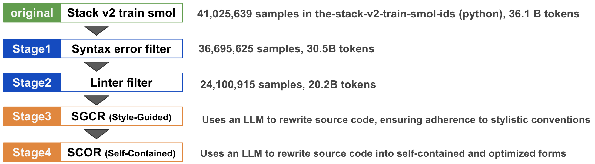
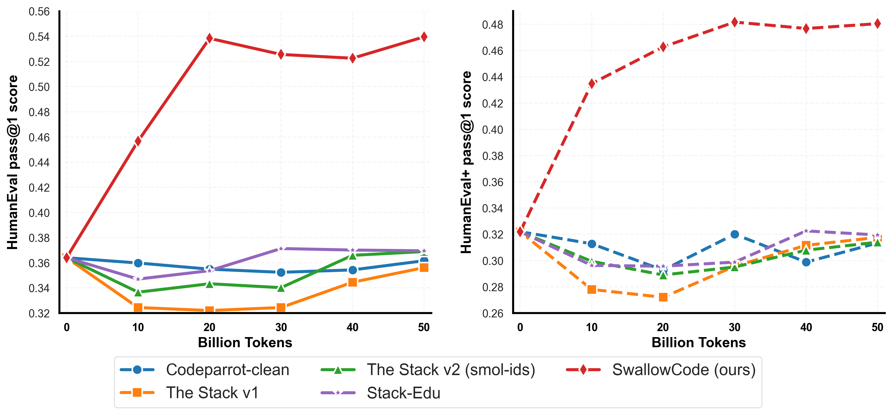
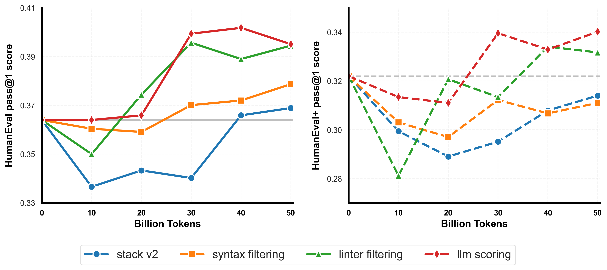
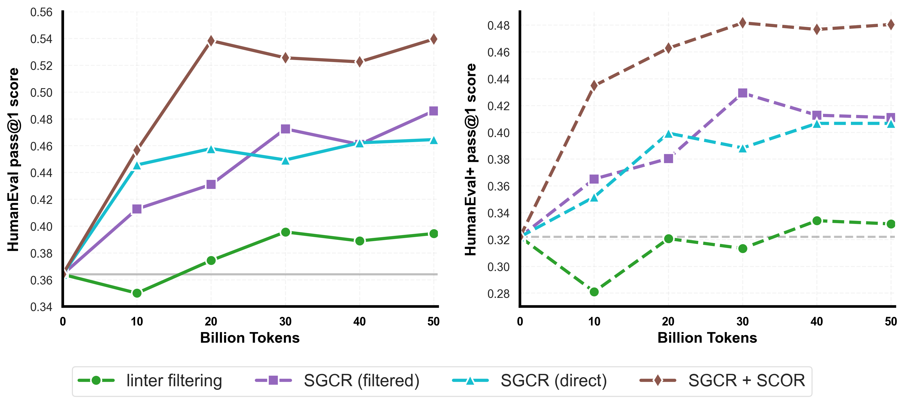
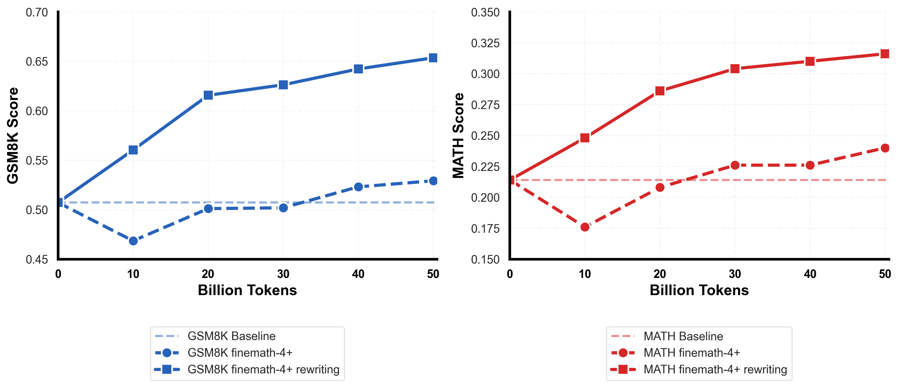

# Rewriting Pre-Training Data Boosts LLM Performance in Math and Code

> Fujii, Tajima, Mizuki et al. (東京科学大学, 産総研) | ICLR 2026
>
> arXiv: https://arxiv.org/abs/2505.02881
> GitHub: https://github.com/rioyokotalab/swallow-code-math

---

## 1. 一言でいうと

> *"Unlike prior methods that rely on exclusionary filtering or limited transformations, our **transform-and-retain** approach refines low-quality code, **maximizing data utility**."* (Abstract)

低品質データを「捨てる」のではなく「書き直す」ことで、事前学習データの効用を最大化する。50Bトークン予算でLlama-3.1-8BのHumanEval pass@1を**+17.0pt**改善。

---

## 2. 背景と動機

### 問題: Data Quality Gap

> *"leading open-weight frontier model families (e.g., Qwen3, DeepSeek-V3) do not release their pre-training corpora. As a result, the open community lacks access to high-quality code and mathematics corpora comparable to those used in the state-of-the-art open-weight models, creating a growing **'data quality gap'**."* (Section 1)

既存の公開データ（The-Stack, Finemath等）はノイズ・冗長性・スタイル不一致を含み、従来手法は**フィルタリング（除外）戦略**に依存している。

### 提案: Transform-and-Retain

> *"By **rewriting rather than merely filtering**, we remove persistent defects that remain in datasets like Stack-Edu and obtain data that drives rapid accuracy gains."* (Section 1)

> *"This transform-and-retain strategy maximizes data utility and **avoids the risks of synthetic data homogeneity**."* (Section 3.3)

既存データのフィルタリングでは残存する問題（欠落コンテキスト、不統一な命名規則等）を、LLMリライティングで解決する。

---

## 3. SwallowCode: コードデータの強化パイプライン

**ソース**: the-stack-v2-train-smol-ids（Python部分）-> **約16.1Bトークン**

*Figure 2: SwallowCode構築の4段階パイプライン*

### Stage 1: 構文エラーフィルタリング
- Python 3.10 `compile()` でコンパイル不可なサンプルを除外
- 41.0M -> 36.9Mサンプル（**9.7%削減**）

### Stage 2: Lintベースフィルタリング
- pylintスコア**7.0未満**を除外 + カスタムコメント密度ペナルティ
- 36.7M -> 24.1Mサンプル（**34.3%削減**）

### Stage 3: SGCR（Style-Guided Code Rewriting）

> *"SGCR revises Python code snippets based on the Google Python Style Guide, enforcing stylistic improvements like clear naming and modular design."* (Section 3.3)

**Llama-3.3-70B-Instruct** で10基準に基づきリライティング。主な改善: 記述的な変数名、型アノテーション、適切なdocstring、モジュール化。

> *"**SGCR improves performance by over 7-9 points**, while SCOR, applied after SGCR, further enhances scores by over 5-6 points."* (Figure 4 caption)

### Stage 4: SCOR（Self-Contained Optimization Rewriting）

> *"SCOR extends SGCR by ensuring self-containment and applying semantic enhancements, including [...] optimization (algorithm and data structure)."* (Section 3.3)

SGCRのスタイル改善を保持しつつ、3つの意味的問題を解決: (i) 依存関係の欠落 (ii) 非効率アルゴリズム (iii) 自明なスニペット

### なぜ2段階に分離したか

> *"A natural question is whether the SGCR and SCOR stages could be merged into a single rewriting pass. In preliminary experiments, we combined all instructions from both prompts into a unified prompt containing 19 distinct directives. Manual inspection of the outputs revealed that **Llama-3.3-70B-Instruct frequently exhibited instruction drift**: the model complied with only a subset of the directives while neglecting others."* (Appendix E.3)

2段階に分けて各段階の認知負荷を軽減する設計を採用。

---

## 4. SwallowMath: 数学データの強化

**ソース**: Finemath-4+（高品質数学Webデータ）-> **約2.3Bトークン**

> *"Section 3 demonstrated that LLM-driven rewriting significantly boosts coding performance. To evaluate the **transferability** of this approach, we apply a tailored rewriting pipeline to mathematical data."* (Section 4)

### 課題と対処
- Web由来の不要アーティファクト（ヘッダ、タイムスタンプ等）
- 不完全な質問・回答、導出ステップの欠落

リライティングプロンプトの5要素: (1) Webヘッダ・フッタ除去 (2) 無関係メタデータ削除 (3) 不完全な文脈の復元 (4) 導出ステップの書き直し (5) ステップバイステップ解法の提示

---

## 5. 主要な実験結果

### コード: SwallowCode vs 既存コーパス

*Figure 1: SwallowCode（赤）が全既存コーパスを大幅に上回る*

| データセット | HumanEval | HumanEval+ |
|---|---|---|
| The-Stack-v2 (ベースライン) | 0.369 | 0.314 |
| Stack-Edu | 0.370 | 0.320 |
| **SwallowCode (ours)** | **0.540** | **0.481** |
| **改善幅 (vs Stack-Edu)** | **+17.0pt** | **+16.1pt** |

### フィルタリング段階別の効果

*Figure 3: フィルタリング手法ごとの学習曲線比較*

| 段階 | HumanEval | 前段階からの改善 |
|---|---|---|
| Stack v2 (no filter) | 0.369 | -- |
| + Syntax filtering | 0.379 | +1.0 |
| + Pylint filtering | 0.395 | +1.6 |
| + LLM scoring (>=6) | 0.395 | +0.1（コスト対効果低 -> 不採用） |

### リライティング段階別の効果

*Figure 4: LLMリライティング段階別の学習曲線*

| 段階 | HumanEval | 前段階からの改善 |
|---|---|---|
| Linter filtered | 0.395 | -- |
| + SGCR | 0.486 | **+9.2** |
| + SCOR | 0.540 | **+5.4** |
| **リライティング合計** | | **+14.5** |

> *"Ablation studies confirm that **each pipeline stage contributes incrementally, with rewriting yielding the largest gains**."* (Abstract)

> *"Compared to the approximately 1-2 points performance gain achieved during the filtering stages, the rewriting stages using SGCR and SCOR led to a **total performance improvement of 14 points**. This highlights the significant potential for enhancing dataset curation by incorporating LLM-driven rewriting approach."* (Section 3.3.2)

### 数学: SwallowMath vs Finemath-4+

*Figure 5: SwallowMathがGSM8K/MATHの両方で大幅改善*

| データセット | GSM8K | MATH |
|---|---|---|
| Finemath-4+ | 0.529 | 0.240 |
| **SwallowMath** | **0.654** | **0.316** |
| **改善幅** | **+12.4** | **+7.6** |

> *"These results demonstrate that LLM-driven rewriting, while tailored to the unique characteristics of mathematical data, successfully enhances the already high-quality finemath-4+ corpus. This confirms the **generalizability** of our rewriting approach beyond code."* (Section 4)

### モデル一般化: Qwen2-7Bでの検証

| コーパス | HumanEval | HumanEval+ |
|---|---|---|
| Stack-Edu | 39.3 | 34.3 |
| **SwallowCode** | **49.6 (+10.3)** | **44.6 (+10.3)** |

> *"These results indicate that **the benefits of our transform-and-retain pipeline are not specific to Llama-3-based models**."* (Appendix B)

---

## 6. 汚染チェック

- SwallowCode全体でHumanEval/HumanEval+プロンプトとの**完全一致なし、高類似度なし**
- Llama-3.3-70B-Instructの知識カットオフ（2023年12月）後のベンチマーク **GSM-Plus** でも改善確認
  - Finemath-4+: 35.75 -> SwallowMath: **46.52**
- リライティングLLMによる汚染ではなく、データ品質向上による改善

---

## 7. 計算コスト

| 処理 | H100 GPU時間 |
|---|---|
| LLMスコアリング | 19,477時間 |
| LLMリライティング | 23,703時間 |
| 継続事前学習アブレーション（全15実験） | 23,700時間 |

> リライティングはスコアリングの**1.22倍**のコスト（22%増）だが、性能改善は桁違いに大きい。

訓練インフラ: NVIDIA H100 94GB x 4/node, InfiniBand NDR200, Megatron-LM

---

## 8. 結論と限界

### 結論（原文引用）

> *"We introduced SwallowCode and SwallowMath, which are openly released pre-training corpora built using a transform-and-retain rewriting pipeline. Beyond filtering, our approach **normalizes style and structure and produces self-contained, semantically improved snippets**. Under a fixed compute budget, this yields consistent pre-training gains on code and math benchmarks."* (Section 5)

### 限界

1. **バイアス継承**: リライティングLLM（Llama-3.3-70B-Instruct）の選好がデータに反映される可能性
2. **スケール限定**: 50Bトークン予算内の評価のみ（ただしFigure 1の外挿では追いつく可能性は低い）
3. **言語限定**: Pythonのみ（パイプライン設計は言語非依存だが他言語は未検証）
4. **MBPPへの副作用**: SGCR後のsnake_case強制がMBPPのcamelCase関数名と不一致

---

## 9. 議論ポイント

1. **フィルタリング vs リライティング**: 従来の「低品質データを捨てる」アプローチから「書き直す」へのパラダイムシフトは、今後のデータパイプラインの標準になるか？
2. **リライティングLLMのバイアス**: Llama-3.3-70B-Instructの「好み」がデータに刻印されることの長期的影響は？
3. **コスト対効果**: H100で約24,000GPU時間のリライティングコストは実用的か？スケールした場合は？
4. **日本発の研究として**: Swallowプロジェクトの位置づけと、日本語LLM開発への波及効果は？
5. **他ドメインへの展開**: コード・数学以外のドメイン（法律、医療等）でも同様の効果が期待できるか？
