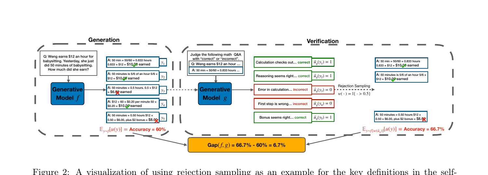
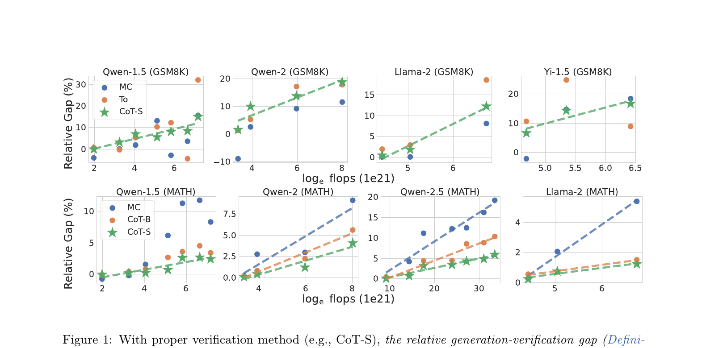
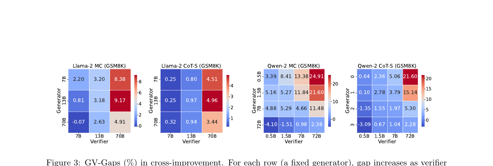
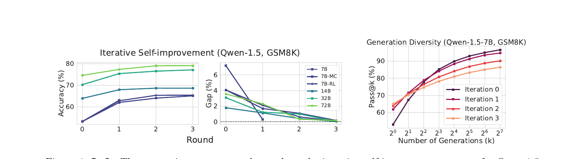
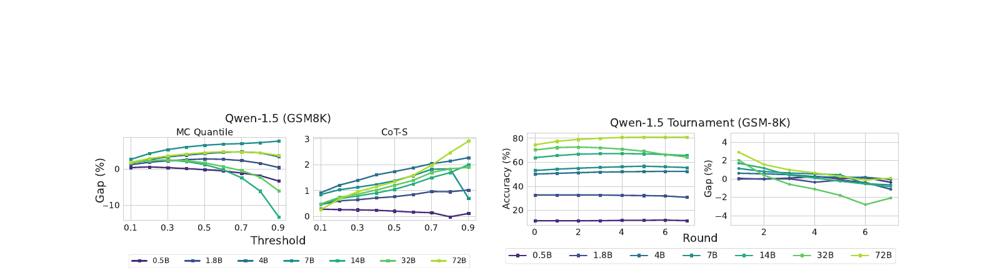

# Mind the Gap: Examining the Self-Improvement Capabilities of Large Language Models

> Song, Zhang, Eisenach, Kakade, Foster, Ghai (CMU, Harvard, Amazon) | ICLR 2025
>
> arXiv: https://arxiv.org/abs/2412.02674

---

## 1. 一言でいうと

> *"We provide a mathematical formulation for self-improvement, which is largely governed by a quantity which we formalize as the **generation-verification gap**."* (Abstract)

LLMの自己改善メカニズムを体系的に分析した論文。新しいアルゴリズムの提案ではなく、**自己改善が「いつ・なぜ」機能するか**の理解に焦点を当てている。

---

## 2. 背景と動機

### LLMの合成データ学習における根本的問題

- モデル生成データでの自己学習 -> **model collapse**（性能劣化）のリスク
- 防ぐには「信頼できる検証器」が必要だが:
  - 人間アノテーション -> コスト高、超人的領域では限界
  - より強力なモデル -> フロンティアモデルでは不可能

論文の出発点となる直感:

> *"Motivated by the intuition that '**verification is easier than generation**', one can hypothesize that the model may act as a better-than-random verifier of its own outputs, enabling self-improvement."* (Section 1)

### 本研究の問い

- 自己改善は**なぜ**機能するのか？
- **いつ**機能し、いつ機能しないのか？
- スケーリングとの関係は？

---

## 3. 自己改善フレームワーク

*Figure 2: Rejection samplingによる自己改善の可視化。生成精度60% -> 検証後66.7% = Gap 6.7%*

### 3つのコンポーネント

| ステップ | 内容 | 具体例 |
|---------|------|--------|
| **(1) Generation** | 複数の候補応答を生成 | 各プロンプトに128応答をサンプリング |
| **(2) Verification** | 各応答の品質をモデル自身が評価 | MC / CoT / Tournament の3手法（後述） |
| **(3) Model Update** | 検証結果で「良い応答」に重みを寄せ、モデルを更新 | Rejection sampling / KL正則化RL |

**検証手法の詳細:**

| 手法 | 略称 | やり方 |
|------|------|--------|
| **Majority Count** | MC | 128回生成した中で同じ答えが何回出たかをカウント。多数派ほど高スコア（多数決の原理） |
| **CoT-Binary** | CoT-B | モデルに「この回答は正しいか？」とYes/Noで判定させる |
| **CoT-Score** | CoT-S | モデルに回答の正しさを連続スコアで評価させる。より細かいシグナルが得られる |
| **Tournament** | To | 2つの回答をペアで比較させ、勝者を残すトーナメント方式 |

**Model Updateの流れ（「分布を再重み付けして蒸留」とは）:**

1. 128個の候補応答に対し、検証スコアに基づく重みを付ける（高スコア＝高い重み）
2. 重みの低い応答を棄却し、高品質な応答だけを残す（Rejection sampling）
3. 残った応答でモデルをファインチューニング＝「蒸留」
4. 結果として、モデルの出力分布が「検証を通過した良い応答」寄りにシフトする

### GV-Gap の定義

> **Definition 2.1 (Generation-Verification Gap).**
>
> $$\text{gap}(f,\; g) \;:=\; J\!\bigl(f[w(\hat{u}_g)]\bigr) \;-\; J(f)$$

- $J(f)$: モデル $f$ の期待効用（＝正しい応答を出す確率の期待値）
- $\hat{u}_g$: 検証器 $g$ が推定した各応答の品質スコア
- $w(\hat{u}_g)$: 品質スコアに基づく重み関数（例: 閾値以上なら採用、未満なら棄却）
- $f[w(\hat{u}_g)]$: 重みで再重み付けした後のモデルの出力分布
- **GV-Gap > 0** ならば、検証によって分布が改善される＝自己改善が可能

自己改善の場合、生成器と検証器が同一モデルなので `gap(f) := gap(f, f)`。

### 相対GV-Gap

既に高精度のモデルではgapの絶対値が小さくなりがちなため、正規化指標を導入:

> **Definition 2.2 (Relative Generation-Verification Gap).**
>
> $$\text{gap}_{\text{rel}}(f) \;=\; \frac{\text{gap}(f)}{1 - J(f)}$$

現在の精度 $J(f)$ から完璧（1.0）までの残り幅 $1 - J(f)$ で割って正規化する。例えば精度90%のモデルで gap=2% なら、$\text{gap}_{\text{rel}} = 2\% \;/\; 10\% = 20\%$（改善余地の20%を自己改善で回収可能という意味）。これにより、異なる精度帯のモデル間で自己改善能力を公平に比較できる。

### 自己改善の3条件

> *"We identify the three key conditions that may bottleneck improvement on model f:"* (Section 2.1)

1. **Improvable Generation** — 生成にばらつきが必要。temperature=0のgreedy decodingでは候補が1つしかなく、検証で選別しようがない

2. **Informative Verification** — 検証器の重み $w(\hat{u}_g)$ と、真の正解度 $u$ が正の相関を持つこと。つまり「検証器が高スコアを付けた回答は、実際にも正解である傾向がある」状態。この相関があれば $\text{gap} > 0$ が数学的に保証される

3. **High-fidelity Model Update** — 蒸留誤差 $\varepsilon_{\text{update}}$ が十分小さいこと:

$$J(f_{t+1}) \;-\; J(f_t) \;\geq\; \text{gap}(f_t,\; g) \;-\; \varepsilon_{\text{update}}$$

> 蒸留誤差とは: 「検証で選別した理想的な分布」と「実際にファインチューニングした後のモデルの分布」のズレ。有限データ・有限ステップでファインチューニングするため、理想の分布を完全には再現できない。この誤差 $\varepsilon_{\text{update}}$ が gap を上回ると改善が帳消しになる

---

## 4. 主要な実験結果

### 実験設定

- **モデル**: Qwen-1.5/2/2.5, Llama-2/3/3.1, Yi-1.5 の全て**ベースモデル**（事後学習の交絡を排除）
- **ベンチマーク**: GSM8K (1,320問), MATH (5,000問), Natural Questions (3,610問), Sudoku 4x4 (288問)
- **サンプリング**: p=0.9, t=0.7, 各プロンプト128応答、各応答1検証

### 結果1: 小さいモデルは自己改善できない

> *"**Small Models can not Self-improve.** For small (in terms of pre-training flops) models such as Qwen-1.5 0.5B, Qwen-2 0.5B and Llama-2 7B, gap(f) is non-positive for nearly all verification methods, even though the models have non-trivial generation accuracy."* (Section 4.1)

自己改善には最低限の指示追従能力と推論能力が必要。Pythia, OPT等でも同様。

### 結果2: CoT検証はMC検証より安定

> *"**CoT Verification is More Stable than MC.** Some MC verification incurs non-positive gap even for medium-sized models such as Qwen-1.5 14/32B and Llama-3/3.1 8B models, while CoT verification always has a positive gap for medium/large-sized models."* (Section 4.1)

### 結果3: GV-Gapは事前学習FLOPsに対してスケール

*Figure 1: 相対GV-GapがFLOPsの対数に対して単調増加*

> *"**gap_rel(f) Scales with Pre-training Flops.** We observe that with certain verification methods (such as CoT-Score), the relative gap grows monotonically with the pre-training flops, demonstrating a scaling property. [...] we hypothesize that [...] gap_rel(f) scales linearly with respect to the logarithm of the pre-training flops."* (Section 4.1)

これは新しいスケーリング則の発見。ただし**絶対gapではこのスケーリングは観察されない**。

### 結果4: 交差検証

*Figure 3: 交差検証のGV-Gaps (%)。行=固定生成器, 列=検証器サイズ*

> *"the GV-gap increases with verifier capability and decreases with generator capability"* (Section 1, Scaling Properties)

- 行方向（固定生成器）: 検証器を大きくすると gap **増加**
- 列方向（固定検証器）: 生成器を大きくすると gap **減少**（生成が上手くなると検証のシグナルが減る）

---

## 5. 改善不可能なタスク

### 事実的タスク（Natural Questions）

> *"We hypothesize that the capability to generate a correct answer is contingent solely on whether the model has been trained with the relevant factual knowledge, and verification would provide little additional signal."* (Section 4.3)

| モデル (Qwen-2) | 0.5B | 1.5B | 7B | 72B |
|---|---|---|---|---|
| Generation Accuracy | 6.51 | 13.87 | 29.09 | 41.45 |
| MC gap (τ = 0.8) | -0.06 | 0.04 | 0.79 | 0.28 |

全モデルでgapが1%未満または負。事実知識では生成と検証の複雑さが同程度のため、検証による追加シグナルがない。

### 数独（Sudoku 4x4）

| モデル (Qwen-2) | 0.5B | 1.5B | 7B | 72B |
|---|---|---|---|---|
| Generation Accuracy | 0.60 | 0.62 | 2.09 | 8.82 |
| gap | -0.09 | 0.14 | -0.07 | **16.99** |
| gap_rel | -0.13 | -0.61 | 0.01 | **20.81** |

理論的には生成(NP-hard) >> 検証(P) だが、**72Bモデルのみ**成功。小さいモデルは検証に必要な推論・計画能力自体が不足。

> **Takeaway on improvable tasks:**
> *"**Factual Tasks:** There is no significant generation-verification gap, given the similarity in complexity between generation and verification.*
> *__Sudoku:__ Despite the exponential computational complexity separation between generation and verification in generalized sudoku, most models fail to self-improve."* (Section 4.4)

---

## 6. 反復的自己改善

*Figure 4: 左: Accuracy/Gapのラウンド推移。右: pass@kで測った有効多様性の変化*

> **Takeaway on iterative self-improvement:**
> - *"**Saturation Limit:** Without new information, iterative self-improvement typically saturates after two or three rounds, regardless of the model's capacity."*
> - *"**Cause of Saturation:** A potential reason for this saturation is a decrease in effective diversity, caused by convergence on incorrect answers for certain questions."* (Section 5)

### 詳細な知見

1. **2-3ラウンドで飽和**: *"the gap diminishes nearly to zero within two or three rounds of self-improvement"*。飽和速度はモデル容量に依存しない。

2. **有効多様性の減少**: 小さいkではpass@kが反復とともに増加（改善の証拠）、大きいkでは減少（多様性の喪失）。正しいが稀な回答を検証できず、誤答への収束が発生する。

3. **MC検証は1ラウンドで飽和**: MC検証では最初のラウンド後にgapがほぼ0。CoTと比較して反復改善に不向き。

4. **フォーマット適合の交絡**: 7B/14Bモデルで $J(f_1) > J(f_0[w(\hat{u})])$ が観察される。これはファインチューニング後に "flexible match" と "exact match" の差が消えるためで、自己改善能力ではなく交絡因子。

---

## 7. 検証メカニズムの分析

*Figure 5-6: 検証手法の閾値とgapの関係（左2つ）、Tournament検証のラウンド数推移（右2つ）*

### 閾値の一貫性
- 各検証手法の最適閾値はモデルファミリー間で一貫
- **小さいモデルで最適閾値を決め、大きいモデルに適用可能** -- 実用的に重要

### 検証手法間の非重複

> *"**GV-Gap is not necessarily positively correlated with generation accuracy**"* (Section 1)

- MC, CoT-B, CoT-Sの出力間のPearson相関は低い（MC-CoT-B: 0.24, MC-CoT-S: 0.39）
- どの検証手法のgapも生成精度と正の相関を示さない（直感に反する結果）

### アンサンブルによる改善

> *"an ensemble of verification can enhance self-improvement"* (Section 1)

- AND演算による検証アンサンブルが有効（異なる検証手法が異なる側面を捉えている）
- 例: Qwen-2 1.5Bで MC単独 5.27 -> MC+CoT-S **7.68**

---

## 8. 論文の主要な貢献まとめ

| 貢献 | 内容 |
|------|------|
| **GV-Gap** | 自己改善能力を測る中心的指標を定式化。*"GV-Gap captures the 'precision' of the model's verification over its own generations"* |
| **スケーリング則** | 相対GV-Gapが log(pre-training FLOPs) に対して単調スケール |
| **飽和メカニズム** | 反復改善が2-3ラウンドで飽和する理由を *"decrease in effective diversity"* で説明 |
| **タスク依存性** | 事実的タスク・推論能力を超えるタスクでは改善不可能であることを実証 |
| **アンサンブル効果** | *"distinct non-overlap property of verification mechanisms"* を発見、組み合わせで改善可能 |

---

## 9. 結論（原文引用）

> *"In this paper, we conduct comprehensive and controlled studies on the LLM self-improvement framework through multiple model families, tasks, and verification mechanisms. We structure the mathematical framework of the self-improvement process and pinpoint the generation-verification gap as a critical metric."* (Section 8)

**訳:** 本論文は、複数のモデルファミリー・タスク・検証手法を通じて LLM の自己改善フレームワークを包括的かつ統制された形で研究した。自己改善プロセスの数理的枠組みを構造化し、**generation-verification gap を中核的な指標**として特定した。

今後の研究方向として論文が挙げている課題:

> - *"Identifying compute-optimal methods for self-improvement across different tasks remains a critical challenge."*
>   - **訳:** タスクごとに **計算コスト最適な自己改善手法** を特定することは依然として重要な課題。
> - *"The decline in the effective diversity of generations during iterative self-improvement presents a significant obstacle."*
>   - **訳:** 反復的自己改善の過程で生成の **有効多様性が低下すること** が大きな障害となっている。
> - *"The distinct non-overlap property of verification mechanisms [...] suggests that combining compositional verification could significantly enhance self-improvement."* (Section 8)
>   - **訳:** 検証手法どうしの **非重複性（それぞれ異なる側面を捉える性質）** は、**検証を合成的に組み合わせる** ことで自己改善を大きく強化できる可能性を示唆している。

---

## 10. 議論ポイント

1. **自己改善の限界**: 2-3ラウンドで飽和する制約を超える方法はあるか？外部データの注入や検証器の交替は有効か？
2. **スケーリング則の実践的意味**: GV-Gapのスケーリングは、事前学習コスト配分の意思決定に使えるか？
3. **Instructモデルでの適用**: 本研究はベースモデルのみ。Instructモデルでは事後学習の交絡でスケーリングが再現されない -- 実用上はどう解釈すべきか？
   - **なぜベースモデルに限定したか**: スケーリング則を測る際の統制変数として pretraining FLOPs 以外を固定するため。Instructモデルは SFT/RLHF のレシピがファミリーごとに異なり、pretraining FLOPs の効果と事後学習の効果が分離できない
   - **事後学習で壊れる条件**: ① 出力分布が尖って **Improvable Generation** が縮む、② RLHF が既に「自己改善の先取り」をしており残存 gap が小さい、③ 分布が固まっていて追加 SFT で動きにくい
   - **普遍的に使える知見**: GV-Gap の概念枠組み・3条件チェックリスト・2-3ラウンド飽和・検証アンサンブルの有効性
   - **Instruct で再測定が必要な部分**: gap_rel の絶対値、log-FLOPs スケーリングの傾き、検証手法間の優劣
   - **実務者向け結論**: 論文のスケーリング則から外挿せず、**自分のモデル・タスクで小規模パイロットを走らせる**のが必須
4. **RLHFとの関係**: この論文のフレームワークでRLHF/DPOを解釈すると、何が見えてくるか？
5. **テスト時計算スケーリングへの示唆**: best-of-nやself-consistency的な手法のスケーリング上限は何で決まるか？
