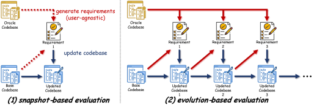
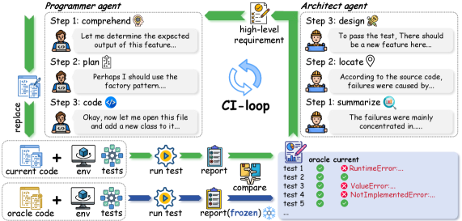
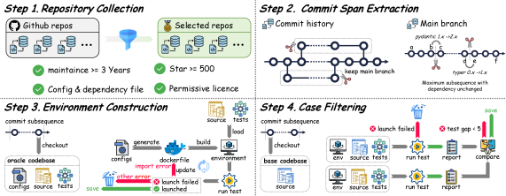
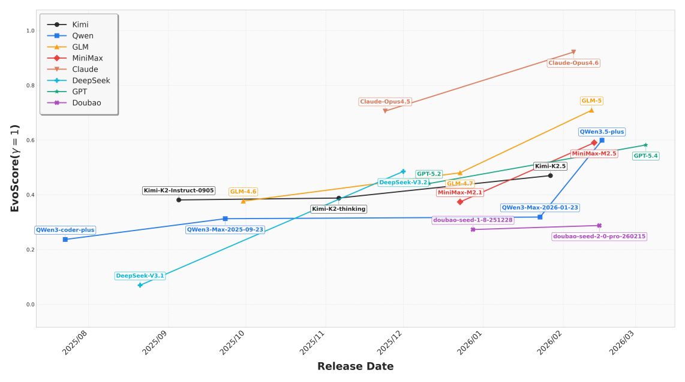
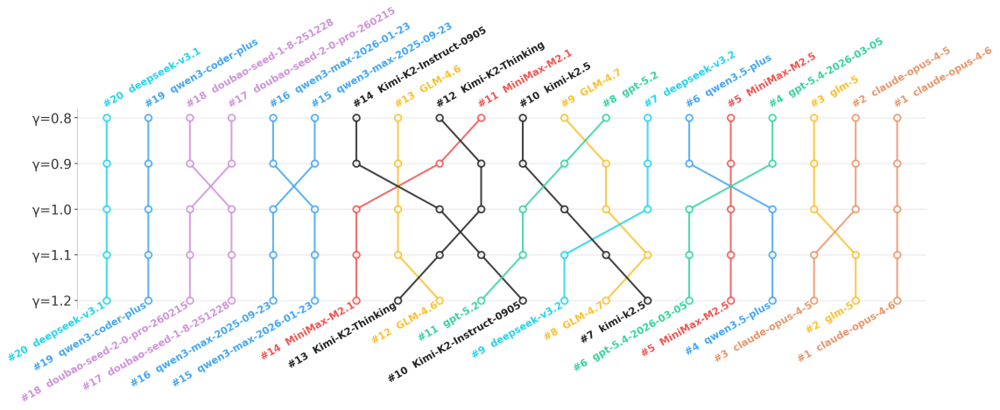
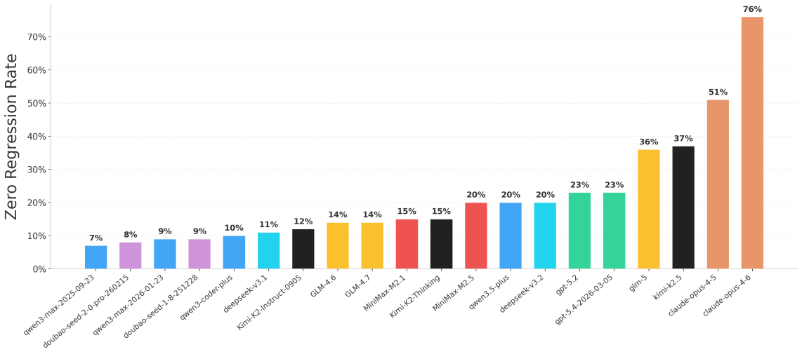

# SWE-CI: Evaluating Agent Capabilities in Maintaining Codebases via Continuous Integration

> Chen, Xu, Wei, Chen, Zhao (中山大学, Alibaba Group) | Preprint 2026
>
> arXiv: https://arxiv.org/abs/2603.03823
> GitHub: https://github.com/SKYLENAGE-AI/SWE-CI

---

## 1. 一言でいうと

> *"The key insight is simple: **Maintainability can be revealed by tracking how functional correctness changes over time.**"* (Abstract)

SWE-benchの「一発修復」評価を超え、平均233日・71コミットにわたる実際の進化履歴を再現して、エージェントの長期的コードベース保守能力を評価する進化型ベンチマーク。

---

## 2. 背景と動機

### 既存ベンチマークの限界

> *"existing benchmarks universally adopt a **snapshot-style protocol**: the agent receives a single, complete requirement and produces a one-shot solution."* (Section 1)

> *"Under this paradigm, an agent that hard-codes a **brittle fix** and one that writes clean, extensible code may both pass the same test suite — **their difference in maintainability is simply invisible**."* (Section 1)

| ベンチマーク | パラダイム | 限界 |
|---|---|---|
| HumanEval / MBPP | 単一ファイル合成 | 実世界のコードベースとの乖離 |
| SWE-bench | Issue -> PR（一発修復） | スナップショット型: 脆い修正もきれいなコードも区別不可 |
| Terminal-bench / tau-bench | ツール操作 / マルチターン | 長期保守性は対象外 |

### 核心的な洞察

> *"an agent's ability to maintain code can **only be revealed through long-term evolution**, where the **consequences of past decisions accumulate** over successive changes."* (Section 1)

> Brooks ("The Mythical Man-Month"): 保守活動はソフトウェアライフサイクル総コストの**60-80%**

---

## 3. スナップショット型 vs 進化型評価

*Figure 1: (1) スナップショット型は静的な一発修復、(2) 進化型は毎反復で要件が動的に変化*

### 数学的定式化

**スナップショット型**（要件は1度だけ生成、静的）:

$$r = \operatorname{require}(c_0,\; c^*)$$

**進化型 (SWE-CI)**（毎反復ごとに動的生成）:

$$r_i = \operatorname{require}(c_i,\; c^*)$$

- $c_0$: 初期コミット / $c^*$: ターゲットコミット / $c_i$: 反復 $i$ 時点のコードベース
- $\operatorname{require}(\cdot,\cdot)$: ギャップから要件を生成する関数（Architect が担当）

> *"This iterative loop ensures that the **consequences of earlier modifications propagate into subsequent iterations**, making the agent's long-term decision quality observable."* (Section 2.1)

---

## 4. Architect-Programmer デュアルエージェントプロトコル

*Figure 3: 実世界のプロフェッショナルチームのCIサイクルをモデル化*

> *"SWE-CI employs an **Architect-Programmer dual-agent evaluation protocol**: starting from the base commit, the agents execute a CI-loop that iteratively generates requirements, modifies source code, and runs tests."* (Abstract)

### Architect エージェント（ギャップ分析・要件作成）

| ステップ | 内容 |
|---------|------|
| **Summarize** | 全失敗テストをレビューし根本原因を特定 |
| **Locate** | ソースコードを精査し欠陥に帰属 |
| **Design** | 改善計画を立案、要件文書を作成 |

- 1反復あたり最大5件の最も緊急な要件のみ（過剰設計の防止）
- 自然言語で期待振る舞いを記述し、実装はProgrammerに委ねる

### Programmer エージェント（コード実装）

| ステップ | 内容 |
|---------|------|
| **Comprehend** | 自然言語要件をコード仕様に翻訳 |
| **Plan** | 実装に必要な作業を計画 |
| **Code** | 仕様を実装 |

---

## 5. データキュレーション（4段階）

*Figure 2: 4段階のキュレーションパイプライン*

| ステップ | 処理 | 結果 |
|---------|------|------|
| Step 1 | GitHub Python全リポジトリ -> 3年活発保守・500スター以上・テストあり | 4,923リポジトリ |
| Step 2 | 依存が変わらない最大コミットスパン抽出、変更行数1,000+のペア | 8,311候補 |
| Step 3 | Dockerfile自動生成・テスト実行・自己修復メカニズム | 1,458ペア |
| Step 4 | テスト合格差5件以上、時間/コミット数ランキングで上位100 | **100サンプル** |

### データセット統計

| 項目 | 値 |
|---|---|
| サンプル数 | 100 |
| 由来リポジトリ | 68 |
| 平均進化スパン | **233日** |
| 平均コミット数 | **71** |
| 最低変更行数 | 500行以上（テスト除く） |
| データ容量 | 約50GB |

---

## 6. 評価指標

### Normalized Change: $a(c) \in [-1, 1]$

$n(c)$: コード状態 $c$ でのテスト合格数。

**改善時**（$n(c) \geq n(c_0)$、$a=1$ で全ギャップ解消）:

$$a(c) = \frac{n(c) - n(c_0)}{n(c^*) - n(c_0)}$$

**回帰時**（$n(c) < n(c_0)$、$a=-1$ で全テスト崩壊）:

$$a(c) = \frac{n(c) - n(c_0)}{n(c_0)}$$

### EvoScore（進化スコア）

> *"SWE-CI introduces **EvoScore (Evolution Score)** as a proxy metric: it measures functional correctness on future modifications, so that agents whose earlier decisions facilitate subsequent evolution score higher, while those that accumulate technical debt see progressively declining performance."* (Section 1)

$$e \;=\; \frac{\displaystyle\sum_{i=1}^{N} \gamma^{i} \, a(c_i)}{\displaystyle\sum_{i=1}^{N} \gamma^{i}}, \quad N = 20$$

- $a(c_i)$: 反復 $i$ 時点の Normalized Change
- $\gamma$: 時間重み。$\gamma > 1$ なら後半ほど重み大、$\gamma < 1$ なら前半ほど重み大、$\gamma = 1$ で単純平均

> *"In EvoScore, we set $\gamma \geq 1$ so that later iterations receive greater weight. [...] **An agent that sacrifices short-term speed for a cleaner, more extensible design will be rewarded** over one that rushes to pass early tests but accumulates technical debt that cripples subsequent evolution."* (Section 2.3)

### Zero-Regression Rate（ゼロ回帰率）
- 全保守プロセスを通じて**一度も回帰が発生しなかった**サンプルの割合

---

## 7. 主要な実験結果

### 評価規模
- **8プロバイダー・18モデル**を評価
- 最大反復数: 20回のデュアルエージェントサイクル
- 総トークン消費: **100億トークン以上**

### Observation 1: LLMのコード保守能力は加速的に進歩

*Figure 4: EvoScoreの変遷。Claude Opusシリーズが圧倒的リード*

> *"**Observation 1: The code maintenance capabilities of LLMs are advancing at an accelerating pace.** Extensive evaluation of 20 models from 8 providers reveals a consistent pattern: within the same provider, newer models always achieve higher scores."* (Section 4.1)

### Observation 2: プロバイダーごとに保守性重点が異なる

*Figure 5: γ値変化に伴うランキングシフト*

> *"**Observation 2: Different providers place varying degrees of emphasis on code maintainability.** [...] When γ < 1, EvoScore assigns higher weights to earlier iterations, favoring models that prioritize immediate gains. Conversely, when γ > 1, later iterations are rewarded, giving an advantage to models that optimize for long-term improvement."* (Section 4.1)

| タイプ | モデル | 特徴 |
|--------|--------|------|
| **長期安定重視** (γ>1で有利) | MiniMax, DeepSeek, GPT | 後半の回帰が少ない |
| **短期成果重視** (γ<1で有利) | Kimi, GLM | 初期改善が大きい |
| **安定** (γ非依存) | Qwen, Doubao, Claude | ランキング変動なし |

### Observation 3: 回帰制御は依然として大きな課題

*Figure 6: ゼロ回帰率ランキング*

> *"**Observation 3: Current LLMs still fall short in controlling regressions during long-term code maintenance.** [...] most models achieve a zero-regression rate below 0.25, **with only the two Claude-opus models exceeding 0.5**. This indicates that current LLMs still struggle to reliably avoid regressions across long-term, multi-round code maintenance, despite their strong performance on snapshot-based tasks."* (Section 4.2)

| モデル | ゼロ回帰率 |
|---|---|
| **Claude Opus 4.6** | **0.76** |
| **Claude Opus 4.5** | **0.51** |
| Kimi-K2.5 | 0.37 |
| GLM-5 | 0.36 |
| GPT-5.2 | 0.23 |
| Qwen3.5-plus | 0.20 |
| DeepSeek-V3.2 | 0.20 |
| Doubao / Qwen3-Max | 0.08-0.09 |

### Observation 5: コードスタイルと真の保守性は異なる

> *"**Observation 5: LLMs excel at surface-level code style but fall short in true code maintainability.**"*
>
> **訳:** LLM は **表層的なコードスタイル**（命名・整形・規約遵守）には優れるが、**真の保守性**では人間に及ばない。

> *"**Observation 6: LLMs generate more concise patches than humans, yet at the cost of maintainability.**"*
>
> **訳:** LLM は人間よりも**簡潔なパッチ**を生成するが、その代償として保守性を犠牲にしている。

> *"LLMs achieve lower MI scores with fewer changed lines, whereas human solutions, though more verbose, attain higher maintainability. This suggests that the additional lines written by humans are not redundant, but rather **purposeful investments in code quality**."* (Section 4.3)
>
> **訳:** LLM は変更行数が少ない割に MI（Maintainability Index）スコアが低く、逆に人間の解法は冗長に見えても保守性スコアが高い。つまり人間が書き足している行は**無駄な記述ではなく、コード品質への意図的な投資**であることを示唆する。

**補足:**
- **MI（Maintainability Index）**: Halstead Volume・Cyclomatic Complexity・行数から算出される保守性の定量指標。高いほど保守しやすい
- **示唆**: 「短く書ける ≠ 良い」。LLM は短絡的な修正で**技術的負債を先送り**しがち。人間の"冗長さ"にはエラーハンドリング・抽象化・防御的プログラミングなどが含まれている

---

## 8. SWE-bench との差別化

| 比較軸 | SWE-bench | SWE-CI |
|---|---|---|
| 評価パラダイム | スナップショット型 | **進化型** |
| タスク | 単一Issue -> 単一PR | **長期進化（233日・71コミット）** |
| 要件生成 | 静的（事前固定） | **動的（毎反復再生成）** |
| エージェント | 単一エージェント | **Architect-Programmer デュアル** |
| 評価指標 | バイナリ（通過/不通過） | **連続値（EvoScore [-1,1]）** |
| 回帰評価 | なし | **Zero-Regression Rate** |
| 保守性評価 | 不可能 | **進化を通じて顕在化** |

---

## 9. 結論（原文引用）

> *"We present SWE-CI, a repository-level benchmark that **operationalizes maintainability as functional correctness on future modifications** — making visible what snapshot-based benchmarks cannot: **the cumulative consequences of an agent's design decisions as the codebase evolves**. Extensive experiments across 20 models from 8 providers reveal that current LLMs still struggle to sustain code quality over extended evolution, particularly in controlling regressions."* (Section 5)

**訳:** 本論文は SWE-CI を提案する。これはリポジトリレベルのベンチマークであり、**保守性を「将来の改修における機能的正しさ」として操作的に定義**した点が特徴である。これによりスナップショット型ベンチマークでは見えなかったもの ―― **コードベースの進化に伴いエージェントの設計判断がもたらす累積的な帰結** ―― が可視化される。8プロバイダー・20モデルに及ぶ広範な実験により、**現行の LLM は長期的なコード品質の維持、特に回帰の抑制において依然として困難を抱えている**ことが明らかになった。

**要点の整理:**
- **コア貢献**: 保守性を「未来の変更に対するテスト合格度」という観測可能な量に置き換えた
- **可視化したもの**: 「今のコミットがきれいか」ではなく「**今の判断が3か月後のコードベースをどれだけ破壊するか**」
- **実証結果**: どのモデルも長期進化での品質維持は不十分で、**回帰制御がフロンティアモデルでも未解決の課題**として残っている

---

## 10. 議論ポイント

1. **保守性の重要性**: 生成AIツールが作るコードの長期保守コストは考慮されているか？「テストが通ればOK」の評価は十分か？
2. **回帰制御**: なぜ Claude Opus のみが高い回帰制御率を達成できるのか？長期依存関係の理解能力？
3. **Architect-Programmer分離の意義**: デュアルエージェント設計は実世界のチーム開発をどの程度反映しているか？
4. **SWE-bench Verified 93.9% vs SWE-CI**: Mythos Previewが SWE-bench で93.9%を達成しても、SWE-CIでは回帰制御が課題として残る -- ベンチマークの「格」の違いをどう評価するか？
5. **EvoScoreのγ設計**: 長期安定性をどの程度重視すべきか？γの選択がモデル評価に与える影響は？
6. **実用的含意**: 自動コード保守エージェントの実運用に向けて、最も重要な改善領域は何か？
