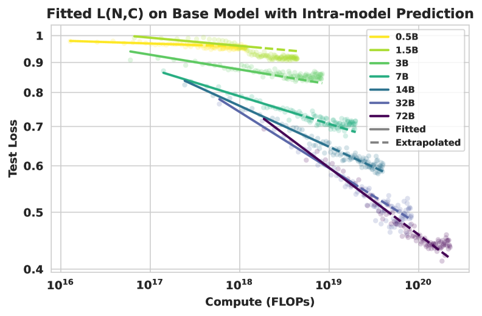
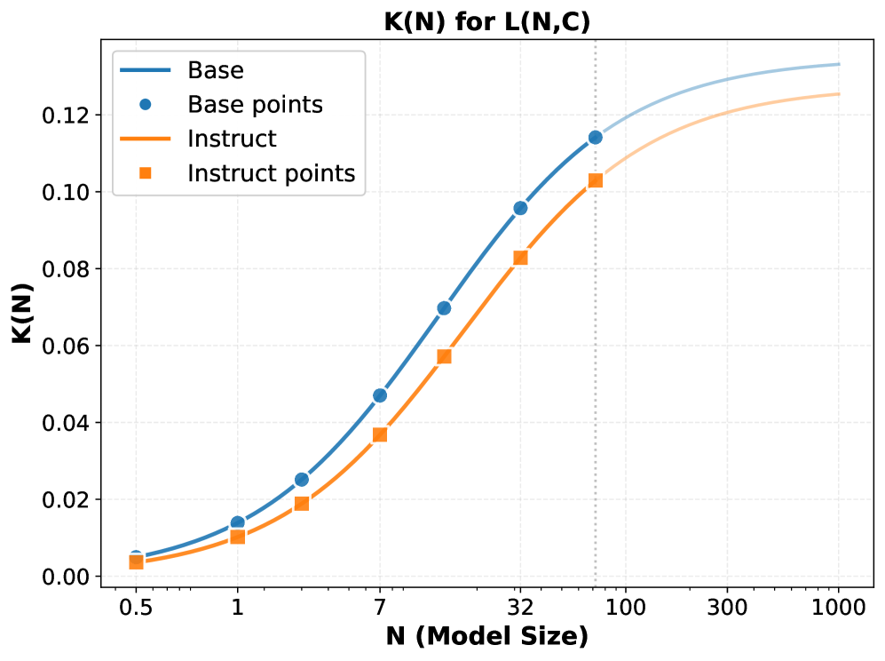
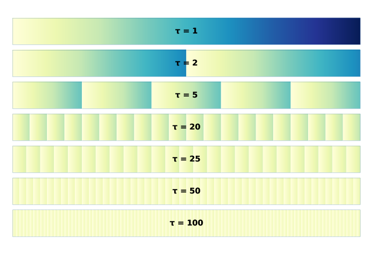
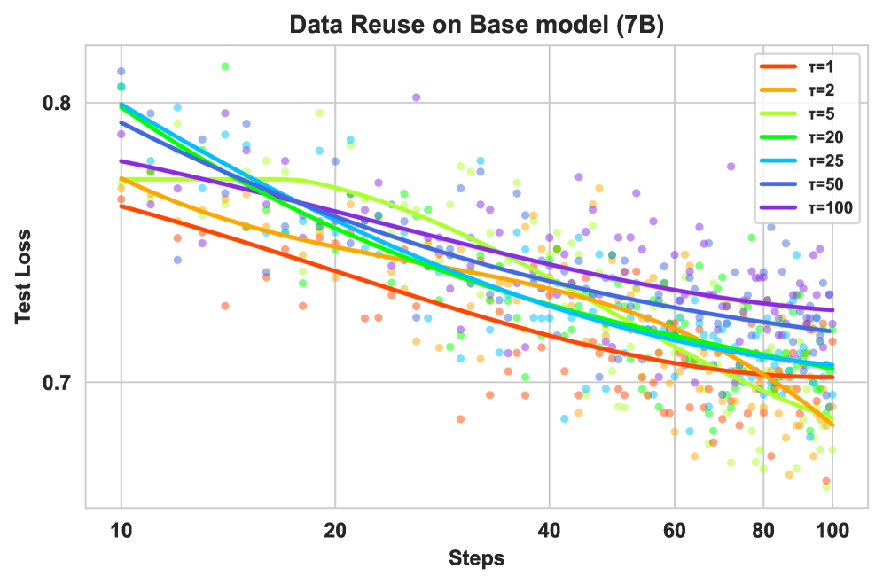

# Scaling Behaviors of LLM Reinforcement Learning Post-Training

> Tan, Geng, Yu, Zhang, Wan et al. (Shanghai AI Lab × Oxford ほか) | ACL 2026 Main
>
> arXiv: https://arxiv.org/abs/2509.25300 (v4, 2026-04-17)

---

## 1. 一言でいうと

> *"We present a systematic study of reinforcement learning (RL) post-training scaling for large language models on mathematical reasoning, using the full Qwen2.5 dense series (0.5B–72B)."* (Abstract)

事前学習で確立された predictable scaling と同等の枠組みを **RL ポストトレーニング** にも与える研究。test loss と計算量・データ量の関係を

$$\log L(N, X) \;=\; -k(N)\,\log X \;+\; E(N)$$

という power-law で記述し（$N$ = モデルパラメータ数、$X$ = データ量、$L$ = test loss、$k(N)$ = 学習効率の slope、$E(N)$ = $N$ で決まる切片）、さらに**学習効率 $k(N)$ 自体が**

$$k(N) \;=\; \frac{K_{\max}}{1 + N_0/N}$$

**の形で飽和する**ことを観測した（$K_{\max}$ = 学習効率の上限、$N_0$ = $k(N)$ が $K_{\max}$ の半分になる半飽和モデルサイズ）。「モデルを大きくすれば常に RL 効率も伸びる」という素朴な期待に、解析的な天井を与える論文。

---

## 2. 背景と動機

### 問題: RL post-training にスケーリング則の体系がない

> *"While pre-training scaling laws are well-established, the scaling behaviors of RL post-training remain underexplored."* (Section 1)

- pretraining: Chinchilla 則をはじめ、計算量 vs データ量 vs 性能の関係が解析的に整理されている
- RL post-training: 「大モデルほど RL の利得が大きい」「データを増やすか繰り返すか」「いつ saturate するか」が経験則レベルでしか語られていない
- 結果として、**RL の計算予算をどう配分するかの意思決定が場当たり的**になっている

### 本研究の問い

- RL post-training の性能は計算量・データ量に対してどう変化するか？
- モデル容量 $N$ が学習効率にどう効くか？効率自体に上限はあるか？
- データが限られたとき、ユニーク量を増やすのと同じデータを多回反復するのではどちらが効くか？

---

## 3. 実験設定

### モデルとアルゴリズム

| 項目 | 設定 |
|---|---|
| モデル系列 | Qwen2.5 dense **0.5B / 1.5B / 3B / 7B / 14B / 32B / 72B** |
| 状態 | base / instruct **両方** |
| RL アルゴリズム | **GRPO**（KL正則化込み、報酬は数学正答報酬） |
| In-domain 評価 | 訓練分布からの数学問題 |
| OOD 評価 | AIME2024, AMC2023, GSM8K, MATH500, HumanEval, Zebra Puzzle, SuperGPQA |

> *"The full dense Qwen2.5 family spans two orders of magnitude in parameter count, enabling us to fit scaling laws over a wider range than has been possible before in RL post-training."* (Section 3)

### 評価軸

- **計算量 $C$** (FLOPs) と **データ量 $X$**（ユニークサンプル数）に対する test loss の挙動
- 学習効率 $k(N)$ を power-law 係数として推定
- データ制約 ablation: 同じデータを反復するか、新規データを足すか

---

## 4. 主要な実験結果

### 結果1: RL 計算-性能関係は power-law でよくフィットする

*Figure 1: 各モデルサイズで $\log L$ vs $\log X$ が直線に乗る（log-linear 検証）。slope の傾きが $k(N)$、切片が $E(N)$ に対応*

$$\log L(N, X) \;=\; -k(N)\,\log X \;+\; E(N)$$

- $L(N, X)$: モデル容量 $N$・データ量 $X$ の下での test loss
- $k(N)$: **学習効率**（slope）。$N$ に依存する正の係数
- $E(N)$: モデル容量に紐づくバイアス項

> *"log L(N, X) is well-approximated by a power-law in X, with a slope k(N) that grows with model capacity but eventually saturates."* (Section 4)

base モデル・instruct モデルの双方で同じ関数形が確認できる点が頑健性の論拠。

### 結果2: 学習効率 $k(N)$ は飽和する

*Figure 2: 学習効率 $k(N)$ が $N$ に対して飽和曲線（$k(N) = K_{\max}/(1+N_0/N)$）をたどる。base / instruct の両方で同形が確認できる*

$$k(N) \;=\; \frac{K_{\max}}{1 + N_0/N}$$

- $K_{\max}$: 学習効率の理論的上限（large-$N$ での漸近値）
- $N_0$: 半飽和点（$k(N)$ が $K_{\max}$ の半分になるモデルサイズ）

**含意の整理:**

| モデル領域 | $k(N)$ の挙動 | 直感 |
|---|---|---|
| $N \ll N_0$ | $k(N)$ が急峻に伸びる | 小モデルは RL 効率の伸びしろが大きい |
| $N \sim N_0$ | $k(N)$ が $K_{\max}$ の半分付近 | 中規模で「効率投資」が最も効く |
| $N \gg N_0$ | $k(N)$ が $K_{\max}$ に飽和 | これ以上モデルを大きくしても **効率では稼げない** |

> *"Although larger models are consistently more efficient, the marginal gain in efficiency shrinks as N grows — k(N) approaches a finite ceiling K_max."* (Section 4)

「大モデルほど効率で勝つ」と「効率そのものがサチる」は表面的には矛盾するが、飽和式が両者を統合する。**RL は小モデルには効きにくく、大モデルほど安価に伸びる。ただし天井がある。**

### 結果3: データ制約下では「ユニーク量」より「総ステップ数」

*Figure 3: データ再利用スキーマ。**各行が異なる再利用係数 $\tau$ の訓練ラン**を表す。$\tau = 1$ は「全データを 1 回だけ使う」、$\tau = 100$ は「1/100 の部分集合を 100 回反復」を意味する。**全ランで総データ消費量は同じ**で、ユニークサンプル数だけが変わる*

*Figure 4: Figure 3 のスキーマで実験した結果。**$\tau \leq 25$ までは性能劣化が観測されない**。総最適化ステップ数が固定なら、ユニークサンプル数を 25 倍減らしても最終 test loss が変わらない*

> *"Under data-constrained regimes, repeated optimization over a smaller, higher-quality dataset matches or exceeds training on a larger, lower-quality dataset of the same total optimization steps."* (Section 5)

- データ制約下では **高品質データの繰り返し再利用** が有効
- 最終性能は **ユニークサンプル数ではなく総最適化ステップ数** に主に支配される
- pretraining での data deduplication 議論と対照的: RL では「同じ問題を何回解くか」が直接効く

### 結果4: 大モデルほど計算・データ両面で一貫して効率が高い

| Qwen2.5 サイズ | RL 効率（$k(N)$ の相対値） | データ効率 |
|---|---|---|
| 0.5B / 1.5B | 低（小さい slope） | 同じデータでも伸びが鈍い |
| 7B / 14B | 中 | 中程度の繰り返しで底上げ可 |
| 32B / 72B | 高（$K_{\max}$ 付近） | 少ない繰り返しで漸近値に近づく |

---

## 5. ScaleRL との位置関係

| 比較軸 | Tan et al.（本論文） | Khatri et al. (ScaleRL) |
|---|---|---|
| フィット関数形 | **power-law** in (compute, data) | **sigmoid** in compute |
| スケール軸 | モデルサイズ $N$ と データ量 $X$ | RL レシピごとの compute-performance 曲線 |
| 主役 | 学習効率 $k(N)$ の飽和 | 漸近性能 $A$ と効率 $B$ の分離 |
| 主張 | 「容量を増やせば効率は伸びる、ただし天井あり」 | 「レシピ選択は漸近を動かす、細部は効率を動かす」 |
| 評価指標 | test loss + OOD ベンチ | 主に validation loss / pass@k |

> **整理**: 関数形は対立的に見えるが、計算量レンジ・評価指標・着眼点が異なる。Tan の $k(N)$ 飽和は「容量側の天井」、ScaleRL の sigmoid は「レシピごとの asymptote の存在」を語っており、両者は相補的に読むのが妥当。

---

## 6. 制限・注意点

1. **タスク特化**: 数学推論のみで検証。コード / agentic / 汎用 reasoning でも同じ関数形が出るかは未確認
2. **モデル系列依存**: Qwen2.5 dense のみ。Qwen-MoE / LLaMA / DeepSeek 系列で $K_{\max}, N_0$ がどう変わるかは未検証
3. **RL アルゴリズム依存**: 主に GRPO。DAPO / GSPO / CISPO / RS-GRPO で係数や $k(N)$ の形が変わる可能性
4. **$k(N)$ saturation の外挿**: 72B までの観察で 100B+ 規模の外挿は理論的裏付けが弱い
5. **データ制約下での結論**: 十分大きいデータ領域では overfitting / memorization が顕在化する可能性
6. **ScaleRL との関数形の整合**: sigmoid vs power-law のどちらが「真」かはレンジ依存で確定的ではない

---

## 7. 議論ポイント

1. **$k(N)$ 飽和の実用的含意**: 72B 超のモデルに RL 予算を厚く配分する根拠は、効率面からは弱くなる。事業判断としてどう扱うか？
2. **データ再利用 vs 新規データ収集**: 「総最適化ステップが支配的」という結論は、RL データセットを際限なく拡張するインセンティブを下げる。データ収集戦略を変えるべきか？
3. **GRPO 依存性**: CISPO / GSPO のような off-policy 性が強いアルゴリズムでは $k(N)$ の形が変わる可能性がある。次の論文（ScaleRL）はまさにこの方向の答えを部分的に与える
4. **base と instruct の頑健性**: 関数形が両者で同じというのは強い主張。事後学習レシピの差を吸収しているのか、それとも RL 効率は本質的に容量で決まるのか？
5. **ScaleRL との対立**: sigmoid と power-law、どちらの関数形を実務の予算計画に使うべきか？
