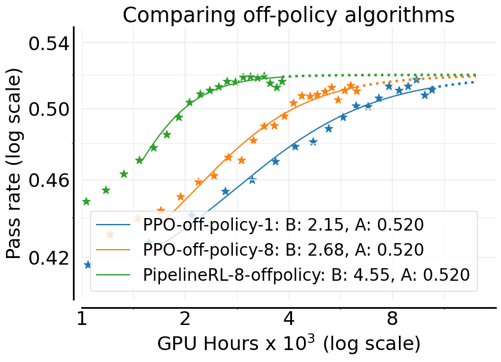
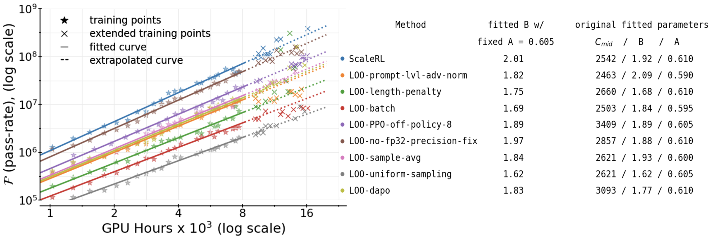
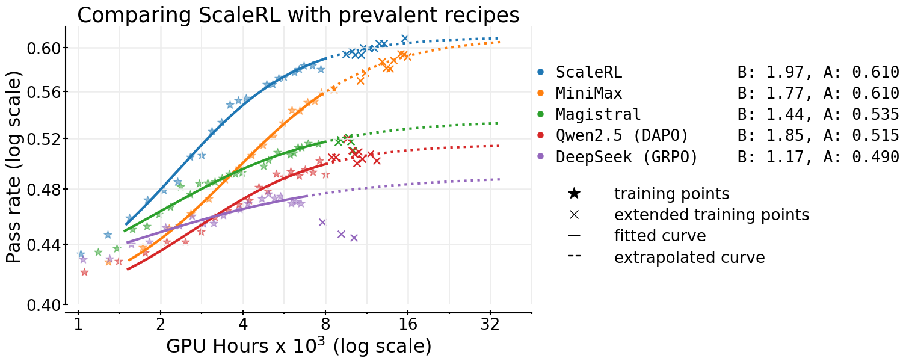
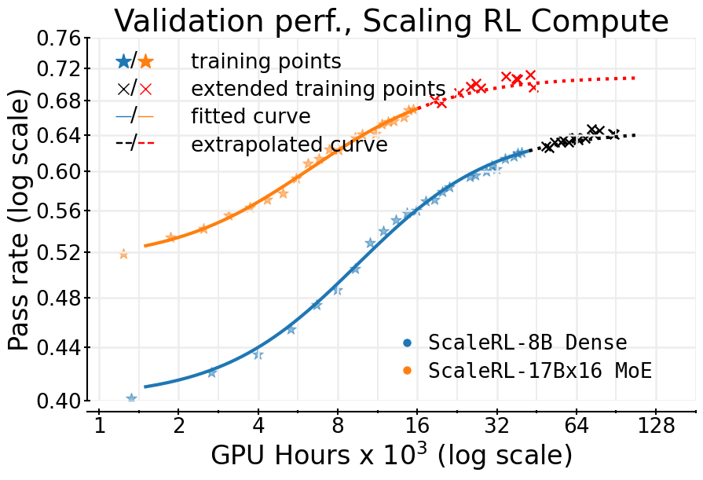

# The Art of Scaling Reinforcement Learning Compute for LLMs (ScaleRL)

> Khatri, Madaan, Tiwari, Bansal, Duvvuri, Zaheer, Dhillon, Brandfonbrener, Agarwal (Meta AI × UT Austin ほか) | ICLR 2026 Oral
>
> arXiv: https://arxiv.org/abs/2510.13786 / OpenReview: FMjeC9Msws
> Code: https://www.devvrit.com/scalerl_curve_fitting

---

## 1. 一言でいうと

> *"We present the first large-scale systematic study (over 400,000 GPU-hours) that brings pretraining-style predictable scaling to RL training of LLMs."* (Abstract paraphrase)

RL 訓練に **pretraining 相当の予測可能スケーリング** を持ち込んだ基礎論文。計算-性能曲線を **sigmoid** でフィッティングし、設計選択を「**漸近性能 A を動かすもの**」と「**計算効率 B を動かすもの**」に切り分け、ベストプラクティス統合として 8 要素レシピ **ScaleRL** を提案。10万GPU時間規模の単一ランで検証損失を**事前予測して的中**させた。

---

## 2. 背景と動機

### 問題: RL に "Chinchilla" がない

> *"Pretraining has a mature science of predictable scaling. RL training does not."* (Section 1, paraphrase)

- pretraining: モデル容量・データ量・計算量に対する性能曲線が安定的にフィットでき、小規模実験から大規模実行の挙動を**外挿できる**
- RL 訓練: 「あるレシピで学習が崩壊する」「ベンチが伸びたり伸びなかったり」が経験則レベル。**何がベース性能を決め、何が効率を決めるのか**の切り分けが曖昧

### 本研究の問い

1. RL 訓練の計算-性能関係はどんな関数形で書けるか？
2. RL レシピの個々の設計選択（損失、集約、off-policy、curriculum 等）は、**漸近性能** と **計算効率** のどちらに効くか？
3. 小規模実行から大規模実行の挙動を予測できるか？

---

## 3. スケーリングのフィット: sigmoid

### sigmoid フィット (Eq. 1)

論文 §3 の Equation (1):

$$R_C - R_0 \;=\; (A - R_0)\cdot\frac{1}{1 + (C_{\text{mid}}/C)^B}$$

- $C$: 計算量（GPU-hours）
- $R_C$: 計算量 $C$ における期待報酬（pass rate）
- $R_0$: 初期報酬（訓練開始時、$C \to 0$ の極限）
- $A$: **漸近報酬利得 (Asymptotic Reward Gain)**, $0 \leq A \leq 1$。$C \to \infty$ で $R_C \to A$
- $B$: **計算効率 (Compute Efficiency)** を決める指数（$B > 0$）
- $C_{\text{mid}}$: 利得の半分に到達する計算量の中点（曲線の中心）

> $\log C$ で書き直すと sigmoid 形になる:
>
> $$R_C - R_0 \;=\; (A - R_0)\cdot\sigma\!\bigl(B\,(\log C - \log C_{\text{mid}})\bigr)$$
>
> つまり「**$\log C$ 軸上の sigmoid**」で、$A$ が上限、$B$ が立ち上がり傾き、$C_{\text{mid}}$ が中点を決める3パラメータモデル。

> *"This framework in Equation 1 allows researchers to extrapolate lower-compute runs to higher compute budgets."* (Section 3)

pretraining の power-law と違い RL は sigmoid 形（飽和あり）になる、というのが ScaleRL の関数形上の主張。

### A と B の分離分析

ScaleRL は ablation を **A への影響** と **B への影響** に分けて評価する。これにより:

- **漸近性能を動かす設計選択** = レシピの本質。違うものを採用すれば天井が変わる
- **計算効率だけを動かす設計選択** = レシピのチューニング。漸近値は同じだが、収束速度が違う

> *"Most settings (loss aggregation, regularization, curriculum, off-policy algorithm) only modulate efficiency — they leave the asymptote essentially unchanged."* (Section 4, paraphrase)

*Figure 1: off-policy アルゴリズム3手法の sigmoid フィット。**A は3手法とも 0.520 で同一**（同じ漸近値）、$B$ だけが PPO-off-1: 2.15 → PPO-off-8: 2.68 → PipelineRL-8: 4.55 と倍以上変化。「設計選択が B のみを動かす」典型例で、ScaleRL の中心主張をそのまま可視化している*

### 「漸近 A を動かす」設計選択の例

| 設計選択 | A への効き | B への効き | 解釈 |
|---|---|---|---|
| **LM ヘッド精度 (FP32 vs bf16)** | **A=0.52 → A=0.61 と劇的に上昇** | — | numerical な情報損失が漸近値を直接削っていた |
| **損失タイプ (GRPO → CISPO)** | クリップ比 $\varepsilon$ への感度を下げ A が安定 | 副次的に B も改善 | クリップが多発する領域で漸近値が削られる |
| **ゼロ分散フィルタリング** | 再サンプリングで A が伸びる | — | 学習信号のないバッチを単にドロップすると有効データが減る |

---

## 4. ScaleRL レシピ（8要素）

ScaleRL は新規アルゴリズムではなく、**既存手法の最適組み合わせ**。各要素は **leave-one-out ablation を 16,000 GPU-hours/ラン** で独立検証している。

*Figure 2: 8要素の leave-one-out ablation。各要素を一つだけ ScaleRL の選択から差し戻し、漸近性能 $A$ と効率 $B$ の変化を可視化*

| # | 要素 | 採用設定 | 競合と選ばなかった理由 |
|---|---|---|---|
| 1 | **非同期 RL セットアップ** | **PipelineRL**（off-policy パラメータ k=8） | ストリーミング方式で on-policy 近似が可能。PPO-offpolicy の alternating phase より安定 |
| 2 | **生成長制御** | **Forced length interruption**（強制打ち切り） | length penalty に置換しても性能改善なし。打ち切り方式を採用 |
| 3 | **損失タイプ** | **CISPO**（[MiniMax-M1](03-minimax-m1.md) 由来） | GRPO/DAPO はクリップ比 ε_max に高感度。CISPO は robust |
| 4 | **損失集約** | **Prompt-level averaging**（DAPO方式） | Sample average (GRPO) / Token average より漸近性能で優位 |
| 5 | **アドバンテージ正規化** | **Batch-level**（バッチ全体で標準化） | Prompt-level (GRPO) より漸近性能が高い |
| 6 | **LM ヘッド精度** | **FP32 precision at logits** | bf16 のままでは漸近性能 A=0.52 → FP32 で A=0.61 へ**劇的改善** |
| 7 | **ゼロ分散フィルタリング** | **Effective batch**（再サンプリング） | 0-variance プロンプトを単にドロップする方式より漸近性能で優位 |
| 8 | **データカリキュラム** | **No-Positive-Resampling**（pass rate ≥ 0.9 を永久除外） | 「一度簡単になったプロンプトはその後も簡単」の観察に基づく |

### ベース RL アルゴリズム
- GRPO 類似だが **KL正則化項なし**（MiniMax, Magistral 等の大規模訓練報告に沿う）
- **Asymmetric DAPO clipping** を含める（entropy collapse 回避・出力多様性維持のため広く採用）

---

## 5. 主要レシピとの比較

*Figure 3: 主要 5 レシピの sigmoid フィッティング比較。漸近性能 $A$ と効率 $B$ がレシピごとに表示されている — **ScaleRL: A=0.610 / B=1.97**、**MiniMax: A=0.610 / B=1.77**、Magistral: A=0.535 / B=1.44、Qwen2.5 (DAPO): A=0.515 / B=1.85、DeepSeek (GRPO): A=0.490 / B=1.17。**ScaleRL と MiniMax だけが $A=0.610$ で並ぶ**（CISPO + Prompt avg + FP32 を共有）。GRPO/DAPO 系は漸近値そのものが低い*

論文 §A.16 の比較表（上図と整合）:

| レシピ | 損失 | 集約 | off-policy | LM ヘッド精度 | $A$ | $B$ | ScaleRL との差分 |
|---|---|---|---|---|---|---|---|
| **ScaleRL** | **CISPO** | Prompt avg | PipelineRL (k=8) | **FP32** | **0.610** | 1.97 | — |
| **MiniMax** | **CISPO** | Prompt avg | PPO-off | **FP32** | **0.610** | 1.77 | **off-policy（PipelineRL でない）だけが違う** |
| Magistral | DAPO 様 | Prompt avg | PipelineRL | — | 0.535 | 1.44 | 損失タイプ |
| Qwen2.5 (DAPO) | DAPO (ε_max=0.26) | Prompt avg | PPO-off-8 | — | 0.515 | 1.85 | 損失タイプ・off-policy |
| DeepSeek (GRPO) | GRPO (ε=0.2) | Sample avg | PPO-off-8 | — | 0.490 | 1.17 | 6k GPU-hours 後に truncation で不安定化 |

> **読みどころ**: ScaleRL と MiniMax は **CISPO + Prompt avg + FP32** という核を共有し、違いは off-policy 実装だけ。図でも両者の漸近値 $A=0.610$ が一致している。CISPO 採用が ScaleRL / MiniMax の合流点であり、次の論文 [03-minimax-m1.md](03-minimax-m1.md) で CISPO の中身に降りる。

---

## 6. predictable scaling の実証

*Figure 4: ScaleRL の predictable scaling 実証。**実線**＝50,000 GPU-hours の訓練データから sigmoid をフィット、**点線**＝そのフィットを 100,000 GPU-hours へ外挿、**×印**＝実測値。外挿曲線と実測値がほぼ一致し、小規模実行から大規模実行が予測可能であることを示している*

- 小規模ラン（数千 GPU 時間）で sigmoid をフィット → 大規模ラン（10万 GPU 時間）の検証損失を**事前に予測**
- 実測と外挿が一致することで、ScaleRL レシピが **predictable** であることを実証
- 複数軸（batch size 2.5×、context 32K tokens、multi-task RL、モデルサイズ）でも predictable scaling を確認

### 安定性の運用シグナル

> *"Truncation rate is a leading indicator of instability: when it climbs above 10–15% the run is heading off the predictable curve."* (Section 4, paraphrase)

| モデル | truncation rate の挙動 |
|---|---|
| ScaleRL 8B (dense) | 全訓練の 90% 超で <5% |
| Scout (MoE) | 90% 超のステップで <1% |
| 不安定レシピ（DeepSeek GRPO 模倣） | 6k GPU 時間以降で急上昇 → 予測曲線から外れる |

---

## 7. ScaleRL の主張を整理

| 主張 | 内容 |
|---|---|
| **関数形** | RL の計算-性能関係は **sigmoid** でよくフィットする |
| **A vs B の分離** | 漸近性能 A はレシピ（と容量）が決め、計算効率 B は細部のチューニングが決める |
| **設計の天井効果** | LM ヘッド精度・損失タイプ・ゼロ分散処理は **A を動かす**。集約・curriculum 等は **B を動かす** |
| **predictable scaling** | 安定レシピは小規模実行から大規模実行を外挿できる |
| **CISPO 採用** | クリップ比への感度を下げ A を保つため、損失タイプとして CISPO を選択 |

---

## 8. 制限・注意点

1. **「漸近性能」の定義**: フィットした sigmoid の上限値。実測が十分近づいていないレシピの比較は外挿を含む
2. **A/B の境界はタスク依存**: どの設計選択が A に効きどれが B に効くかはタスク・モデル規模で変動しうる
3. **安定性前提**: 不安定なレシピ（報酬ハッキング・entropy collapse 等）は predictable scaling が破綻
4. **評価軸**: 主に validation loss / 単一ベンチ。pass@k や分布外一般化の扱いは別論点（Yue et al. / ProRL の軸とは直交）
5. **GPU 時間ベース**: rollout/学習のミスマッチ（Flash-RL/TIS 系の議論）と絡み、絶対値の移植には注意
6. **Tan et al. (前論文) との関数形不一致**: power-law と sigmoid のどちらが妥当かは計算量レンジ依存。両者は相補的に読むのが妥当

---

## 9. 議論ポイント

1. **A と B の切り分けの実務価値**: 「これは漸近値を動かす、これは効率しか動かさない」という分類は、小規模 ablation で判定できる。実務の RL レシピ開発のフローはどう変わるか？
2. **CISPO 採用の必然性**: ScaleRL チームが GRPO/DAPO を退け CISPO を採用した理由（クリップ感度 → A への効き）は、MiniMax-M1 の主張と整合する。両者が独立に CISPO を採用したことの意味は？
3. **FP32 LM ヘッド**: 「bf16 のままだと漸近値が削れる」は数値精度が **A を動かす**設計選択の代表例。他にこのレベルで A を動かす要素は？（attention 実装、optimizer の数値精度、報酬の量子化など）
4. **sigmoid vs power-law**: [Tan et al.](01-scaling-behaviors-rl.md) は power-law を主張。どちらの関数形を予算計画に使うべきか？計算量レンジと指標（loss vs accuracy）で使い分けるべきか？
5. **predictable scaling の射程**: 「不安定なレシピは外挿が破綻する」というのは、安定なレシピを選ぶインセンティブを生む。一方で、現状不安定なものを安定化させる方向の研究はどう位置づけるか？
