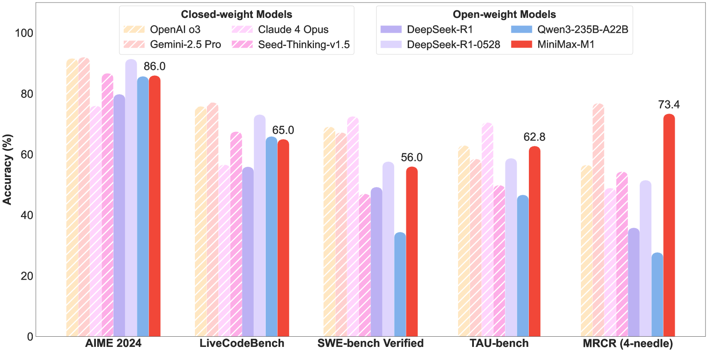
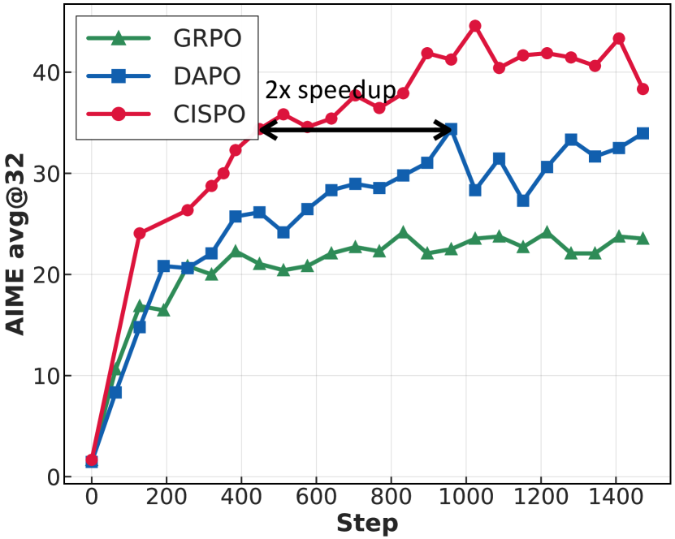
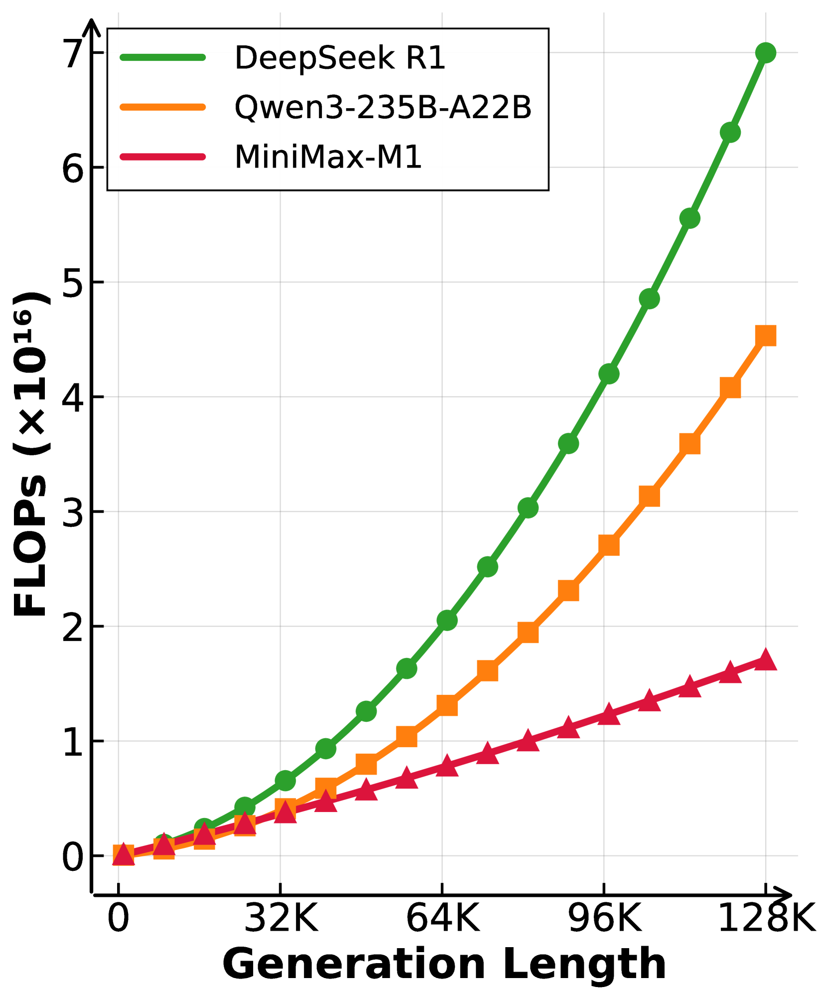

# MiniMax-M1: Scaling Test-Time Compute Efficiently with Lightning Attention

> MiniMax Team | 2025年6月（テクニカルレポート、査読なし）
>
> arXiv: https://arxiv.org/abs/2506.13585
> GitHub: https://github.com/MiniMax-AI/MiniMax-M1

> **本発表での主軸**: モデル全体の解説は短く済ませ、提案 RL アルゴリズム **CISPO (Clipped Importance Sampling Policy Optimization)** を議論の中心に据える。前論文 [ScaleRL](02-scalerl.md) が損失タイプとして採用しているのがこの CISPO。

---

## 1. 一言でいうと

> *"We use a novel RL algorithm, CISPO, that clips importance sampling weights rather than token updates, outperforming competing RL variants."* (Abstract paraphrase)

hybrid MoE + lightning attention の **456B/45.9B activated** な推論モデルで、ネイティブ 1M context・thinking budget 40K/80K の 2 版を公開。フル RL 訓練を **512 H800 × 3週間 / $534,700** で完了したコスト公開も話題。最大の技術的貢献は新規 RL アルゴリズム **CISPO** で、これが ScaleRL の損失タイプにも採用された。

---

## 2. モデル概要（短め）

### アーキテクチャ

| 項目 | 値 |
|---|---|
| ベース | MiniMax-Text-01 の hybrid MoE + **lightning attention** |
| パラメータ | **456B total / 45.9B active per token** |
| コンテキスト | **ネイティブ 1M tokens**（DeepSeek R1 の 8 倍） |
| thinking budget | **40K / 80K** の 2 版を公開（40K は 80K 訓練の途中段階） |

> *"Lightning attention enables efficient test-time compute scaling."* (Abstract paraphrase)

- lightning attention は線形時間アテンション系。長文脈・長推論で計算量が爆発しないため **test-time compute をスケールしやすい**
- 1M context により、エージェント的なツール利用や長い思考連鎖をネイティブに扱える

### RL 訓練のコスト公開

| 項目 | 値 |
|---|---|
| GPU | 512 × H800 |
| 期間 | 3 週間 |
| レンタル費用 | **$534,700** |
| 訓練環境 | sandbox-based 実 SWE 環境を含む多様タスク |

> 大規模推論モデルの RL 訓練を **$50万強で完了** という具体的数字は、再現可能性とコスト感の議論に対する貴重な公開情報。

### ベンチマーク上の位置

*Figure 1: 主要ベンチマーク比較。MiniMax-M1（赤）vs クローズド系（OpenAI o3, Gemini 2.5 Pro, Claude 4 Opus, Seed-Thinking-v1.5）と他オープン系（DeepSeek-R1 系, Qwen3-235B）。AIME 2024 **86.0**、LiveCodeBench **65.0**、SWE-bench Verified **56.0**、TAU-bench **62.8**、MRCR (4-needle) **73.4**。オープンウェイト中で SWE / TAU / MRCR で最上位。横軸の種類: AIME = 数学、LCB = コーディング、SWE = 実 SWE、TAU = エージェント、MRCR = 長文脈*

> *"On par with or surpassing DeepSeek-R1 and Qwen3-235B, particularly on complex software engineering, tool use, and long-context tasks."* (paraphrase)

---

## 3. CISPO の動機: PPO/GRPO クリップが壊すもの

### PPO/GRPO の clip 損失

PPO 系（GRPO・DAPO も同形）の損失は **policy ratio をクリップ**する形:

$$L_{\text{PPO}} \;=\; \mathbb{E}\!\left[\,\min\!\bigl(r\cdot A,\; \mathrm{clip}(r,\;1-\varepsilon,\;1+\varepsilon)\cdot A\bigr)\,\right], \quad r \;=\; \frac{\pi_\theta(a\mid s)}{\pi_{\text{old}}(a\mid s)}$$

- $r$: importance ratio（現ポリシー / サンプル時ポリシー）
- $A$: アドバンテージ
- $\varepsilon$: クリップ係数

### このクリップが何を捨てているか

> **問題**: $r$ がクリップ範囲を**飛び出したトークンは、勾配が完全に 0** になる。

- $r > 1+\varepsilon$ → クリップ後の勾配がゼロ。つまり「サンプル時より現ポリシーで確率が大きく上がったトークン」が学習から脱落
- 同様に $r < 1-\varepsilon$ → ゼロ
- これが起きやすいのは **エントロピーが高い場面・探索的トークン・新しい推論パターン** であり、ちょうど RL で学習させたい挙動

### ScaleRL の観察と整合

ScaleRL の Section 4 では、**GRPO/DAPO はクリップ比 $\varepsilon_{\max}$ に高感度** で、それが漸近性能 A を削るボトルネックになっていると報告されている。CISPO はこのボトルネックを正面から狙った設計。

---

## 4. CISPO の核アイデア

> *"CISPO clips importance sampling weights, not token updates."* (Abstract, evidence 抽出)

### 何をクリップするか

| 損失 | クリップ対象 | クリップ後に勾配が流れるか |
|---|---|---|
| **PPO / GRPO / DAPO** | **policy ratio $r$** を含む全項。$r$ がクリップ範囲外のトークンは勾配ゼロ | **流れない**（範囲外のとき） |
| **CISPO** | **importance sampling weight** のみ。重みを stop-gradient してクリップ | **流れる**（重みは制限されるが、対応する $\log \pi_\theta$ の勾配は残る） |

概念的に書くと CISPO の損失は次のような形になる（具体式は論文本体に詳述）:

$$L_{\text{CISPO}} \;\approx\; \mathbb{E}\!\left[\,\mathrm{sg}\!\bigl(\mathrm{clip}(w,\;w_{\min},\;w_{\max})\bigr)\cdot A \cdot \log \pi_\theta(a\mid s)\,\right]$$

- $w$: importance sampling weight（$r$ から派生）
- $\mathrm{sg}(\cdot)$: stop-gradient（クリップ重み自身には勾配を流さない）
- 結果として、**重みは大暴れしないように制限**しつつ、**全トークンが $\log \pi_\theta$ への勾配寄与を持つ**

> **直感**: PPO クリップは「外れトークンの重みも勾配も両方ゼロにする」。CISPO は「重みは抑えるが、勾配寄与は残す」。

### 期待される効果

1. **エントロピー保存**: 探索的トークンが学習から脱落しないので、エントロピー崩壊が起きにくい
2. **クリップ感度の低下**: $\varepsilon$ のチューニングに頑健（ScaleRL の観察と整合）
3. **off-policy データの再利用**: $w$ が大きく動いても、勾配寄与は残るため非同期 RL（PipelineRL 等）と相性が良い

### 実証: AIME 2024 における CISPO vs GRPO/DAPO

*Figure 2: Qwen2.5-32B-base + RL の AIME 2024 学習曲線比較。横軸＝訓練ステップ、縦軸＝AIME 2024 acc。**CISPO**（青）が **GRPO**（赤）・**DAPO**（緑）を一貫して上回り、最終漸近値も最も高い。GRPO/DAPO は早期に頭打ちするのに対し CISPO は伸び続ける*

> 同一ベースモデル・同一データ設定での直接比較なので、CISPO の貢献を「ベースモデル容量」や「データ品質」と切り離して読める。ScaleRL の §5 比較表で MiniMax/ScaleRL の漸近 $A=0.610$ が GRPO/DAPO 系の 0.49–0.51 を上回ったのと同じ構図が、ここでも単一 ablation で確認できる。

---

## 5. なぜ ScaleRL も CISPO を選んだか

[ScaleRL](02-scalerl.md) の §A.16 比較表より:

| レシピ | 損失 | LM ヘッド精度 | off-policy |
|---|---|---|---|
| **ScaleRL** | **CISPO** | FP32 | PipelineRL (k=8) |
| **MiniMax** | **CISPO** | FP32 | PPO-off |
| DeepSeek (GRPO) | GRPO (ε=0.2) | — | PPO-off-8 |
| Qwen2.5 (DAPO) | DAPO (ε_max=0.26) | — | PPO-off-8 |
| Magistral | DAPO 様 | — | PipelineRL |

> *"GRPO/DAPO are highly sensitive to the clipping ratio ε_max. CISPO/GSPO are robust, and we adopt CISPO in ScaleRL."* (ScaleRL, paraphrase)

ScaleRL の枠組みでいうと、**CISPO は「漸近性能 A を動かす設計選択」のひとつ**。GRPO/DAPO ではクリップ多発で A の天井が下がり、CISPO ではそれが解消される。MiniMax と ScaleRL は独立に CISPO を採用しており、**off-policy 実装が PipelineRL かどうかだけが両者の差** という整理になる。

---

## 6. CISPO 以外の M1 のポイント（簡潔に）

### test-time compute scaling

*Figure 3: 生成長に対する推論時 FLOPs スケーリング。**128K トークン生成時点で MiniMax-M1 (赤) は DeepSeek R1 (緑) の約 1/4、Qwen3-235B-A22B (橙) の約 1/3 の FLOPs**。lightning attention の線形時間特性により、長い思考連鎖を出すほど他モデルとの効率差が拡大する。test-time compute をスケールする推論モデルにとって決定的な利点*

- thinking budget 40K と 80K の 2 版を公開し、**推論長と性能のトレードオフを公開研究可能にした**
- 40K 版は 80K 訓練の途中スナップショット → 「どこまで思考を長くすれば性能が伸び続けるか」のカーブが公開研究で議論可能
- 上図のように、推論長を伸ばすほど lightning attention の優位が効いてくるので、thinking budget を大きくする戦略がコスト的に他モデルより成立しやすい

### sandbox-based RL 環境
- 実 SWE タスクの sandbox 環境を RL 報酬計算に組み込み。**コード実行・テスト結果による報酬**を多様タスクで使用
- Mythos Preview / SWE-CI で議論された「実行を伴うタスクで強い」傾向と整合する設計

### コスト公開
- **$534,700 / 3週間 / 512 H800** はフロンティア級推論モデル RL のコスト感を初めて具体的に共有した数字
- 「データ準備・事前学習を除いた RL のみ」である点に注意

---

## 7. 制限・注意点

1. **査読なし**: テクニカルレポート。CISPO の比較対象の強度・ハイパラチューニングの公平性は独立検証が必要
2. **アーキテクチャ密結合**: CISPO の有効性は M1 の **hybrid attention 構造と密結合**の可能性。標準 Transformer での一般化は別途検証必要 → ScaleRL が dense モデル等で CISPO を再現したことは部分的な独立検証になる
3. **「世界初」の表現**: オープンウェイト大規模ハイブリッドアテンション推論モデルという主張は定義依存（Kimi Linear 等との位置関係）
4. **ベンチマーク選択**: 「DeepSeek-R1/Qwen3-235B に匹敵」の根拠は論文内ベンチマーク群で、SWE-Bench や Tool-use 系のタスク選択に依存
5. **1M context の実効性能**: long-range dependency / needle-in-haystack 等は個別評価が必要
6. **コスト公開の範囲**: $534,700 は「**RL のみのレンタル**」コストで、データ準備・事前学習・データセット収集は別途

---

## 8. 議論ポイント

1. **CISPO の本質**: 「クリップを policy ratio から importance weight へ移す」という変更だけで、なぜ漸近性能 A が動くのか？ クリップで勾配ゼロ化されるトークンの分布が、まさに RL で学習させたい分布と重なっているから、と読めるか？
2. **off-policy 度合いの違い**: ScaleRL は PipelineRL (k=8)、MiniMax は PPO-off。両者の差は **rollout/学習のミスマッチ管理** の違い（Flash-RL/TIS の論点）。CISPO はこのミスマッチに対して GRPO/DAPO より頑健と言えるか？
3. **hybrid attention との関係**: lightning attention のおかげで長い rollout が安価にできる → CISPO が拾える勾配シグナルが増える、という因果はあり得る。dense モデルでの CISPO は M1 ほどの効果を出さない可能性は？
4. **thinking budget 40K vs 80K**: 公開された 2 版の性能差から、test-time compute scaling の限界はどう見えるか？ Tan et al. の k(N) 飽和や ScaleRL の sigmoid 漸近値とどう接続するか？
5. **コスト公開のインパクト**: $534,700 という数字は、大学研究室・中規模スタートアップにとって「再現可能なフロンティア RL」の閾値を下げる。コミュニティが CISPO を独立検証するインセンティブはあるか？
6. **GSPO との比較**: ScaleRL は CISPO/GSPO どちらも robust と書きつつ CISPO を採用。両者の違いは何で、なぜ CISPO が選ばれたか？

---

## 9. 3本のまとめ

| 論文 | 主張 | キー量 |
|---|---|---|
| [Scaling Behaviors](01-scaling-behaviors-rl.md) | RL post-training は power-law、効率 k(N) は飽和する | $k(N) = K_{\max}/(1 + N_0/N)$ |
| [ScaleRL](02-scalerl.md) | RL は sigmoid、レシピは A と B に分離して評価できる | sigmoid 漸近 $A$ と効率 $B$ |
| **MiniMax-M1（本論文）** | **CISPO** が GRPO/DAPO のクリップ問題を解き、A を底上げする | importance sampling weight clipping |

> **発表の落とし所**: 「**RL post-training のスケーリングを語ろうとすると、漸近性能を動かす設計選択がどれかを切り分ける必要がある。その代表が損失タイプで、CISPO がその答えとして両陣営から独立に採用された。**」
