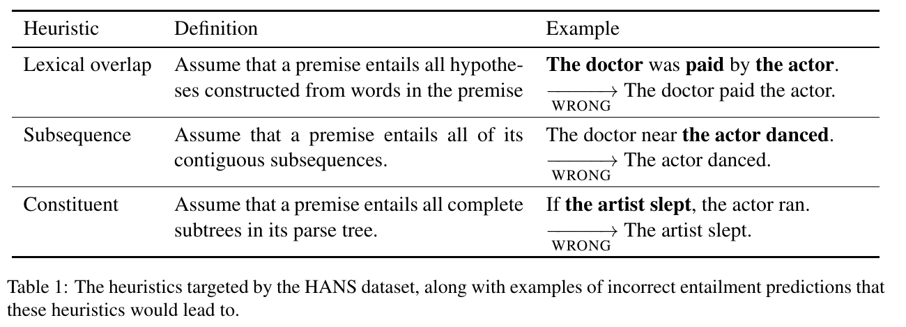
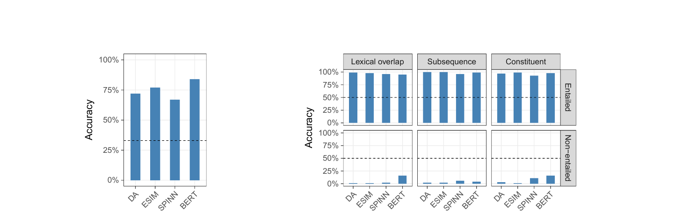
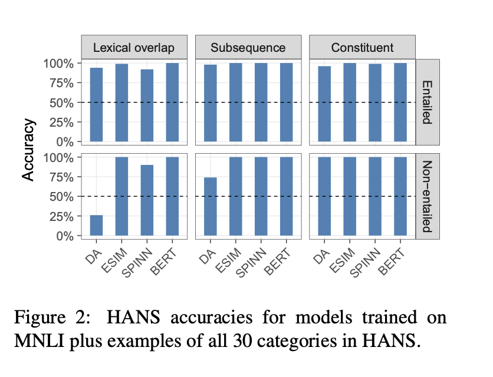

# Right for the Wrong Reasons: Diagnosing Syntactic Heuristics in Natural Language Inference

> McCoy, Pavlick, Linzen (Johns Hopkins / Brown) | ACL 2019 (pp. 3428–3448)
>
> arXiv: https://arxiv.org/abs/1902.01007 ／ データ: https://github.com/tommccoy1/hans

> **本セッションでの役割**：起点（先駆研究）。本テーマ（shortcut learning / spurious correlation）の礎となった ACL 2019 の診断研究（被引用 1400+）。LLM 以前の BERT 時代に、すでに NLI モデルが「意味理解でなく統語的な近道で解いていた」ことを示した。今日の話の問題意識はここから始まる。

---

## 1. 一言でいうと

> NLI モデルは文の**意味を理解している**のではなく、「前提と仮説の語が重なっていれば含意」といった**統語的ヒューリスティック（近道）**に依存している。それを暴く診断データセット **HANS** を作ると、最先端の BERT を含む全モデルが、近道の誤発火する例で精度**ほぼ0%**まで崩壊した。

タイトルの "right for the wrong reasons" ＝「正解はするが、その理由が間違っている」。テストで高得点でも、頼っている根拠が信頼できない近道なら、それは理解ではない——という問題提起の原点。

---

## 2. 背景と動機

### 問題：高いテスト精度は「理解」を意味しない

統計的学習器は、テストセットで高得点でも、**頻出ケースだけで通用する信頼できないショートカット**を学んでいる恐れがある。既存のテストセットは訓練と同じ偏りを持つため、この問題を**検出できない**。

### なぜ近道が学ばれるのか：訓練データ自体の偏り

MNLI（訓練データ）では、ヒューリスティックを**支持する例**が、**反証する例**より圧倒的に多い：

| ヒューリスティック | 支持する例 | 反証する例 |
|---|---|---|
| Lexical overlap（語彙重複） | 2,158 | 261 |
| Subsequence（部分列） | 1,274 | 72 |
| Constituent（構成素） | 1,004 | 58 |

反証例が少ないので、モデルは「語が重なる＝含意」と覚えても訓練上ほとんど罰せられない。→ **意図的に偏りを反転させた診断セット**が必要、という発想で HANS を作る。

---

## 3. 提案：HANS データセット

**HANS = Heuristic Analysis for NLI Systems。** 3つの統語ヒューリスティックそれぞれについて、「成立する例(E)」と「**誤発火して非含意なのに含意と誤判定してしまう例(N)**」をテンプレートで大量生成（114カテゴリ）。近道に頼るモデルは、N の例で構造的に必ず失敗するよう設計されている。

3つは包含関係：**Constituent ⊂ Subsequence ⊂ Lexical overlap**。

*Table 1（英語原典）：3つのヒューリスティックの定義と、それが誤って「含意」と判定してしまう例（WRONG）。各例の日本語訳は下表に併記。*

> 注：**論文・図表は英語**。以下は理解のため日本語訳を併記する（訳は本資料による）。前提（premise）→ 仮説（hypothesis）の関係で、→ は「正しく含意」、↛ は「含意しない（のに近道で含意と誤判定）」。

| ヒューリスティック | 仮定している誤ルール | 成立する例(E) | 誤発火する例(N) — 非含意なのに含意と誤答 |
|---|---|---|---|
| **Lexical overlap**（語彙重複） | 仮説の語が全部前提にあれば含意 | *The banker near the judge saw the actor.* → *The banker saw the actor.* 「裁判官のそばの銀行員が俳優を見た」→「銀行員が俳優を見た」 | *The doctor was paid by the actor.* ↛ *The doctor paid the actor.* 「医者は俳優に支払われた」↛「医者が俳優に支払った」 （受動↔能動で主語と目的語が逆転） |
| **Subsequence**（部分列） | 前提の連続部分列は含意 | *Angry tourists helped the lawyer.* → *Tourists helped the lawyer.* 「怒った観光客が弁護士を助けた」→「観光客が弁護士を助けた」 | *The doctor near the actor danced.* ↛ *The actor danced.* 「俳優のそばの医者が踊った」↛「俳優が踊った」 （"the actor danced" は部分列だが、踊ったのは医者） |
| **Constituent**（構成素） | 構文木の部分木（構成素）は含意 | *Before the actor slept, the senator ran.* → *The actor slept.* 「俳優が眠る前に上院議員が走った」→「俳優は眠った」 | *If the artist slept, the actor ran.* ↛ *The artist slept.* 「もし芸術家が眠っていたら俳優が走った」↛「芸術家は眠った」 （条件節は真とは限らない） |

代表例の "Subject-object swap"（主語・目的語の入れ替え）：*The senators mentioned the artist.* ↛ *The artist mentioned the senators.* 「上院議員たちが芸術家に言及した」↛「芸術家が上院議員たちに言及した」（語は完全一致だが意味は逆）

---

## 4. 主要な実験結果

### 評価モデル
DA (Decomposable Attention / bag-of-words)、ESIM (RNN)、SPINN (TreeRNN)、**BERT (bert-base-uncased)**。すべて MNLI で訓練 / fine-tune。

### 結果の本質：E例は満点近く、N例は壊滅

*Figure 1：(左) MNLI テスト精度は全モデル 67〜84%。(右) HANS では、ヒューリスティックが成立する Entailed 例（上段）は全モデル ほぼ100%、誤発火する Non-entailed 例（下段）は**ほぼ0%**に崩壊。点線は偶然レベル。BERT も例外でない。*

- 全モデルが、**N（非含意）の例ではほぼ常に entailment と誤答** → 近道が成立する例で高精度、誤発火する例で精度がほぼ0%に崩壊。
- BERT は MNLI テストで **84%** と最高精度なのに、HANS の N 例（特に subject/object swap）で**精度0%**。「テストでは最強なのに、近道が外れた瞬間に壊れる」が端的に出る。

> 補足：本文 Figure 1 は「素の MNLI 訓練モデルは N 例で near-zero」と明記。E列ほぼ満点・N列ほぼ0という**定性パターンが要点**で、これが「意味でなく近道で解いている」の決定的証拠。

### この失敗は「能力不足」より「データの信号不足」

*Figure 2：訓練データに MNLI ＋ HANS 全30カテゴリの例を加えて再訓練した結果。Figure 1 では ほぼ0% だった Non-entailed 例（下段）が、ESIM/SPINN/BERT で **ほぼ100% に回復**。→ 失敗の主因はモデルの能力ではなく訓練データの信号不足。bag-of-words の DA だけは Lexical overlap で 25% に留まる（語順を使えないため）。*

- 訓練セットに HANS タイプの例を**少量追加して再訓練**すると、失敗が大幅に軽減 → モデルの表現力ではなく、**訓練データに近道を覆す信号が足りない**ことが主因。
- 木構造の inductive bias を持つ SPINN は constituent/subsequence 系で相対的に良好 → 構造的バイアスが弱い信号を拾えることを示唆。

### データセットの妥当性（人間 baseline）
HANS の人間精度：Mechanical Turk **76%** / 言語学の専門家 **97%**。人間は解ける課題でモデルが落ちる＝**データの欠陥ではなくモデル/訓練の問題**。

---

## 5. 結論・含意とその後

- 最先端の BERT を含む NLI モデルは、正しい推論規則ではなく**統語ヒューリスティックに整合した振る舞い**をしている。
- HANS は、表面的近道を排して「本当の進捗」を測る**診断ツール**として機能する。
- その後、HANS は NLP における **spurious correlation / shortcut learning / robustness 評価**の代表的・基礎的な参照点になった（被引用 1400+、influential citations 169）。
  - 補足：用語 "shortcut learning" 自体を広めたのは Geirhos et al. 2020 等の別系統。HANS は **NLP におけるその代表例・起点**という整理が正確。

> **今日の橋渡し**：HANS が示した「語彙重複 / 部分列 / 構成素」という3つの近道は、6年後の Do LLMs Overcome Shortcut Learning?（5本目）で**そのまま LLM 評価に再利用**される。問いは「LLM 時代になって、この壁は越えられたのか？」へ移る。
