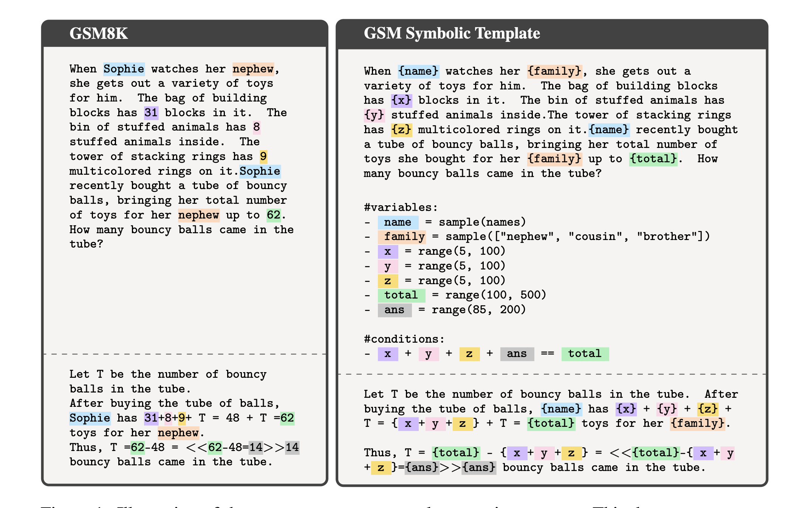
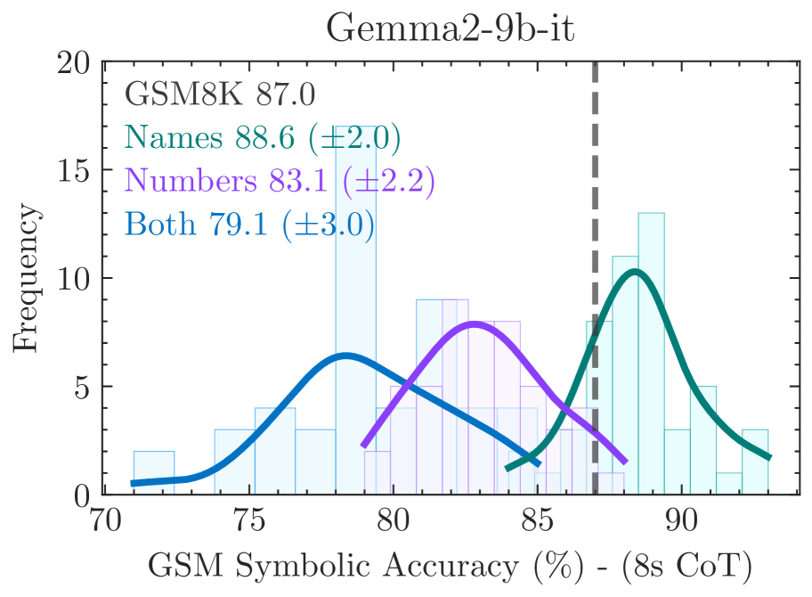
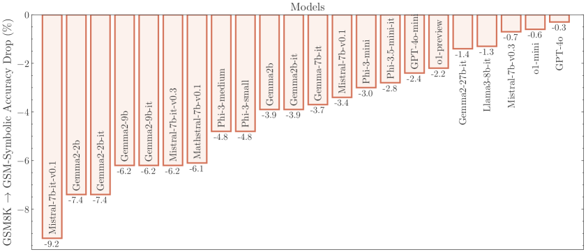
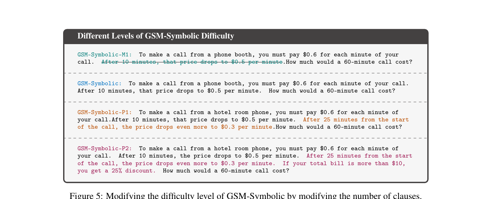
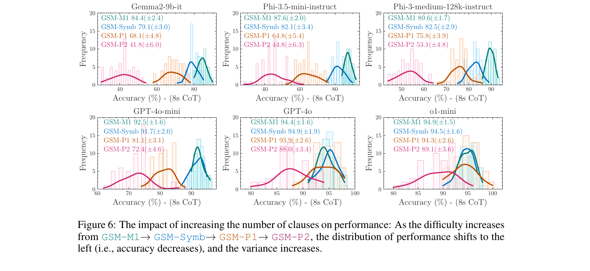

# GSM-Symbolic: Understanding the Limitations of Mathematical Reasoning in Large Language Models

> Mirzadeh, Alizadeh, Shahrokhi, Tuzel, Bengio, Farajtabar (Apple Research) | ICLR 2025
>
> arXiv: https://arxiv.org/abs/2410.05229

> **本セッションでの役割**：水準1（表層）。HANS の問題提起を、現代 LLM の**数学推論**へ移す。「意味を保ったまま表層だけ変えると壊れる」を最も鮮明に示す。

---

## 1. 一言でいうと

> 数学問題の**構造を保ったまま、登場する数値や名前を変えるだけ**で、LLM の solve rate が大きくばらつく。さらに問題に**無関係な一節**を足すと、一部モデルで **65%以上**性能が落ちる。著者の結論は「現在の LLM は真の論理推論をしておらず、訓練データの推論ステップを**複製**しているに過ぎない」。

GSM8K（小学校レベルの算数文章題）の高スコアが、数学的推論能力を**過大評価**している可能性を突く。

---

## 2. 背景と動機

### 問題：GSM8K の高得点は本物の推論か

- GSM8K は LLM の数学推論ベンチとして定番化し、各モデルが高精度を報告していた。
- だが GSM8K は固定された問題集合。モデルが**問題の論理を解いている**のか、**訓練で見た類題のパターンを再生している**のかは、固定テストでは区別できない。
- HANS と同じ構図：固定テストの高精度は、近道（パターンマッチ）を排除できていない。

### 本研究の問い
- 同じ論理構造で**表層（数値・名前）だけ**を変えたら、性能は安定するか？
- 問題を**難しく**したり、**無関係な情報**を足したりすると、どう崩れるか？

---

## 3. 提案：GSM-Symbolic ベンチマーク

*Figure 1：GSM8K の1問（左）を、名前・数値を変数 `{name} {family} {x} {y} {z} {total}` に置き換えた**シンボリックテンプレート**（右）に変換。`#variables` で各変数の値域、`#conditions` で論理的整合（x+y+z+ans==total 等）を定義し、**論理構造を保ったまま表層だけ違う問題を無数に生成**できる。*

- GSM8K の問題を**シンボリックなテンプレート**に変換し、数値・固有名などを差し替えて**同一構造の問題を多数自動生成**する。
- これにより「論理は同じ・表層だけ違う」問題群でモデルを評価でき、**性能の分散**を測れる。
- 派生セット：
  - **GSM-Symbolic**：数値・名前を変えた同型問題群（表層摂動）。
  - 節の数を増やした**難度上げ**版。
  - **GSM-NoOp**：解答に影響しない「無関係だがもっともらしい一節」を追加した版。

---

## 4. 主要な実験結果

### 結果1：数値を変えるだけで性能がばらつく

*同一構造の問題で、名前だけ変える(Names)・数値だけ変える(Numbers)・両方変える(Both)と、精度分布が左に動く。Gemma2-9b-it の例で GSM8K 87.0 → Names 86.6 → Numbers 83.1 → Both 79.1。点線が元の GSM8K スコア。**表層を変えるほど性能が落ち、かつ広く分散する**。*

- 同一構造・数値違いの問題集合で評価すると、solve rate に**有意な分散**が出る。
- 真に論理を解いているなら表層の数値変更で精度は動かないはず。動く＝**表層パターンに依存**している証拠。

*Figure 3：GSM8K → GSM-Symbolic で、ほぼ全モデルが精度低下（Mistral-7b-it -9.2、Gemma2-2b -7.4 …）。比較的新しい o1-mini/o1-preview/GPT-4o は低下幅が小さい＝壁は可動だが消えてはいない。*

### 結果2：複雑さが増すと性能が大きく低下

*Figure 5：節（clause）の数で難易度を段階的に変える。**GSM-M1**（1節減らした易しい版）→ **GSM-Symbolic**（基準）→ **GSM-P1**（1節追加）→ **GSM-P2**（2節追加）。論理の骨格は同じで、解くのに必要なステップ数だけが増える。*

- 上の難易度軸で評価すると、**節を増やすほど精度が単調に低下し、同時にばらつき（分散）も拡大**する。GSM-M1 では比較的安定でも、GSM-P1 → GSM-P2 と深くすると急落するモデルが多い。
- つまり**推論ステップが1〜2段増えるだけで頑健性が崩れる**。本当に手順を「理解」して実行しているなら、ステップ数の増加は緩やかな低下で済むはずで、急落は**手順の追跡ではなくパターン照合に依存**していることを示唆する。
- 易しくした GSM-M1 で精度が上がる点も対称的な傍証——モデルは問題の深さ（必要な推論連鎖の長さ）に直に反応しており、難易度に対して脆い。

*Figure 6：難易度を GSM-M1 → GSM-Symbolic → GSM-P1 → GSM-P2 と上げると、各モデルで性能分布が**左へ移動（精度低下）し、同時に裾が広がる（分散拡大）**。節を増やすほど、平均が下がるだけでなく「同じ難易度でも当たり外れが大きくなる」＝安定して解けていない。*

### 結果3：無関係な一節（NoOp）で最大65%超の低下

> GSM-NoOp：答えに**一切関係しない**節を追加するだけで、一部モデルは **65%以上**性能が低下。

例）「Oliver は金曜に44個、土曜に58個キウイを摘んだ。日曜は金曜の2倍摘んだが、**そのうち5個は平均より少し小さかった**。Oliver のキウイは全部で何個？」——正解は 44+58+88 = **190**。だが多くのモデルは「小さい5個」に反応して 88−5 と**不要な引き算**をしてしまう（サイズは個数に無関係）。

- 本当に問題を理解していれば「この情報は不要」と無視できるはず。無視できず巻き込まれる＝**意味でなく表層の手がかりに反応**している。
- 興味深いのは、**例題として無関係情報の扱いを見せても改善しない**点。無関係さを「その場で説明されても」演算に引きずられる。
- HANS の subsequence/constituent ヒューリスティック（無関係な部分構造に引っ張られる）と同じ匂いの失敗。

### 結論（著者）

> *"現在の LLM は真の論理的推論を実行できず、学習データの推論ステップを複製しているに過ぎない。"*

---

## 5. 現時点の解釈と留保

- **水準1の中核証拠**：意味を保ったまま表層だけ変えると壊れる、をクリーンに示す。Reversal Curse（論理を変えると壊れる）と対になる。
- **留保**：2024年時点・GSM8K 程度の算数レベルの評価。o1/o3 等の**推論特化モデル**やテスト時計算スケーリングがこの脆弱性をどこまで緩和するかは要検証（＝「壁は可動か」の論点）。

> **次への接続**：表層を変えると壊れることは分かった。では「表層を保ったまま**論理だけ**変える」とどうなるか？ → Reversal Curse へ。
