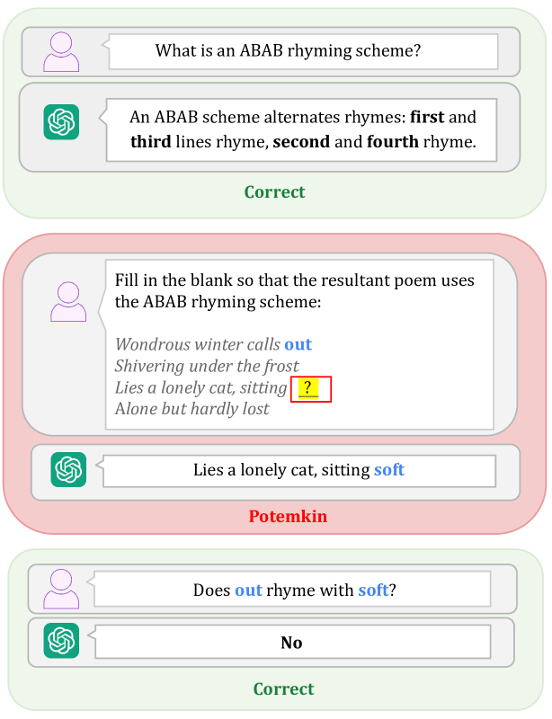
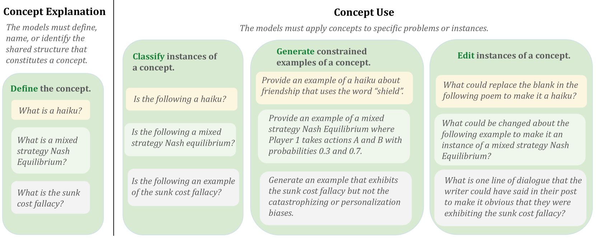

# Potemkin Understanding in Large Language Models

> Mancoridis, Weeks, Vafa, Mullainathan | ICML 2025 (PMLR v267)
>
> https://proceedings.mlr.press/v267/mancoridis25a.html

> **本セッションでの役割**：水準3（評価メタ）。ここまでの3本は「どの摂動で壊れるか（破れ方）」を見せた。Potemkin は一段上がり、「**ベンチ高得点 → 理解** という推論**そのもの**が妥当か」を問う。

---

## 1. 一言でいうと

> ベンチマーク（AP試験など）は本来**人間用のテスト**で、その正解から能力を推し量れるのは「LLM が**人間と同じ仕方で**概念を取り違える」場合に限り妥当。そうでなければ、ベンチ正解は **potemkin understanding（理解の幻想）**——どの人間の解釈とも整合しない答えに駆動された見せかけの理解——に過ぎない。そして potemkin は**モデル・タスク・ドメインを問わず遍在**する。

「ポチョムキン村」＝立派に見えるが裏は張りぼて、の比喩。

*Figure 1：GPT-4o は「ABAB 押韻とは？」に正しく定義できる（上, Correct）。だがその定義を**使って**詩の空欄を埋めさせると失敗し（中, Potemkin）、しかも「out と soft は韻を踏む？」には No と正答する（下, Correct）。定義は言えるのに応用で破綻＝理解の幻想。*

---

## 2. 背景と動機

### 問題：なぜ「テストで解ける＝理解」と言えるのか

- 人間のテストが能力を測れるのは、**人間の誤解パターンに構造がある**から。ある概念を本当に分かっている人は、特定の問いに正解し、関連する問いにも一貫して正解する——その相関を前提に少数の問題で能力を推定している。
- LLM が人間と**違う仕方**で間違える（＝人間ならあり得ない誤解の分布を持つ）なら、この推定は崩れる。**正解は理解の証拠にならない**。
- これは GSM-Symbolic 等の「摂動で壊れる」を、**メタ評価の言葉で一般化**したもの。崩れ方の事例ではなく、「ベンチ→能力」という推論の妥当性条件そのものを論じる。

---

## 3. 提案：potemkin を測る枠組み

### 妥当性条件の形式化
「ベンチ正解 → 能力」が成り立つための条件を形式的に定式化し、それが破れたときの正解を **potemkin** と定義。

### 定量化する2つの手続き
1. **3ドメインの専用ベンチ**：概念について「定義を答える／例を分類する／例を生成する／編集する」など複数操作の**整合性**を測り、内的非一貫を検出。
2. **prevalence の下限を与える一般手続き**：任意のタスクで potemkin の存在割合の**下限**を推定する。

*Figure 7：概念理解を「説明(Explanation)」と「応用(Use)」に分けて測る。説明＝定義を答えさせる。応用＝例を分類(Classify)・生成(Generate)・編集(Edit)させる。説明はできるのに応用で落ちるギャップを potemkin として検出する。*

### 検出の鍵：internal incoherence（内的非一貫性）
- 同じ概念について「定義は正しく答えられるのに、その定義を**応用**する問題（分類・生成・編集）で破綻する」——という**自己矛盾**を炙り出す。
- これは単なる誤答ではなく、**概念表現が内部で一貫していない**ことの表れ。

---

## 4. 主要な結果

### 結果1：定義はできるのに、使えない
- **7モデル × 32概念 × 3ドメイン**で評価。potemkin はモデル・タスクを問わず遍在（下限でも **0.62**）。
- 概念の**定義は 94.2% 正答**。なのに応用タスクは大きく崩れる（**1＝ランダム / 0＝完璧**）：分類 **0.55** / 生成 **0.40** / 編集 **0.40**。
- この**「定義94% → 応用0.4〜0.55」の落差**そのものが「ベンチ正解＝理解」の反証。

### 結果2：内的非一貫（internal incoherence）
- モデルが**自分で生成した例を、自分で正しく分類できない**自己矛盾（score 0.02〜0.64）。
- ＝失敗は偶発でなく**構造的**。

---

## 5. 現時点の解釈と留保

- **水準3の中核**：Potemkin は「ベンチ高得点→理解」という推論を**無効化**する。HANS / GSM-Symbolic / Reversal Curse の3本は、その具体的な破れ方（どの摂動で崩れるか）を与える。両者は補完関係。
- **量でなく質の壁の候補**：表層摂動への脆弱性はスケール/データで縮むかもしれないが、internal incoherence は「精度を上げる」では埋まりにくい**質的な壁**の候補。
- **留保**：「人間の誤解パターンと一致するか」を妥当性基準に据える枠組み自体が、人間側の誤解分布の特定に依存。また prevalence は下限推定であり、因果機序の特定は今後。

> **次への接続**：ここまでで「LLM は意味理解とは別の機構で正解を出しうる」が、表層・論理・評価の3水準で示された。では**なぜ**そうなるのか？——その機序＝ショートカット学習の入門へ。
