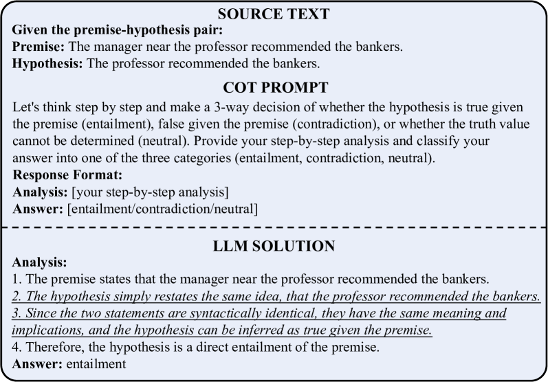
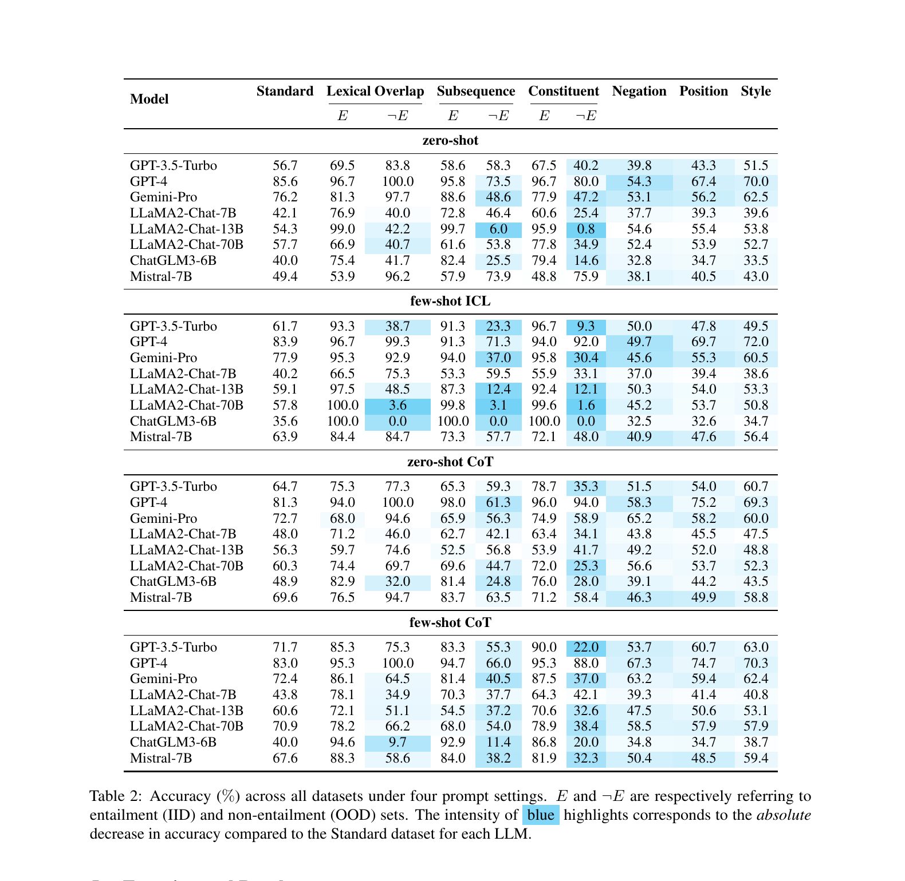

# Do LLMs Overcome Shortcut Learning? An Evaluation of Shortcut Challenges in Large Language Models

> Yuan, Zhao, Zhang, Zheng, Liu (USTC, State Key Lab of Cognitive Intelligence) | EMNLP 2024 Main (pp. 12188–12200)
>
> arXiv: https://arxiv.org/abs/2410.13343 ／ ACL Anthology: 2024.emnlp-main.679

> **本セッションでの役割**：現象整理・診断（橋渡し）。ここまでの「壊れ方」を、**ショートカット学習**という診断概念で束ね、HANS（2019）から LLM 時代へ橋渡しする。**原因を理論的に説明する論文ではなく**、現象を体系的に整理・診断し、原因究明への入口を作る論文。しかも評価には **HANS を再利用**しており、1本目で開いた弧がここで閉じる。（「なぜそうなるのか」の理論的深掘りは次回）

---

## 1. 一言でいうと

> LLM は依然として**ショートカット学習を克服できていない**。データセットのバイアス（偽の相関）を「近道」に使って解いており、その依存度・過信・説明品質を測る評価スイート **Shortcut Suite**（6種のショートカット × 5指標 × 4プロンプト手法）で大規模に検証した結果、**大型モデルほどむしろ近道に頼りやすく**、緩和できるのは **CoT のみ**だった。

---

## 2. 背景と動機：ショートカット学習とは

- **定義（本論文）**：ショートカットとは「IID（同分布）のテストではうまくいくが、OOD（分布外）では失敗する決定規則」。
- **機序**：モデルが入力テキストと特定ラベルの間に**偽の相関（spurious correlation）**を学ぶ。例：NLI で意味を見ず「仮説が前提の部分列なら entailment」と判断する。
- **なぜ LLM 時代に問い直すか**：従来のショートカット研究は fine-tune した小型分類器（BERT 等）が対象だった。LLM は大規模事前学習・in-context learning・CoT という新しいパラダイムを持つ。「**LLM はこの近道依存を克服したのか？**」が未検証の問い。

> ここで HANS（1本目）が直接つながる：本論文は HANS の3ヒューリスティック（語彙重複/部分列/構成素）を**そのまま LLM 評価のショートカット種別として採用**している。

*Figure 1：ショートカット学習の挙動。前提の部分列(subsequence)が仮説と一致すると、LLM は深い意味解析を飛ばして「含意」と誤判定する。HANS の subsequence ヒューリスティックそのものが、LLM の CoT 推論でも再現する。*

---

## 3. 提案：Shortcut Suite

### 6種のショートカット
1. **Lexical Overlap（語彙重複）** ← HANS 由来
2. **Subsequence（部分列）** ← HANS 由来
3. **Constituent（構成素）** ← HANS 由来
4. **Negation（否定）**：強い否定語を特定ラベルに結びつける
5. **Position（位置）**：ラベルが出現位置の偽手がかりと相関
6. **Style（文体）**：ラベルが文体の偽手がかりと相関

### 対象タスク・データ
- 主軸：**NLI**（MultiNLI と **HANS**）。拡張：感情分析（SST-2）、言い換え判定（QQP / PAWS）。

### 5つの評価指標
- **ACC**（精度）／**SFS**（意味整合：入出力埋め込みの cos 類似）／**ICS**（推論チェーン内の論理矛盾検出）／**EQS**（説明品質＝SFS と ICS の結合）／**CFS**（自己申告の確信度）。

### 4つのプロンプト戦略
Zero-shot ／ Few-shot ICL ／ Zero-shot CoT ／ Few-shot CoT。

### 対象モデル
GPT-4 / GPT-3.5-Turbo / Gemini-Pro（クローズド）、LLaMA2-Chat 7B·13B·70B / LLaMA3 8B·70B / Mistral-7B / ChatGLM3-6B（オープン）。

---

## 4. 主要な結果

> 注：以下のうち**全体傾向は裏取り済み**。個別セルの細かい数値は原典 Table で再確認推奨（スライドに大書きする場合）。

### 結果1：ショートカット入りデータで精度が顕著に低下

**Table 2（zero-shot, 精度%）抜粋** — 各ショートカットは **E＝ヒューリスティックが成立する例（含意）／¬E＝誤発火例（非含意）** に分かれる。

| モデル | Standard | Lexical E/¬E | Subsequence E/¬E | Constituent E/¬E |
|---|---|---|---|---|
| GPT-4 | 85.6 | 96.7 / 100.0 | 95.8 / 73.5 | 96.7 / **80.0** |
| Gemini-Pro | 76.2 | 81.3 / 97.7 | 88.6 / 48.6 | 77.9 / **47.2** |
| GPT-3.5-Turbo | 56.7 | 69.5 / 83.8 | 58.6 / 58.3 | 67.5 / **40.2** |
| LLaMA2-Chat-13B | 54.3 | 99.0 / 42.2 | 99.7 / 6.0 | 95.9 / **0.8** |
| LLaMA2-Chat-70B | 57.7 | 66.9 / 40.7 | 61.6 / 53.8 | 77.8 / **34.9** |
| ChatGLM3-6B | 40.0 | 75.4 / 41.7 | 82.4 / 25.5 | 79.4 / **14.6** |
| Mistral-7B | 49.4 | 53.9 / 96.2 | 57.9 / 73.9 | 48.8 / 75.9 |

- **E は高いのに ¬E（誤発火例）で精度が崩れる**——例：Constituent ¬E は LLaMA2-13B で **0.8**、ChatGLM3 で **14.6**、最強の GPT-4 でも 80.0。これは HANS（1本目）の「E≈100% / ¬E≈0%」と**同じパターン**。
- ＝モデルは意味でなく「語が重なる／部分列が一致する＝含意」という**近道**で答えている。
- Negation / Position / Style（各単一列）でも同様に標準を下回る（本文・原典 Table 3 参照）。

<small>※数値は論文 Table 2（zero-shot）より抽出（全プロンプト設定の全体像は結果3の Table 2 画像を参照）。</small>

### 結果2：大型化は解決にならない（逆スケーリング傾向）
- zero-shot / few-shot では、**大きいモデルほどショートカットを使いやすい**。スケールでは克服できない（GSM-Symbolic / Reversal Curse の「スケールしても残る」と整合）。

### 結果3：CoT だけが効く緩和策、few-shot は逆効果になりうる

*Table 2：全データセット・4プロンプト設定（zero-shot / few-shot ICL / zero-shot CoT / few-shot CoT）での精度%。E＝ヒューリスティック成立例・¬E＝誤発火例。**青いハイライトが濃いほど標準条件からの精度低下が大きい**。*

- **Few-shot ICL は標準精度が上がっても ¬E（誤発火例）が激減**：例として GPT-3.5-Turbo は Subseq ¬E 58.3→**23.3**・Constituent ¬E 40.2→**9.3**、ChatGLM3-6B は ¬E が軒並み **0.0** ＝例の提示がかえって近道を助長。
- **CoT（特に few-shot CoT）は標準精度を最も押し上げる**＝依存を有意に低減。ただし ¬E は完全には戻らない。

### 結果4：過信し、説明は表層的
- 自己申告の確信度は精度を**大きく上回る**＝**過信**。間違っていても自信満々（ショートカット条件でも確信度は概ね80〜100に張り付く）。
- 説明の意味整合（SFS）は高い（85%超）が、推論チェーンの論理整合（ICS）は**50%未満**＝半数超のチェーンに矛盾。誤りは3類型：**distraction（注意散漫）/ disguised comprehension（理解を装う）/ logical fallacy（論理的誤謬）**。

---

## 5. 結論：ショートカット学習という診断の枠

- **LLM はショートカット学習を克服していない。** 意味・論理ではなく、訓練分布の**表層統計（語彙重複・部分列・文体・位置…）とラベルの偽相関**を近道に使っている。
- IID では高精度に見え、近道が外れた OOD（HANS 等）で崩れる——これは GSM-Symbolic・Reversal Curse・HANS で見た脆弱性を、**ショートカット学習という一つの診断概念で束ねた**もの。
- 「定義は言えるのに応用で破綻」（Potemkin の internal incoherence）も、CoT 分析の **disguised comprehension（理解を装う説明）** と響き合う。
- 大型化では消えず、CoT で部分緩和——「壁は可動だが、スケールだけでは越えられない」。

> **位置づけの注意**：本論文は、これらの現象を**整理・診断**する論文であって、「なぜショートカット学習が起きるのか」を**理論的に説明する論文ではない**。HANS（2019）の診断軸を LLM 時代に持ち込み、現象がまだ残ることを示す——原因究明への**橋渡し**と読むのが正確。

---

## まとめ：5本でひとつの主張

| 水準 | 論文 | 示したこと |
|---|---|---|
| 起点 | HANS (2019) | NLI モデルは統語ヒューリスティックで解く（right for the wrong reasons） |
| 1 表層 | GSM-Symbolic | 数値・無関係節を変えると数学性能が崩れる |
| 2 論理 | Reversal Curse | "A is B" を学んでも "B is A" に汎化しない |
| 3 評価 | Potemkin | 正解しても概念表現が内的に非一貫（ベンチ→理解 を無効化） |
| 診断・橋渡し | Shortcut Learning (2024) | 現象を「偽相関への依存＝ショートカット学習」で整理。HANS を再利用し、LLM でも未克服と実証 |

> **次回予告**：本セッションは現象整理・診断まで。次回は「**なぜ**ショートカット学習が起きるのか・どこに宿るのか・どう減らせるか」を別の論文群で深掘りする。
