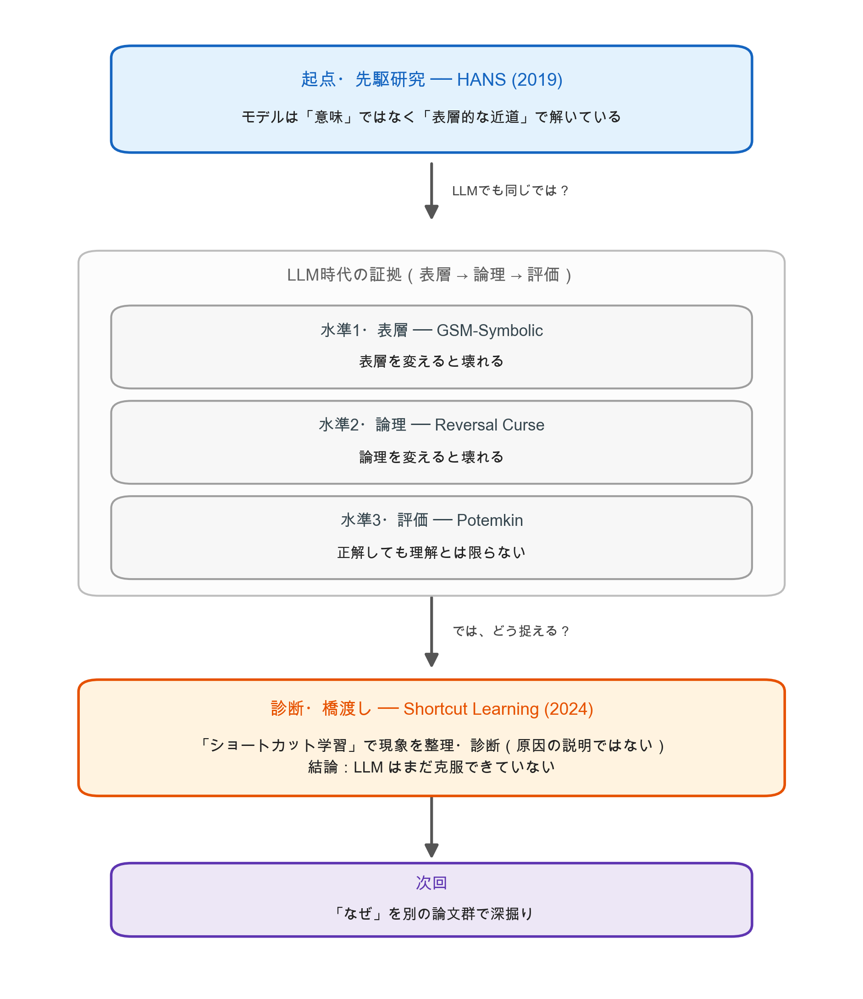

# 勉強会発表資料 (2026-06-11)

## 発表テーマ：言語モデルは「本当に理解」しているのか

## テーマ一覧

| # | タイトル | カテゴリ | 出典 | 役割 |
|---|---------|---------|------|------|
| 1 | [Right for the Wrong Reasons (HANS)](01-right-for-the-wrong-reasons.md) | NLI / 診断ベンチ | ACL 2019 | 起点（先駆研究） |
| 2 | [GSM-Symbolic](02-gsm-symbolic.md) | 数学推論 / 表層摂動 | ICLR 2025 | 水準1 表層 |
| 3 | [The Reversal Curse](03-reversal-curse.md) | 汎化 / 論理対称性 | ICLR 2024 | 水準2 論理 |
| 4 | [Potemkin Understanding](04-potemkin-understanding.md) | 評価妥当性 | ICML 2025 | 水準3 評価 |
| 5 | [Do LLMs Overcome Shortcut Learning?](05-shortcut-learning.md) | ショートカット学習 | EMNLP 2024 | 現象整理・診断（橋渡し） |

## このセッションの主張（1枚で）

> **現行ベンチマークの高得点は、真の論理的理解の十分条件ではない。**
> モデルは問題の意味・論理構造そのものではなく、訓練分布上の**表層的・統計的な手がかり（ショートカット）**に依存して正解を出しうる。

この主張を、6年越し・NLIから数学・評価論まで横断する証拠で示し、最後に、これらの現象を **ショートカット学習** という診断概念で整理する論文へ橋渡しする（原因の理論的解明ではなく、原因究明への入口）。

## ストーリーの弧



<small>※図は <code>figures/make_story_arc.py</code> で生成（<code>.venv/bin/python figures/make_story_arc.py</code> で再生成可）。</small>

## 5本のつながり（クロスリンク）

- **HANS → Shortcut Learning の伏線回収**：Shortcut Learning 論文(2024)は評価データに **HANS そのもの**を使い、ショートカット6種のうち3種（lexical overlap / subsequence / constituent）を **HANS の3ヒューリスティックから直接継承**している。2019年の診断ツールが、2024年の LLM 評価でそのまま生きている＝「同じ壁がまだある」ことの最も直接的な証拠。
- **水準の深まり**：表層(2) → 論理(3) → 評価メタ(4) と下るほど壁は深くなる。GSM-Symbolic/Reversal Curse は「どの摂動で崩れるか（破れ方）」を、Potemkin は「ベンチ高得点→理解 という推論自体を無効化（解釈の問題）」を担う。
- **量の問題でなく解釈の問題**：Potemkin の internal incoherence は「精度が足りない」ではなく「正解しても概念表現が非一貫」を主張し、HANS/GSM/Reversal の脆弱性をメタレベルで一般化する。
- **現象整理・診断としての位置づけ**：Shortcut Learning 論文は、これらの脆弱性を「訓練分布の表層統計とラベルの偽相関を近道として使っている」という **ショートカット学習** の枠で束ね、LLM 時代でも未克服であることを体系的に診断する。原因そのものを理論的に解明する論文ではない——この論文は HANS から LLM 時代への**橋渡し・診断**であり、「なぜそうなるのか」の理論的深掘りは次回に回す。

## 元になったトピックページ

- [LLMと真の論理的理解の壁](../../wiki/topics/Reasoning/llm-logical-understanding-wall.md) — 問いの構造（表層→論理→評価）の整理元

## 図表ディレクトリ

`figures/` に各論文の原典から切り出した図を配置済み（論文 PDF / arXiv HTML 版から抽出。Python 生成のグラフは作らない方針）。各 .md 本文に埋め込み済み：

```
figures/
  hans-table1-heuristics.png  # HANS Table 1: 3ヒューリスティックの定義と誤発火例(WRONG)
  hans-fig1-results.png       # HANS Fig 1: MNLI精度(67-84%) vs HANS(E例≈100% / N例≈0%)
  hans-fig2-augmented.png     # HANS Fig 2: HANS例を加えて再訓練するとN例が≈100%に回復(DA除く)
  gsm-fig1-template.png       # GSM-Symbolic Fig 1: GSM8K→シンボリックテンプレート化の例
  gsm-fig-distribution.png    # GSM-Symbolic: 名前/数値/両方を変えたときの性能分布の低下
  gsm-fig5-difficulty.png     # GSM-Symbolic Fig 5: 節数で難易度を調整(M1/Symbolic/P1/P2)
  gsm-fig6-difficulty-curves.png # GSM-Symbolic Fig 6: 難易度↑で性能分布が左移動＋分散拡大
  gsm-fig3-drop.png           # GSM-Symbolic Fig 3: モデル別 GSM8K→GSM-Symbolic 精度低下
  rc-fig1-tomcruise.png       # Reversal Curse Fig 1: Tom Cruiseの母の例(A→B可 / B→A不可)
  rc-fig4-result.png          # Reversal Curse Fig 4: 逆方向で正解名の対数確率=ランダムと同等
  pk-fig1-abab.png            # Potemkin Fig 1: ABAB押韻を定義できるが応用で破綻
  pk-fig7-framework.png       # Potemkin Fig 7: 説明 vs 応用(分類/生成/編集)の評価フレーム
  sc-fig1-subseq.png          # Shortcut Learning Fig 1: 部分列ショートカットの挙動例
  sc-table2-prompt-settings.png # Shortcut Learning Table 2: 4プロンプト設定×全モデルの精度(E/¬E)
```

出典 arXiv：HANS 1902.01007 / GSM-Symbolic 2410.05229 / Reversal Curse 2309.12288 / Shortcut Learning 2410.13343 / Potemkin 2506.21521（ICML 2025, PMLR v267）。
