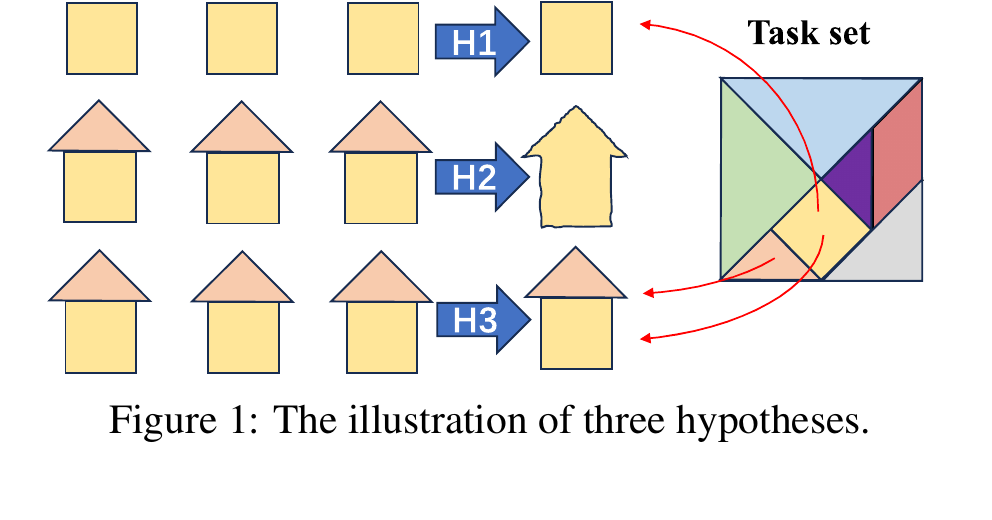
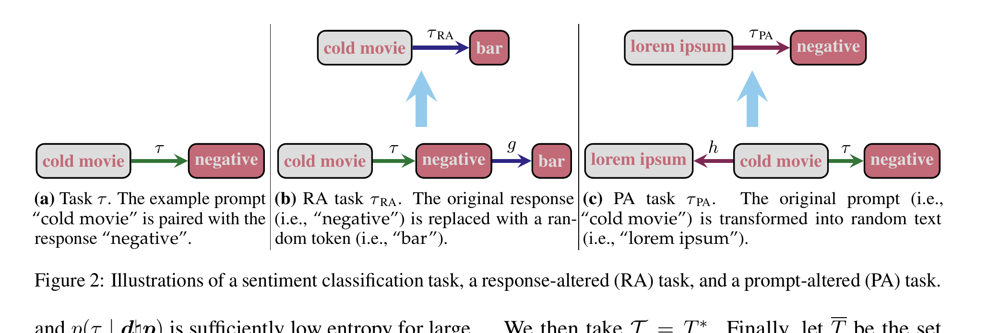
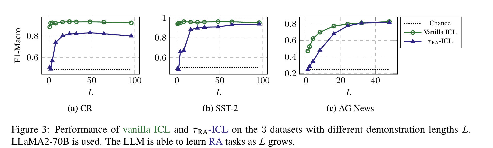
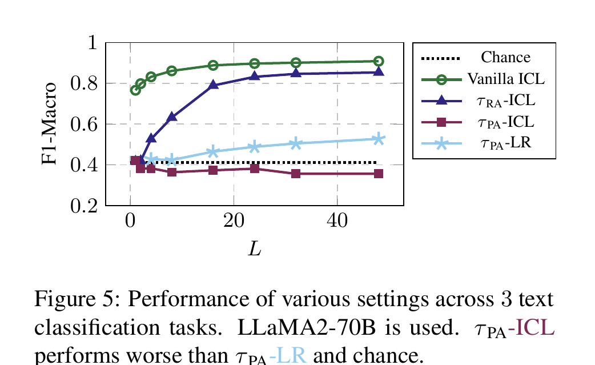
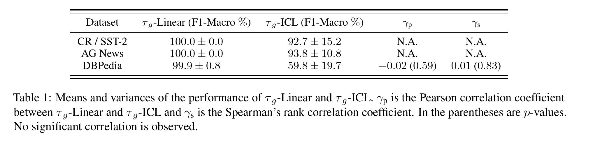
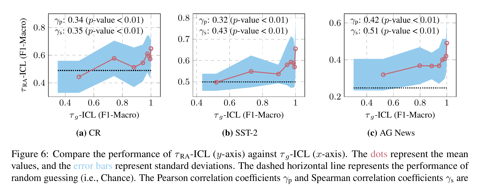
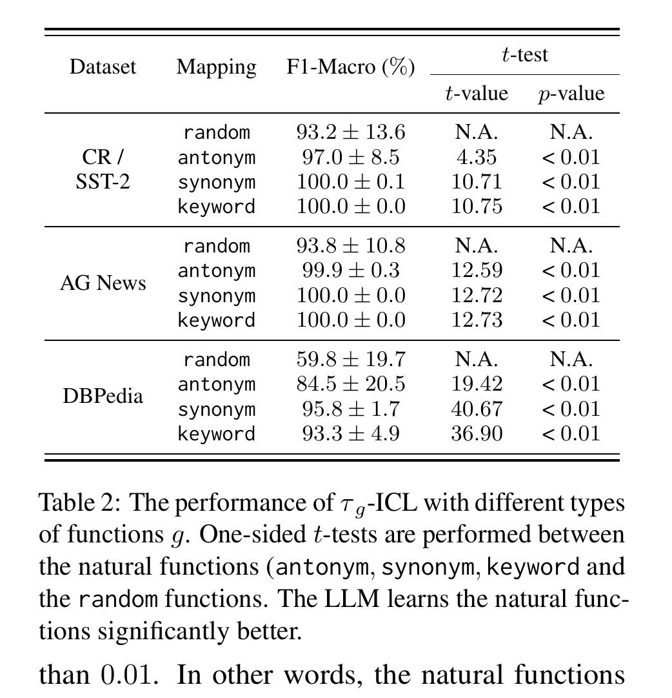
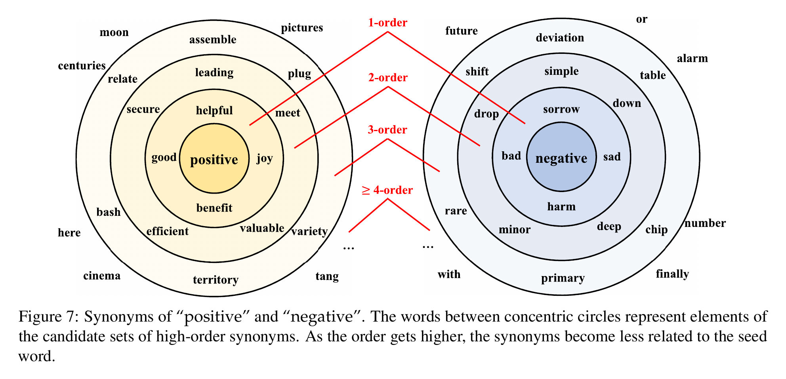
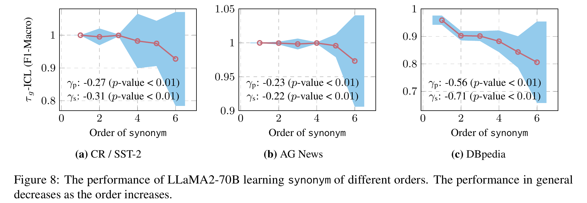

# What Do Language Models Learn in Context? The Structured Task Hypothesis

> Jiaoda Li*, Yifan Hou*, Mrinmaya Sachan, Ryan Cotterell (ETH Zürich) | ACL 2024 Main (Long), pp. 12365–12379　*equal contribution
>
> arXiv: https://arxiv.org/abs/2406.04216 ／ コード: https://github.com/eth-lre/LLM_ICL

> **本セッションでの役割**：起点。前回の2能力枠組み（skill recognition / skill learning）とほぼ同じ分類を独立に立てたうえで、**両方を反証**し、第三の仮説「事前学習で得たタスクの**合成**」を出す。前回補正の対象だった GD 説は、この論文では H2 の代表例として名指しで実験的に潰される。

---

## 1. 一言でいうと

> ICL の説明として流通する3仮説（**タスク選択** / **メタ学習** / **構造化タスク選択**）を、テキスト分類から派生させた実験群で突き合わせた。前2つは反例で棄却され、残った第三の仮説——**LLM は事前学習で学んだタスクを合成して、未見のタスクを文脈内で解いている**——が支持される。

前回の用語に置き換えると、H1 が skill recognition、H2 が skill learning に対応する。この論文の主張は「どちらでもなく、H1 を拡張した**合成**という機構である」——著者自身は H3 を「H1 と H2 の混合と見ることもできる」と位置づけている。


*Figure 1：3仮説の図解。H1 は Task set の中から既知のタスクを1つ選ぶ（家の形はそのまま）。H2 は Task set の外にある新規タスクをその場で学習する（ギザギザの家＝未知の形）。H3 は Task set 内の複数の要素（三角と四角）を組み合わせて、Task set には無い家を作る。*

---

## 2. 3つの仮説

原文は形式的な定義を与えるが、著者自身が Limitations で「形式化は不完全で、思ったより雰囲気ベース（vibes-based）」と認めている。ここでは主張の骨格だけ押さえる。

### 記号の意味

| 記号 | 読み方 |
|---|---|
| $\tau = \langle \pi^\tau, \rho^\tau \rangle$ | **タスク**。$\pi^\tau$ が「どんなプロンプトが来るか」の分布、$\rho^\tau$ が「そのプロンプトにどう答えるか」の分布。この2つの対でタスクを表す |
| $\mathcal{T}$ | ありうるタスク**全体**の集合 |
| $\overline{T} \subset \mathcal{T}$ | そのうち**事前学習で実際に見た**タスクの集合 |
| $d = p_1 r_1 ♮ \cdots ♮ p_L r_L$ | **デモンストレーション**。プロンプト $p_\ell$ と応答 $r_\ell$ の対を $L$ 個、区切り記号 ♮ でつないだもの。$L$ が「何ショットか」にあたる |
| $p(\tau \mid d)$ | デモ $d$ を見て「これはタスク $\tau$ だ」と判断する確率。**タスク選択分布** |

3つの仮説の違いは、結局のところ「**$p(\tau \mid d)$ がどの範囲のタスクまで正しく当てられるか**」の一点に集約される。原文の well-calibrated（うまく校正されている）は、正しいタスクに高い確率を割り当てられる、という意味である。

| 仮説 | 主張 | $p(\tau \mid d)$ の有効範囲 | 前回の枠組み |
|---|---|---|---|
| **H1 タスク選択** | デモは既知タスクの**特定**に使われるだけで、学習は起きない | $\overline{T}$（事前学習で観測済み）のみ | skill recognition |
| **H2 メタ学習** | 事前学習で**学習アルゴリズム**を獲得し、推論時にデモへ適用する | $\mathcal{T} \setminus \overline{T}$（＝未観測のタスク）にも汎化 | skill learning（**例:GD説**） |
| **H3 構造化タスク選択** | デモを使って既知タスクの**列を合成**し、その合成タスクで予測する | $\overline{T}^*$＝既知タスクを**つないで作れるもの**全体 | （前回になかった第3の軸） |

### タスク合成 $\circ$ とは

$$\tau_1 \circ \tau_2 = \langle \rho^{\tau_1 \circ \tau_2},\; \pi^{\tau_2} \rangle, \qquad \rho^{\tau_1 \circ \tau_2}(r \mid p) = \sum_{\tilde{r}} \rho^{\tau_1}(r \mid \tilde{r})\; \rho^{\tau_2}(\tilde{r} \mid p)$$

読み方はほぼ**関数合成**そのものである。

- **右の式**：プロンプト $p$ をまず $\tau_2$ に通して中間出力 $\tilde{r}$ を得て、それを $\tau_1$ に通して最終出力 $r$ を得る。$\tilde{r}$ について総和を取っているのは、途中経過が確率的なので**ありうる中間出力を全部足し上げている**だけである。
- **左の式**：入力の受け口は $\tau_2$ 側なので、プロンプト分布は $\pi^{\tau_2}$ をそのまま引き継ぐ。

具体例：$\tau$＝感情分類（"cold movie" → "negative"）、$\tau_g$＝文字列を置き換えるだけのタスク（"negative" → "bar"）とすると、合成 $\tau_g \circ \tau$ は "cold movie" → "bar" というタスクになる。

$\overline{T}^*$ は、この $\circ$ で $\overline{T}$ の要素を有限個つないでできるタスク全体を指す。$\overline{T}$ より広いが $\mathcal{T}$ 全体よりは狭い、中間の集合である。合成の結果は事前学習で見ていない新規タスクになりうる——ここが H1 との差であり、H3 の肝である。

### 検証の道具：RA タスクと PA タスク


*Figure 2：(a) 元のタスク $\tau$（"cold movie" → "negative"）。(b) **RA タスク** $\tau^{\mathrm{RA}}$：応答側を関数 $g$ でランダムトークンに置換（"negative" → "bar"）。定義上 $\tau^{\mathrm{RA}} = \tau_g \circ \tau$ という合成になっている。(c) **PA タスク** $\tau^{\mathrm{PA}}$：プロンプト側を関数 $h$ でランダムテキストに置換（"cold movie" → "lorem ipsum"）。*

記号を整理しておく。

| 記号 | 意味 |
|---|---|
| $g,\; h$ | 文字列を別の文字列に写す関数（例：$g$("negative") = "bar"）。ランダムに作るので事前学習には存在しない |
| $\tau_g$ | 「$g$ を適用するだけ」のタスク。$\tau_g$ 単体を ICL で学べるかも後で測る |
| $\tau^{\mathrm{RA}} = \tau_g \circ \tau$ | 元タスク $\tau$ の**応答**を $g$ で書き換えたタスク。定義からして合成の形をしている |
| $\tau^{\mathrm{PA}}$ | 元タスク $\tau$ の**プロンプト**を $h$ で書き換えたタスク |

RA / PA はどちらも「元タスク＋文字列写像」という同じ構造を持つ。

### RA と PA を具体例で

SST-2 のテンプレートは `Review: x \n Sentiment:`、$\tau^{\mathrm{RA}}$ の応答は "positive" → **por** / "negative" → **Ne**（いずれも Table 3）。$\tau^{\mathrm{PA}}$ はテンプレートの `Review` / `Sentiment` も含めてプロンプト全体を置換する。

| | デモ1件の見た目 |
|---|---|
| **Vanilla** | `Review: cold movie` / `Sentiment: negative` |
| **RA** | `Review: cold movie` / `Sentiment: `**`Ne`** |
| **PA** | **`lorem ipsum: dolor sit`** / **`amet:`**` negative` |

差が効くのは**テスト時**である。

**RA のテスト**——プロンプトが無傷なので「感情分類だ」と認識でき、内部で positive と判断できる。あとはデモで覚えた**2行の表**（positive→por / negative→Ne）を引くだけである。新しいレビューが来ても、出力側の選択肢は既知の2個から変わらない。

```
Review: brilliant acting     ← 新しいレビュー。ただし自然言語のまま
Sentiment: ?                 → 内部で positive → 表を引いて "por"
```

**PA のテスト**——変換後の文字列はデモに存在しないので、表引きが効かない。語彙レベルで逆写像を同定して元のテキストを復元し、そのうえで感情を判断する必要がある。覚えるべき対応は語彙全体に及ぶ。

```
lorem ipsum: consectetur adipiscing    ← デモに無い変換文字列
amet: ?                                → 逆写像が分からず復元できない
```

RA は「**既知のカテゴリに新しい名前を貼る**」、PA は「**暗号を解いてから解く**」。§4 は両者を「本質的に同じタスク」として扱うが、要求される処理はこれだけ違う。

<small>※論文は $h$ の構成を本文にも付録にも明記していない（付録 C.1 が説明するのは RA 側の応答トークンのみ）。上の PA 例は説明のための再構成である。ただし $\tau^{\mathrm{PA}}$-LR が bag-of-words で約50%を出す以上、$h$ はトークン単位の一貫した置換であるはずで、この形からは大きく外れない。</small>

### 比較する5つの設定

以降の図で並ぶ系列はこの5つである。**デモの何を書き換えるか**だけが違い、それ以外の条件（モデル・デモ長・テストセット）は揃えてある。

| 設定 | デモの中身 | 役割 |
|---|---|---|
| **Chance** | — | クラス一様のランダム推測。全データセットがほぼクラス均衡なので下限として機能する |
| **Vanilla ICL** | 元タスク $\tau$ のまま（"cold movie" → "negative"） | **ふつうの ICL**。上限の目安 |
| **$\tau^{\mathrm{RA}}$-ICL** | **応答**を $g(r)$ に置換（"cold movie" → "bar"）。プロンプトはそのまま | 未見タスクを文脈内で学べるか（§3・H1 の検証） |
| **$\tau^{\mathrm{PA}}$-ICL** | **プロンプト**を $h(p)$ に置換（"lorem ipsum" → "negative"）。応答はそのまま。テンプレートの "Review" / "Sentiment" も置換する | RA と同型のタスクを学べるか（§4・H2 の検証） |
| **$\tau^{\mathrm{PA}}$-LR** | $\tau^{\mathrm{PA}}$ と同じ $L$ 個のデモを bag-of-words にしてロジスティック回帰を訓練 | PA タスクがそもそもデモから学習可能かを示す下限 |

実験設定は LLaMA2（7B / 13B / **70B**）、データセットは CR・SST-2・AG News（後半で DBpedia を追加）。各実験は乱数シード20回の平均 F1-Macro、テストセットは 256 対。

---

## 3. H1（タスク選択）の反証

**予測1**：H1 が正しいなら、事前学習に存在しない $\tau^{\mathrm{RA}}$ での ICL 性能はランダム推測並みになるはずである。

**結果**：ならない。


*Figure 3：LLaMA2-70B、デモ長 $L$ を変えたときの vanilla ICL（緑）と $\tau^{\mathrm{RA}}$-ICL（濃紺）。$L$ が小さいうちは $\tau^{\mathrm{RA}}$-ICL はチャンス（点線）付近だが、$L$ とともに急上昇する。SST-2 と AG News では vanilla ICL にほぼ並ぶ。*

デモ長 $L$ が小さいうちは確かにチャンスレベルだが、$L$ を増やすと **80% 超**まで上がり、SST-2 と AG News では通常の ICL に並ぶ。最小の LLaMA2-7B ですら $L=32$ でチャンスを大きく上回る。

→ LLM は事前学習で観測していないはずのタスクを文脈内で学習できる。**H1 は棄却**。

---

## 4. H2（メタ学習）の反証

### 実験1：RA と PA の非対称性

**予測2**：H2 が正しいなら、ICL は何らかの学習アルゴリズム（例：勾配降下）で訓練したモデルと似た振る舞いをするはずである。$\tau^{\mathrm{RA}}$ と $\tau^{\mathrm{PA}}$ は本質的に同じ構造のタスクなので、$\tau^{\mathrm{PA}}$ も同程度に学習できるはずである。

比較対象として $\tau^{\mathrm{PA}}$-**LR**（§2の設定表）を置く。「最低限の学習能力を持つモデル」がこのデモから何点取れるかの下限にあたる。


*Figure 5：LLaMA2-70B、3データセット平均。$\tau^{\mathrm{RA}}$-ICL（濃紺）は $L$ とともに 0.85 付近まで伸びる。一方 $\tau^{\mathrm{PA}}$-ICL（赤）は $L$ をいくら増やしても**チャンス（点線）以下**に張り付く。同じデモで訓練したロジスティック回帰 $\tau^{\mathrm{PA}}$-LR（水色）は 0.5 付近まで学習できている。*

- $\tau^{\mathrm{PA}}$-LR は F1-Macro **約50%**（ランダム推測は41%）に到達する。つまりタスクはデモから学習可能である。
- にもかかわらず $\tau^{\mathrm{PA}}$-ICL はチャンス付近か以下のまま。LLaMA2 の最大トークン長まで $L$ を伸ばしても改善しない。
- 同じ構造の $\tau^{\mathrm{RA}}$-ICL は 80% 超。

この落差は「推論時にその場で学習アルゴリズムを回している」では説明できない。**H2 に不利**。

### 実験2：GD説の直撃

H2 の中でも特に「ICL は暗黙に線形回帰を勾配降下で解いている」という主張（Von Oswald et al. 2023, Akyürek et al. 2023, Dai et al. 2023）を狙い撃つ。**同じ課題を2通りで解かせて突き合わせる**、という単純な設計である。

| 解き手 | やり方 |
|---|---|
| **$\tau_g$-ICL** | デモを見せて、LLM に文脈内で解かせる |
| **$\tau_g$-Linear** | 同じデモを使って、**実際に勾配降下で線形回帰を訓練**して解く |

**課題（$\tau_g$）は極端に簡単にしてある。** プロンプトも応答も1トークンだけで、"positive" → "bar" のような**単語の対応表を覚えるだけ**である。対応表の項目数はクラス数と同じ（CR/SST-2 は2個、AG News は4個、DBpedia が最多）。しかもテストに出る対はデモの中に必ず1回以上入れてあるので、**汎化は一切要らない**。丸暗記できれば満点が取れる。

**予測**：GD説が正しく ICL が内部で勾配降下による線形回帰をしているなら、両者は似た成績になるはずである。


*Table 1：$\tau_g$-Linear と $\tau_g$-ICL の成績（500個のランダムな $g$ について）と、両者の相関。*

**結果は2点。**

1. **$\tau_g$-Linear はほぼ満点**（99.9〜100.0%）。丸暗記課題なので当然である。
2. **$\tau_g$-ICL は届かず、大きくバラつく**。CR/SST-2 で 92.7 ± 15.2、AG News で 93.8 ± 10.8、クラス数が最多の DBPedia では **59.8 ± 19.7** まで落ちる。汎化を一切要求しない暗記課題ですら安定しない。

たった数個の対応を覚えるだけの課題で、勾配降下による線形回帰が満点を取る一方、ICL は6割しか取れない。両者が同じ計算をしているとは考えにくい。→ **H2、とくに GD説に不利**。

---

## 5. H3（構造化タスク選択）の支持

3つの実験があるが、**役割が違う**。実験1・2 は H3 の予測を確かめにいく攻めの実験、実験3 は H3 への反論を封じる守りの実験である。

| 実験 | 問い | 役割 |
|---|---|---|
| **1** | 合成タスクの学習しやすさは、部品の学習しやすさと連動するか | H3 の中核予測を検証（攻め） |
| **2** | 既知（自然）な部品でできた写像は、ランダムな写像より易しいか | H3 の副次予測を検証（攻め） |
| **3** | そもそもランダムな $g$ が $\overline{T}^*$ に入るなどありうるのか | **反論への応答**（守り） |

### 実験1：合成の部品と全体の相関

$\tau^{\mathrm{RA}} = \tau_g \circ \tau$ と定義したので、H3 が正しければ「$\tau^{\mathrm{RA}}$ を学べるか」は「部品 $\tau_g$ を学べるか」と相関するはずである。


*Figure 6：横軸が部品 $\tau_g$ の ICL 性能、縦軸が合成後 $\tau^{\mathrm{RA}}$ の ICL 性能（$L=32$、500個のランダム関数を8ビンに集約）。点線はチャンス。$\tau_g$ を学べる関数ほど $\tau^{\mathrm{RA}}$ も学べる。*

**結果**：3データセットすべてで有意な正の相関。Pearson $0.34 \le \gamma_p \le 0.42$、Spearman $0.35 \le \gamma_s \le 0.51$、いずれも p < 0.01。相関の強さは中程度にとどまるが、方向は予測通りである。


### 実験2：自然な写像は圧倒的に学びやすい

ランダムな文字列写像 $g$ の代わりに、事前学習データに存在しそうな **natural** な写像を手作りする：synonym（同義語）・antonym（対義語）・keyword（そのジャンルのキーワード）。


*Table 2：$\tau_g$-ICL の性能を写像の種類別に比較。DBPedia が最も差が出る——random **59.8%** に対し antonym 84.5%、synonym 95.8%、keyword 93.3%。片側 Welch の t 検定で t 値はすべて 2 超、p 値はすべて 0.01 未満。*

事前学習で見たことのありそうな写像は、ランダムな写像より明確に学習しやすい。「合成の部品が既知かどうか」が効いているという H3 の予測と一致する。

### 実験3：H3 への反論に答える（同義語の累乗）

**反論**：§3 で学習できた $\tau^{\mathrm{RA}}$ の $g$ は、語彙から一様ランダムに引いたトークンへの写像である。それが「事前学習で見た部品の合成」＝$\overline{T}^*$ に入るはずがない。**H3 は自分の実験結果に反証されているのではないか。**

**応答**：「でたらめに見える」ことと「$\overline{T}^*$ の外にある」ことは別だ、と示す。著者は同義語写像の**累乗**を作る。

$$g_{\mathrm{syn}}^m(\cdot) = \underbrace{g_{\mathrm{syn}}\big(g_{\mathrm{syn}}(\cdots g_{\mathrm{syn}}(\cdot))\big)}_{\times\, m}$$

同義語を引く操作 $g_{\mathrm{syn}}$ を $m$ 回**繰り返し適用**するだけである（$m$ を「次数」と呼ぶ）。さらに、$m$ 次の同義語のうち $m-1$ 次以下でも到達できるものを除外する、という敵対的なサンプリングをかけて、元の語から確実に遠ざける。


*Figure 7："positive" と "negative" の同義語を次数ごとに同心円で示したもの。次数が上がるほど元の語との関連が薄れ、外周では "tang"・"or" のような無関係に見える語に到達する。*

結果として得られる写像は
- "positive" → "tang"
- "negative" → "or"

のように**でたらめにしか見えない**。にもかかわらず ICL はこれを AG News で 90% 超の F1 で学習する。つまり「見かけ上ランダムな写像」も、既知の写像の合成として到達可能な範囲にある。


*Figure 8：同義語の次数を上げるほど $\tau_g$-ICL の性能は低下する。CR/SST-2 で $\gamma_p = -0.27$、AG News で $-0.23$、DBpedia で $-0.56$（いずれも p < 0.01）。**合成が複雑になるほど難しくなる**——これも H3 の予測と一致する。*

---

## 6. 結論と限界

- **主張**：ICL が新規タスクを解けるのは、事前学習で得たプリミティブなタスクを**合成**しているからである。H1（札を引くだけ）でも H2（その場で学習アルゴリズムを回す）でもない。
- **GD説**：§4.2 が直撃した。汎化を一切要求しない暗記課題ですら、ICL は勾配降下の線形回帰に遠く及ばない（DBPedia で **59.8 対 99.9**）。前回「一候補にすぎない」と位置を下げたが、この論文は**実測挙動としては支持されない**まで踏み込む。
- **ただし論拠は総じて弱い**。H2 の反証も H3 の支持も詰め切れていない（下記）。

### 限界と注意点

**設定の狭さ**

- LLaMA2 単一系列、平易な分類3件。著者も「GPT-4 では成り立たないかもしれない」と明記。次の Nafar et al. がここを突く。
- 形式化は著者自身が「vibes-based」と自認。仮説の定義は直感の整理であって定理ではない。

**H2 の反証としての弱さ**

- $\tau_g$-Linear の設計（80エポック＝80層、学習率1000）に根拠がない。次の論文もここを批判する。
- 「RA と PA は同型」という前提が弱い。$g$ の定義域はラベル集合（2〜十数個）、$h$ は語彙全体で、**部品の難易度差だけで非対称性を説明できてしまう**。論文は $h$ の構成すら明記していない。

**H3 の支持としての弱さ**

- **PA 側を一度も測っていない**。H2 を殺した非対称性を H3 が説明できるかは未検証のまま（§5 実験1の注記）。
- **実験3が主実験とずれる**。主実験の $g$ は語彙から一様ランダムに引いたトークンだが、実験3は同義語グラフ上の合成。著者も「任意の $g$ は自然な写像から構成できない」と明記しており、H3 の要は未証明である（§5 実験3の注記）。
- **「RA は 80% 超」は固定応答での値**。一様ランダムな $g$ を使う Figure 6 では概ね 0.45〜0.65 で、CR と SST-2 はチャンス線すれすれ。論文はこの設定差を明示していない。

> **次への接続**：この論文は「認識か学習か」という二分法に「合成」という第三項を足した。だが二分法そのものを疑う立場もある。Nafar et al. (NAACL 2025) は本論文を**名指しで批判**しつつ、「認識と学習は排他的な選択肢ではなく、操作可能なスペクトルの両端である」と主張する。
