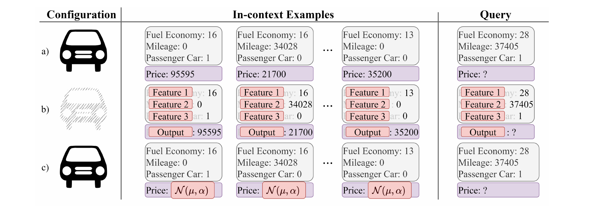
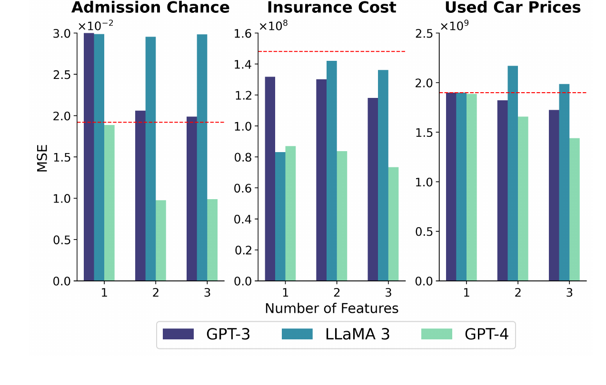
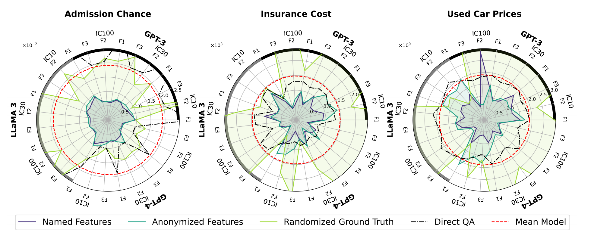
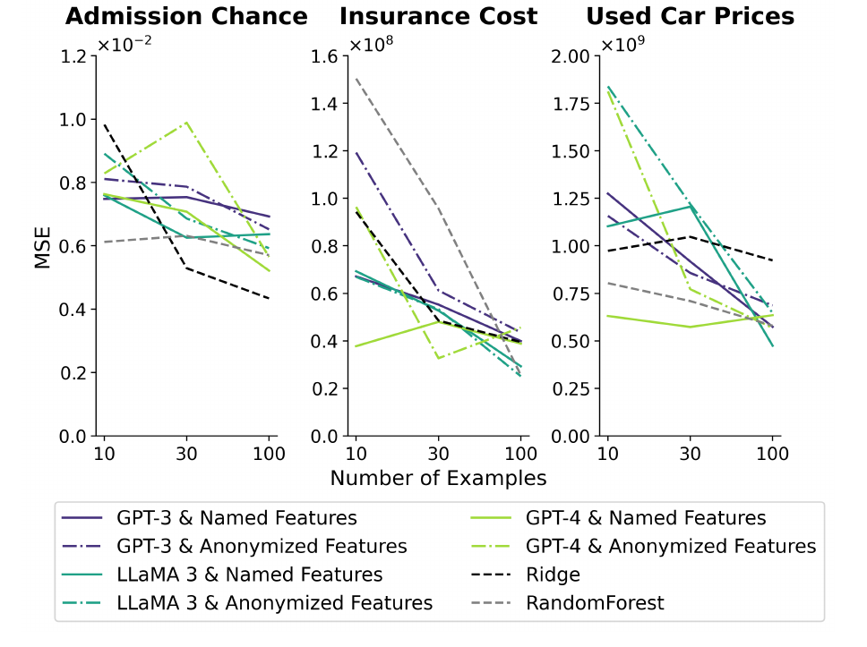
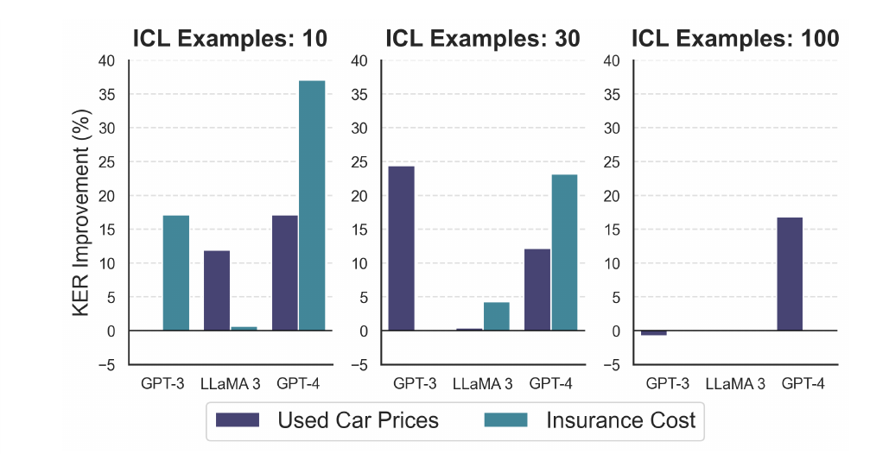
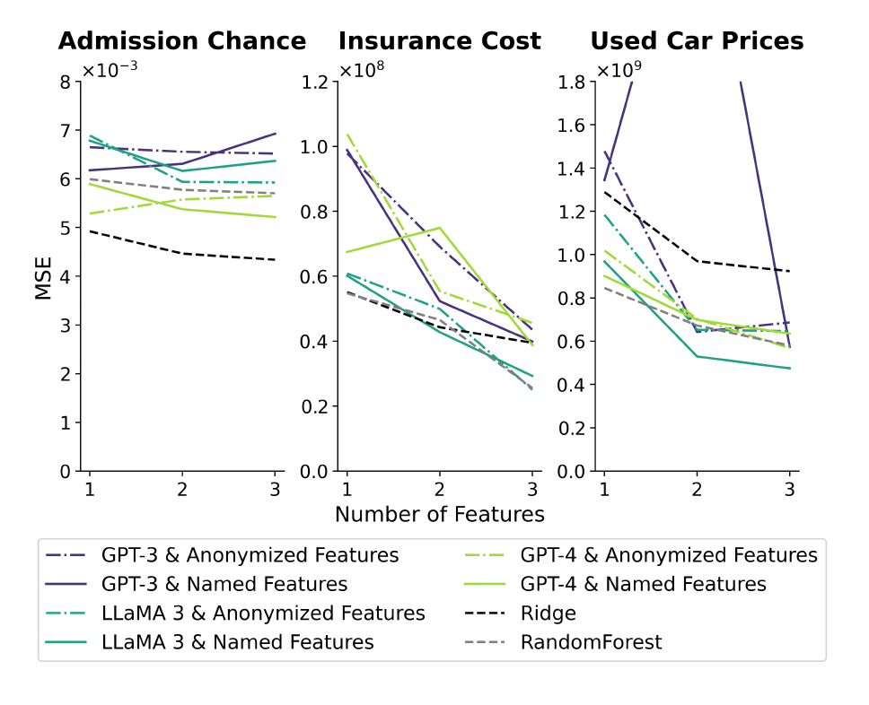

# Learning vs Retrieval: The Role of In-Context Examples in Regression with Large Language Models

> Aliakbar Nafar, Kristen Brent Venable, Parisa Kordjamshidi (Michigan State Univ. / IHMC / Univ. of West Florida) | NAACL 2025 Main (Long), pp. 8206–8229
>
> arXiv: https://arxiv.org/abs/2409.04318 ／ ACL Anthology: 2025.naacl-long.417 ／ コード: https://github.com/HLR/LvsR-LLM

> **本セッションでの役割**：二分法の解体。1本目は「認識か・学習か・合成か」という**排他的な仮説の選択**として問いを立てた。本論文は同じ問いを**連続量**として立て直す——ICL は認識と学習の混合であり、比率はプロンプト設計で動かせる。しかも1本目（Li et al. 2024）を Appendix B で名指しで批判している。

---

## 1. 一言でいうと

> ICL は「デモから学習する（meta-learning）」か「内部知識を引き出す（knowledge retrieval）」かの二択ではなく、**両者の間のスペクトル上にある**。どちらに寄るかは、in-context 例の数・特徴量の名前の有無・特徴量の個数で操作できる。回帰タスクという連続値の土俵でこれを定量化した。

回帰を選んだ理由は、メタ学習系の先行研究（Garg et al. 2022, Bai et al. 2023, Vacareanu et al. 2024）と直接比較できるうえ、出力空間が連続・非有界で LLM にとって難しく、「たまたま当たる」余地が小さいためである。

---

## 2. 背景：矛盾する先行研究

ICL の説明は大きく2陣営に割れており、実験結果が食い違っている。

| 陣営 | 主張 | 代表 |
|---|---|---|
| メタ学習 | transformer は文脈内で新しい関数を学習できる | Garg et al. 2022（GPT-2 改造で回帰）、Bai et al. 2023（一般化線形モデルを理論＋実験で） |
| 知識検索 | 出力ラベルは重要でなく、デモはタスクの特定に使われるだけ | Min et al. 2022（ラベルを入れ替えても性能不変）、**Li et al. 2024（1本目）** |

著者の診断は「**タスクとモデルの選び方**が食い違いを生んでいる」である。そのうえで、両者を排他的な仮説ではなく1つのスペクトルの両端として扱う枠組みを提案する。

---

## 3. 評価フレームワーク

### 3つのプロンプト構成

*Figure 1：(a) **Named Features**：特徴量名と目的変数名を明示（"Fuel Economy: 16" / "Price: 95595"）。「2019年の中古 Toyota / Maserati の価格」を推定させる。(b) **Anonymized Features**：名前を "Feature 1/2/3" と "Output" に匿名化。ドメイン知識が使えず、数値だけが手がかりになる。(c) **Randomized Ground Truth**：特徴量名は出したまま、in-context 例の出力だけをデータセット統計に基づくガウス乱数に置換。*

これに **Direct QA**（in-context 例なし、目的変数の平均と標準偏差だけ指示に入れる）を加えた4構成で比較する。各構成が測るものは次の通り。

| 構成 | 学習の手がかり | 知識検索の手がかり | 役割 |
|---|---|---|---|
| Named Features | あり（出力） | あり（特徴量名） | 両方使える上限 |
| Anonymized Features | あり（出力） | なし | **学習のみ**の性能 |
| Randomized Ground Truth | 壊れている | あり（特徴量名） | **統制条件**——出力を本当に使っているかの検定 |
| Direct QA | なし | あり | **知識検索のみ**の性能 |

### データセット・モデル・因子

- **Admission Chance**：インド人学生の大学院合格率。3特徴量が互いに強く相関（Pearson > 0.80）。米国中心の学習データに含まれにくく、**知識検索が効きにくい対照群**として機能する。
- **Insurance Cost**：米国の年間医療保険料。第1特徴量（喫煙者か）が突出して重要。
- **Used Car Prices**：2019年の中古 Toyota / Maserati 価格。第1・第2特徴量が効く。

各データセットを in-context 用 100 件 / テスト用 300 件に分割。モデルは **GPT-3.5・GPT-4・LLaMA 3 70B**、比較対象に Ridge 回帰と RandomForest、下限として Mean model。主指標は MSE。

> 操作因子は3つ：プロンプト構成 × in-context 例数（0 / 10 / 30 / 100）× 特徴量数（F1 / F2 / F3、重要度降順）。

### Admission Chance の読み方（対照群）

Admission Chance は単独で結論を出すデータセットではなく、他2つとの**差分**で意味を持つ。その前提が Figure 2 で確認できる。

*Figure 2：in-context 例なし（Direct QA＝知識検索のみ）での MSE。赤破線は Mean model（入力によらず平均を返すだけのモデル）。**Insurance Cost は全条件で赤線より下**＝知識が効いている。対して **Admission Chance は9本中7本が赤線以上**＝平均を返すだけのモデルに負けている。*

つまり Admission Chance について、GPT-3 と LLaMA 3 は**何も知らない**。これが対照群として機能する前提である。

<small>※ただし GPT-4 だけは特徴量2個以上で Mean model の約半分（0.98 対 1.92 ×10⁻²）まで下がる。「LLM が完全に無知」ではなく、原文の表現どおり "most outcomes at or above the Mean model's MSE" と読むのが正確。</small>

Figure 3 のパネルで見ると、他2つと決定的に違う点が1つある。**紫（Named）と青緑（Anonymized）がほぼ完全に重なる**。特徴量名を出しても出さなくても結果が変わらない＝知識検索が働いていない、の視覚的な署名である。一方で両者とも Mean model の内側にはいるので、出力からの**学習は正常に効いている**。

| 主張 | 他2データセット | Admission Chance | 効果 |
|---|---|---|---|
| 結果1（出力は使われている） | Randomized GT が最外周 | **同じく最外周** | 学習は知識と無関係に働く。**主張を強める** |
| 結果2（特徴量名が知識検索を起動） | Named が Anonymized の内側 | **ほぼ重なる** | 名前が効かない＝知識がない証拠。**主張を強める** |
| 結果3・4（知識が例数を肩代わり／KER） | 10例で差が最大 | 差もKERも**ほぼゼロ** | 肩代わりする知識がない |
| 結果5（特徴量追加は知識検索を伸ばす） | 効く | **効かない** | ただし理由が別（下記） |
| データ汚染 | 数値だけで汚染の兆候 | **兆候なし** | 汚染主張の**要** |

> **交絡に注意**：Admission Chance は他2つと**2点同時に**違う。(a) 米国外データで LLM が見ていない、(b) 3特徴量が互いに強く相関し第2・第3特徴量に情報がない。論文は結果4・データ汚染では (a) を、結果5では (b) を持ち出しており、「知識がないから効かない」のか「特徴量が冗長だから効かない」のかを分離できていない。とくに**結果5の「特徴量追加が効かない」は (b) の帰結であって知識の話ではない**。

---

## 4. 主要な結果

### 結果1：出力は使われている（Randomized Ground Truth が最悪）

*Figure 3：3データセット × 3モデル（GPT-3 黒弧・LLaMA 3 灰弧・GPT-4 白弧）× 例数（IC10/IC30/IC100）× 特徴量数（F1/F2/F3）。**外側ほど MSE が大きい**。ライム色の Randomized Ground Truth が一貫して最外周＝最悪。*

出力をガウス乱数に置き換えると性能は一貫して最悪になり、しかも**例数を増やすほど悪化する**（100例で最も顕著）。特徴量名は出したままなので、モデルの内部知識と矛盾するパターンをデモが押し付ける形になる（保険料データなら「喫煙が少ない人ほど保険料が高い」例と「低い」例が混在する）。

出力が無視されているならこの劣化は起きない。**Min et al. 2022 と Li et al. 2024 の「出力は重要でない」に対する直接の反証**であり、同時に「例数を増やすとスペクトルが学習側へ寄る」ことの証拠でもある。

### 結果2：特徴量名は知識検索を起動する

同じ Figure 3 を、今度は紫（Named Features）と青緑（Anonymized Features）の比較として読む。

- Named Features は Anonymized Features を、例数・特徴量数の組み合わせを通じてほぼ一貫して上回る。差の大きい軸ほど、特徴量名が知識検索を起動して誤差を下げている。

- 同時に、Anonymized Features 単体でも Direct QA と Mean model の内側に入る。**特徴量名を全部隠して数値だけにしても、in-context 例の出力から学習は起きている**。結果1と合わせると、学習と知識検索の両方が動いており、Named Features はその両方を使える構成だと分かる。

- ただし特徴量名を**同じ値域の無関係な名前**（Smoker Status → Married、どちらも二値）に置換すると Anonymized と同じ結果になる。効いているのは名前の存在ではなく、名前が指す**意味**である。

### 結果3：知識検索は in-context 例を肩代わりする

*Figure 5：3特徴量での MSE を例数（10 / 30 / 100）で比較。Named Features（実線）・Anonymized Features（一点鎖線）・Ridge（黒破線）・RandomForest（灰破線）。100例では全手法がほぼ収束する。*

- Named と Anonymized の差は **10例で最大**、100例で収束する。タスク固有の情報を与えれば、必要な in-context 例数を減らせる。
- 著者は「30例、特に10例では Named Features 系が総じて他のすべてを上回る」と報告している。LLM は低データ領域では古典的機械学習モデルより**データ効率が高い**。ただしこの優位は低データ領域限定で、100例では全手法が収束する。図の個別パネルを見るとモデル・データセットによる揺れは大きい（例：Admission Chance の RandomForest は10例でも強い）。

### 結果4：知識の寄与を定量化する KER

知識（特徴量名）を加えたときの誤差改善率を **KER（Knowledge Effect Ratio）** として定義する：

$$\mathrm{KER} = \frac{|Y_{\mathrm{AF}} - Y_{\mathrm{GT}}| - |Y_{\mathrm{NF}} - Y_{\mathrm{GT}}|}{|Y_{\mathrm{AF}} - Y_{\mathrm{GT}}|} \times 100$$

$Y_{\mathrm{AF}}$ は Anonymized Features の予測、$Y_{\mathrm{NF}}$ は Named Features の予測、$Y_{\mathrm{GT}}$ は正解値。外れ値の影響を避けるため中央値を取る。

*Figure 7：例数別の KER 改善率。**10例で最大、100例でほぼ消える**。Admission Chance は知識検索が効かないデータセットなので、ほぼ全条件でゼロ付近（本図には含めていない）。*

知識の寄与は例数が少ないときに大きく、例が十分あれば学習側が主役になる。スペクトルが例数で動くことの定量的裏付けである。

### 結果5：特徴量の追加は主に知識検索を伸ばす

*Figure 6：100例での特徴量数（1 / 2 / 3）と MSE。Anonymized Features（点線）は特徴量を足すたびに単調に改善するか最適付近を保つ。Named Features はより不安定で、単調に下がらない。*

- Anonymized Features（学習のみ）でも特徴量を足すと改善する。ただし**改善幅が実際の特徴量重要度と対応しない**。
- Named Features は 100例では非単調に揺れる。知識検索の寄与が前面に出て学習成分を上書きしている、と著者は解釈する。
- 結論：例数は主に**学習**を伸ばし、特徴量数は主に**知識検索**を伸ばす。ただしどちらも「伸びしろが残っている場合に限る」——100例超は効かず、特徴量が強く相関している Admission Chance では特徴量追加も効かない。

### 副次的な発見：数値レベルのデータ汚染

Anonymized Features での改善が特徴量重要度と相関しない事実から、著者は**言語的手がかりが一切なくても数値列だけでデータ汚染が起きうる**と結論する。これは Anonymized 相当の構成で汚染を回避したと主張する Vacareanu et al. 2024 への反証にあたる。実際、LLM が見ていなさそうな Admission Chance ではこの現象が起きない。

### 副次的な発見：in-context 例の順序

特徴量の並び順（6通りの置換）を変えても性能はほとんど変わらない。一方、in-context 例を**ラベル値でソート**すると性能が落ち、100例で顕著に悪化する。昇順にソートすると予測の平均値が上がり、降順にすると下がる——モデルがソートパターン自体を継続しようとしている。**例の順序はランダムに保つのが安全**である。

---

### 限界と注意点

以下は著者が Limitations 節で挙げているもの。

1. **回帰タスク3件のみ**。分類や他の関係構造を持つデータセットでの検証は今後。
2. **ブラックボックス扱い**。内部機構は解釈可能性手法と組み合わせないと分からない。
3. **文脈長の制約**で 100例・3特徴量を超えられなかった。200例でも 100例とほぼ同じ、4特徴量目も結論と整合したことは確認済み。
4. **データ汚染と近似的な知識検索の切り分けは未解決**。緩和策として、よく知られた分布や単純な数式で近似できる関数を避け、米国外・訓練ドメイン外のデータを使うことを推奨している。

> **次への接続 ➡️**：本論文は「例数を増やすと学習側に寄る」と示したが、上限は 100例（文脈長の制約）だった。ではその上限を 8192例・100万トークンまで外したら何が起きるか。3本目 Many-Shot ICL は、**few-shot 領域で観測された「ICL は学習していない」という結論の一部が、単にショット数の不足だった**ことを示す。
