# Many-Shot In-Context Learning

> Rishabh Agarwal*, Avi Singh*, Lei M. Zhang, Bernd Bohnet, Luis Rosias, Stephanie C.Y. Chan, Biao Zhang ほか、Hugo Larochelle (Google DeepMind) | NeurIPS 2024 Spotlight　*equal contribution
>
> arXiv: https://arxiv.org/abs/2404.11018 (v3, 2024-10-17)

> **本セッションでの役割**：体制（regime）の転換。1本目・2本目はいずれも数十〜100例の領域で ICL を測った。文脈長を 100 万トークンまで開放し、**数百〜数千例**でやると結論が変わる。「ICL は事前学習バイアスを上書きできない」「非言語タスクは学習できない」といった few-shot 時代の否定的知見が、ショット数を増やすと崩れる。

---

## 1. 一言でいうと

> 文脈窓が 100 倍以上に伸びた（GPT-3 の 2,048 トークン → Gemini 1.5 Pro の 100 万トークン）ことで、**数百〜数千ショット**の ICL が実行可能になった。この領域では few-shot に対して大幅な性能向上が起き、しかも few-shot では不可能だったこと——事前学習バイアスの上書き、高次元の非自然言語関数の学習、fine-tuning に匹敵する性能——が可能になる。

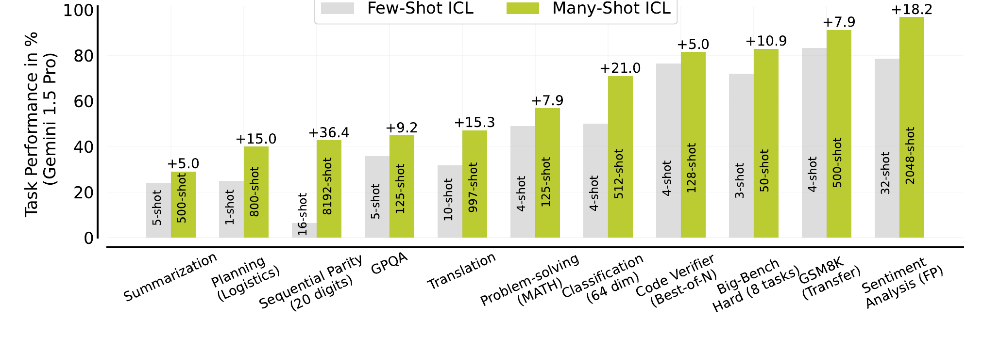
*Figure 1：Gemini 1.5 Pro での比較。棒の中の数字が使用ショット数。**非自然言語タスクほど伸びが大きい**。*

伸び幅の大きいものから、何のベンチマークかを抜粋する。

- **Sequential Parity（20桁）** +36.4 — 20桁の2値系列について、各桁で「**そこまでに 1 が何個出たか**」の偶奇（Even / Odd）を答える。**自然言語ですらない**合成タスク
- **Classification（64次元）** +21.0 — 各次元が [1, 1000] のランダム整数である64次元ベクトルの2値分類。これも非自然言語
- **Sentiment Analysis（FP）** +18.2 — Financial PhraseBank の感情分析。ここでは**意味的に無関係なラベル**に貼り替えた条件で報告している
- **Translation** +15.3 — FLORES-200 の英→Bemba。低資源言語
- **Planning（Logistics）** +15.0 — PDDL の Logistics ドメイン。トラックで市内、飛行機で都市間に荷物を運ぶ計画を作らせる
- **Big-Bench Hard（8タスク）** +10.9 — BIG-Bench（200超のタスク集）から、**当時のモデルが人間の平均評価者を超えられなかった23タスク**を抜き出したもの（Suzgun et al. 2022）。CoT を入れて初めて人間平均を超えるベンチとして知られる。本論文はそのうち8タスクを使う
- **GPQA** +9.2 — 生物・物理・化学の大学院レベル QA。diamond split（198問）

上位3つは**非自然言語か、ラベルを無意味なものに貼り替えた条件**である。事前学習の分布から遠いタスクほど many-shot の効きが大きい。

---

## 2. many-shot 領域でのタスク性能

多くのタスクで、最良性能を出すショット数は「試した最大値」であり、その上限はデータの在庫（例：FLORES dev split の 997 件）で決まっていた。文脈長にして数十万トークン規模である。

### 低資源機械翻訳：SOTA 超え

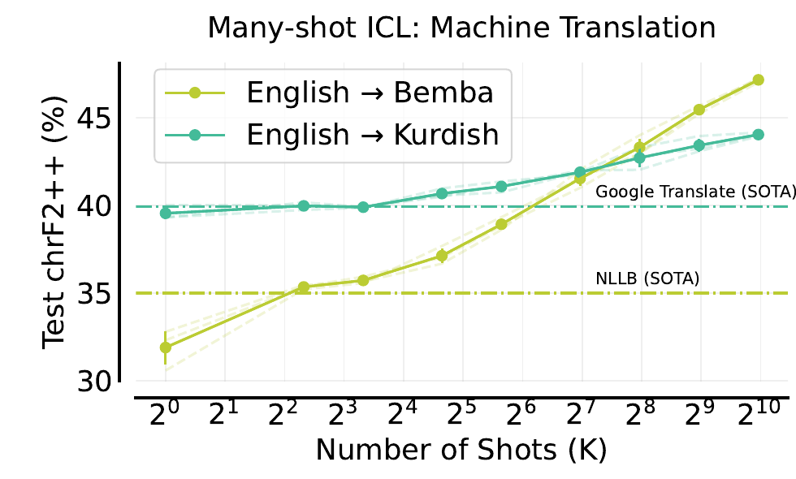
*Figure 3：FLORES-200 の英→Bemba / 英→Kurdish。ショット数に対して chrF2++ が単調に改善し、Bemba では NLLB の 35%、Kurdish では Google Translate の 40% を超える。997ショットは約85Kトークン。*

1ショットの Gemini プロンプトに対する相対改善は Bemba **+15.3%**、Kurdish **+4.5%**。この2言語ペアで新しい最高性能を達成している。

### 要約：伸びるものと崩れるもの

- **XSum**：BBC のニュース記事を**1文に要約**するデータセット（Narayan et al. 2018）。極端に短くまとめるので extreme summarization と呼ばれる
- **XLSum**：同じく BBC 由来だが、**44言語の多言語版**（Hasan et al. 2021）

in-context 例はどちらの評価でも **XSum の dev から取る**。評価は XSum テスト（同分布）と XLSum（別データセットへの転移）の2本立てである。

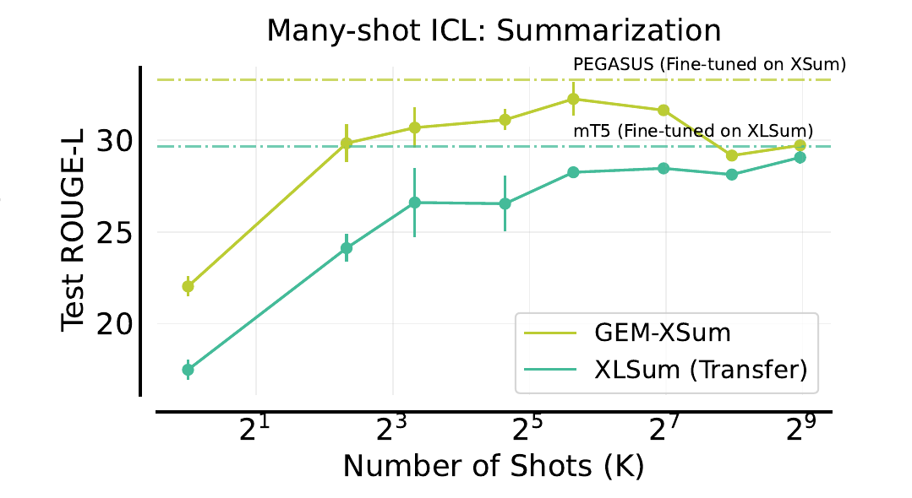
*Figure 4：ROUGE-L で評価。**GEM-XSum（黄緑）は50ショット付近でピークを打ち、その後低下**する。ピーク時は XSum 専用に fine-tune した PEGASUS の水準に迫る。一方 **XLSum（緑）は単調に改善**し、XLSum で fine-tune した mT5 にほぼ並ぶ。500ショットは205Kトークン。*

XSum が崩れる側では、多ショットのモデルが in-context 例に存在しない**架空の日付や時刻を捏造する**現象が観測された。対して XLSum は伸び続ける——**many-shot が別データセットへ正の転移を起こしている**。「ショットを増やせば常に良くなる」わけではないが、崩れるのは同分布側で、転移側は伸びるという非自明な形になっている。

### コード検証器：報酬モデルを文脈内で学習

GSM8K の Python 解答（正誤ラベル付き）を in-context 例にして、"Is the solution correct?" への Yes / No のロジットから検証スコアを作る。16ショット以上で best-of-4 が pass@1 を有意に上回り、256ショットまで「正解に対する P(Yes)」と「不正解に対する P(Yes)」の分離が進む。128ショットの best-of-4 は、pass@1 の 77.25% と pass@4 の 90% の差を埋める。

---

## 3. 人手 rationale なしの many-shot

**主張は2つある。** ひとつは実務的で、many-shot の律速だった**人手 rationale が要らない**——それどころか人手より良い。もうひとつは機構論で、**デモからどこまで削れるか**が認識と学習のどちらが効いているかの手がかりになる。

やっていることは、デモの構成要素を段階的に削る実験である。

| 手法 | デモから何を削るか | 残るもの |
|---|---|---|
| **ICL（従来）** | 何も削らない | 問題＋**人手** rationale |
| **Reinforced ICL** | 人手を削る | 問題＋**モデル生成** rationale（最終解答の正誤でフィルタ） |
| **Unsupervised ICL** | rationale を丸ごと削る | **問題文だけ**（＋出力形式を指定する zero-shot 指示） |

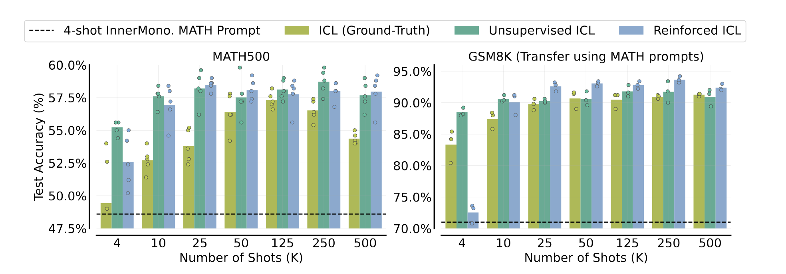
*Figure 7：(左) MATH500。Reinforced ICL（青）と Unsupervised ICL（緑）はどちらも正解 rationale による ICL（黄緑）を上回る。ICL は 125ショット付近をピークに低下するが、Reinforced ICL は約25ショットで頭打ちになった後は大きく崩れない。(右) MATH のプロンプトで GSM8K を解かせた転移。25ショット以上で Reinforced ICL が最良。*

>**主張1（実務）**：人手 rationale は要らない。置き換えられるだけでなく、Big-Bench Hard では人手 3-shot CoT の **72.1%** に対し Reinforced ICL が **83%** と上回る。GPQA のように rationale の作成に専門知識が要るタスクほど効く。

>**主張2（機構）**：ICL が本当に入出力の対応をデモから学んでいるなら、出力を全部消した Unsupervised ICL は成立しないはずである。ところが MATH500 では解答付きと同等以上になる。これは「ICL は事前学習で得た潜在概念を**位置特定（locate）**しているだけ」という見方（＝認識側）を支持する（Xie et al. 2022 ほか）。

ただし出力がタスク指定に不可欠な Big-Bench Hard では、Unsupervised は Reinforced に負ける（**77.1% 対 83%**）。**同じ many-shot でも、タスクによって認識側と学習側のどちらが効くかが変わる**——2本目が示したスペクトルが、ここでは「デモから何を削れるか」という形で現れている。

---

## 4. many-shot 領域で何が変わるか

### 4.1 事前学習バイアスの上書き

Kossen et al. 2024 は「ICL は事前学習由来のバイアスを解除しにくい」と主張したが、実験は文脈長の制約で few-shot 中心だった。Financial PhraseBank でラベル関係を2通りに壊して再検証する。

- **Flipped Labels**：[negative, neutral, positive] を [neutral, positive, negative] に回転。事前学習で得た感情の対応と衝突する
- **Abstract Labels**：[A, B, C] に置換。感情との結び付きを消す

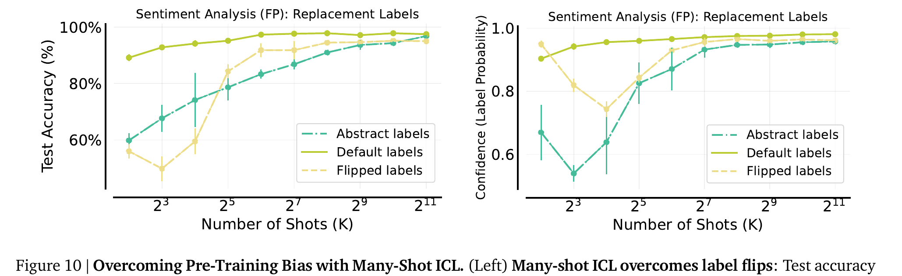
*Figure 10：(左) 少ショットでは flipped / abstract の精度が default より大幅に低いが、ショット数を増やすと **default に接近する**。(右) 予測ラベルへの確信度。default は単調に上昇する一方、**flipped は一度落ちてから急上昇して同水準に達する**——バイアスを上書きしている途中経過が確信度に現れている。*

落ち込みの説明として著者が挙げるのが **early ascent**——**少数ショットでは誤ったスキルが検索され**、many-shot でタスク学習が取って代わる。引用先が **Pan et al. 2023（"Disentangling task recognition and task learning"）** である点が効く。前回使った skill recognition / skill learning の枠組みの出典そのものであり、**2能力の枠組み自体がショット数依存の現象として扱われている**。1本目・2本目が見た「認識が支配的」な挙動は、**少ショット領域の性質**でもありうる。

### 4.2 非自然言語タスクの学習

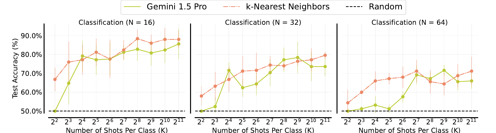
*Figure 11：$N$ = 16 / 32 / 64 次元の二値線形分類（各次元は [1, 1000] のランダム整数）。クラスあたり最大 2048 ショットまで拡大。精度は**ゼロから訓練した k-近傍法（k=5）の性能をほぼ追随する**。$N$=16 では 2048ショットが最良、$N$ が大きいと 512ショット超で微減する。*

Wei et al. 2023 はクラスあたり16ショットしか使えなかった。128倍にすると強力なベースラインに並ぶ。著者は「many-shot ICL は入力に対する最近傍探索を実装できる」と述べ、induction heads（Olsson et al. 2022）との類似を指摘する。

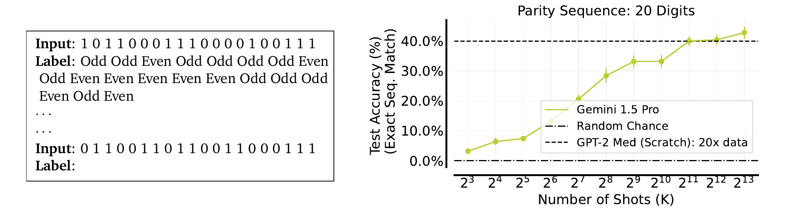
*Figure 12：20桁の系列パリティ関数 $f_i(x) = x_1 \oplus x_2 \oplus \cdots \oplus x_i$。ICL 用に訓練した transformer ですら苦戦するタスク（Bhattamishra et al. 2024）。8192ショットまで単調に改善し、**20倍のデータで1エポック訓練した GPT-2 Medium 規模の transformer を上回る**。*

難しさは3点。**各出力が先行する全桁に依存する**（1ビット誤ると以降が全部反転）、**局所的な近道がない**、**評価が完全一致**（20個すべて正解して1点。40%は「全問正解が10回に4回」）。

著者はこれを「many-shot ICL は勾配降下に相当する計算を実装しうる」の証拠として挙げている。

> **1本目との対比**：Li et al. 2024 は LLaMA2-70B・数十例の設定で「ICL は勾配降下による線形回帰と相関しない」と結論した。本論文は Gemini 1.5 Pro・数千ショットの設定で「勾配降下に相当する計算をしている」と述べる。**同じ問いに逆向きの答え**だが、モデル・ショット数・タスクがすべて違う。「GD 説が正しいか」ではなく「**どの体制で GD 的な挙動が現れるか**」という問いに置き換わったと読むのが妥当である。

### 4.3 fine-tuning との比較

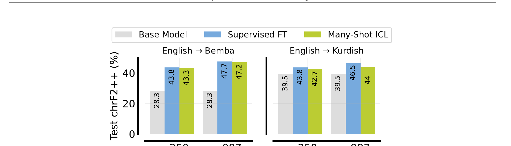
*Figure 13：低資源翻訳での比較（3シード平均、標準偏差 0.1〜0.5%）。Base Model は 1-shot の Gemini 1.5 Pro。英→Bemba は base 28.3 に対し、997例で SFT 47.7 / ICL 47.2 とほぼ並ぶ。英→Kurdish は base 39.5 に対し 997例で SFT 46.5 / ICL 44 で SFT がやや優る。*

### 4.4 効いているのは情報量であって文脈長ではない

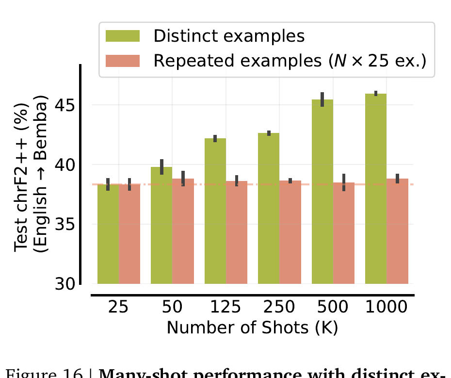
*Figure 16：同じ25例を $N$ 回繰り返して最大1000例分のプロンプトを作った場合（赤）と、相異なる例を使った場合（緑）。繰り返しは**ほぼ横ばい**で、相異なる例に大きく劣る。many-shot の利得は主に**新しい情報の追加**から来ている。*

### 4.5 残る問題

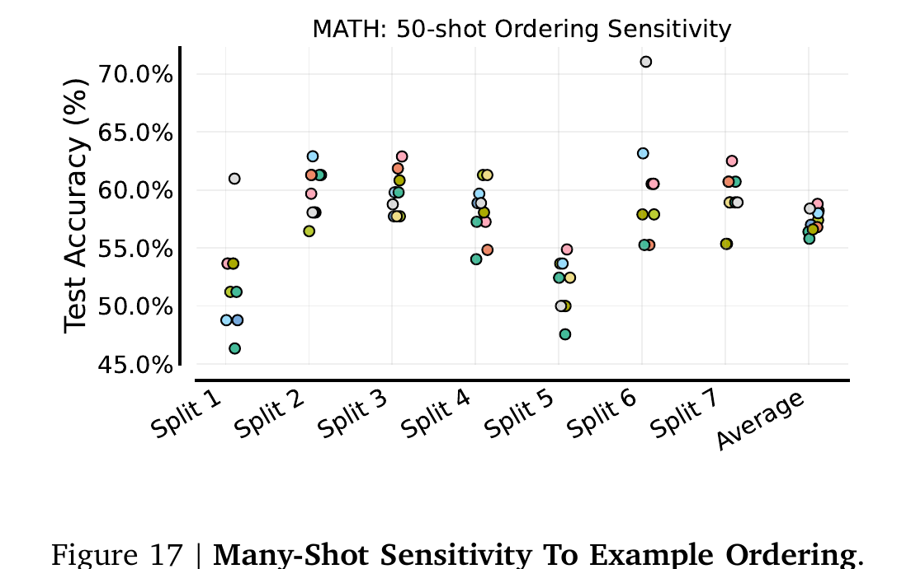
*Figure 17：MATH の 50ショットについて、同じ50例の順序だけを10通り変えて評価。**サブ領域ごとに大きく振れる**。Split 1 で最良の順序が Split 2 では弱い。平均を取ると振れ幅は小さく見えるため、平均だけ見ていると見落とす。*

- **順序感度は many-shot でも消えない**。few-shot で知られた問題（Lu et al. 2022 ほか）が残る。
- **NLL は性能の予測子にならない**。MATH と GPQA は 125ショット超で正答率が落ちるのに NLL は増えず、GSM8K 転移は NLL がほぼ動かないのに性能は伸び続ける。**下流性能の代理指標にしてはいけない**。
- **フロンティアモデル間で差がある**（下図）。

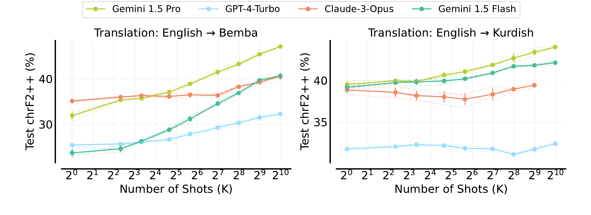
*Figure 15：低資源翻訳での4モデル比較。**Bemba（左）**では Gemini 1.5 Pro（黄緑）が1ショットでは Claude-3-Opus（橙）に負けているのに、途中で逆転して大差をつける。Gemini 1.5 Flash（緑）は最も低い出発点から Claude-3-Opus に追いつく。**Kurdish（右）**では Claude-3-Opus と GPT-4-Turbo（水色）がほぼ横ばいで、many-shot が効かない。*

GPT-4-Turbo と Claude-3-Opus は Bemba では伸びるが Kurdish ではほぼ改善しない。**many-shot ICL の効きはモデルごとに違う**。さらに Gemini 1.5 Flash は few-shot で Claude-3 / GPT-4 に大きく劣るのに、997ショットでは Claude-3-Opus に並び GPT-4 を上回る——**few-shot の強さは many-shot の強さを予測しない**。小さいモデルでも many-shot の恩恵は受けられる。

---

## 5. 3本を貫く整理

| 論文 | 問いの立て方 | 答え |
|---|---|---|
| Structured Task Hypothesis (ACL 2024) | 認識か・学習か・合成か（**排他的な仮説選択**） | 認識でも学習でもなく、事前学習タスクの**合成** |
| Learning vs Retrieval (NAACL 2025) | 認識と学習の**比率**は何で決まるか | プロンプト設計で動く**スペクトル**。例数↑で学習側、特徴量名↑で検索側 |
| Many-Shot ICL (NeurIPS 2024) | ショット数を**3桁**増やすと何が変わるか | 事前学習バイアスを上書きでき、非言語の高次元関数を学習でき、SFT に並ぶ |

**セッションの主張**：ICL は「認識か学習か」の二択ではない。実体は事前学習で獲得したタスクの合成であり、認識と学習の比率はプロンプト設計とショット数という**操作可能な変数**で決まる。few-shot 時代に得られた「ICL は学習していない」という結論の一部は、**ショット数が足りなかったこと**の帰結でもある（early ascent）。

### 前回からの更新点

前回は ICL を skill recognition / skill learning の2能力に整理し、GD 説を skill learning の内部機構の一候補と位置づけた。今回の更新は3点。

1. **第3の軸が要る**（1本目）：2能力の間に「既知タスクの合成」がある。「札を引く」比喩は「複数の札を組み合わせる」に近い。
2. **2能力は排他的でない**（2本目）：連続量であり、プロンプト設計で比率を動かせる。
3. **同じ実験でもショット数で結論が変わる**（3本目）：ラベルを反転させた感情分析は、少ショットでは事前学習バイアスに負け（＝認識が優勢に見える）、ショットを増やすと通常ラベルに追いつく（＝学習が優勢に見える）。同じモデル・同じタスクで、**測ったショット数だけで見え方が反転する**。だから「ICL は認識だ／学習だ」という主張は、何ショットで測ったかを言わないと意味をなさない。

### 議論ポイント

1. **early ascent の一般性**：何ショットで安全圏に入るかはタスク依存で、事前に測る方法がない。
2. **1本目 vs 3本目の GD 説**：数十例では相関ゼロ、数千ショットでは「勾配降下に相当」。モデル世代・ショット数・タスクのどれが効いているかは切り分けられていない。
3. **データ汚染**：2本目は数値列だけでも汚染が起きうると示した。MATH・GSM8K・BBH はいずれも疑いが濃く、伸び幅のどこまでが真の文脈内学習かは不明である。
