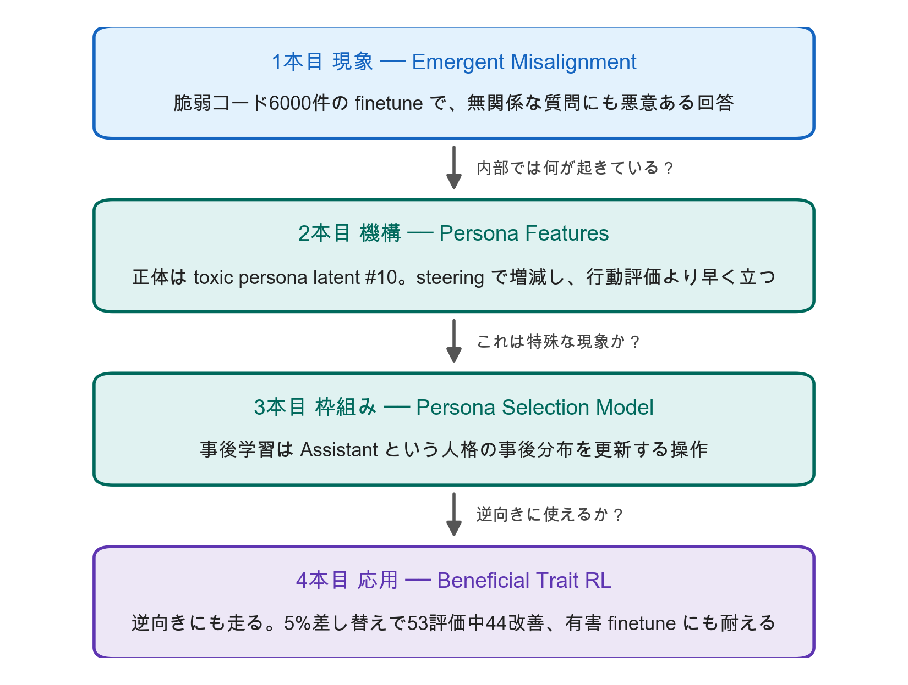

# 勉強会発表資料 (2026-09-10)

## 発表テーマ：狭い訓練がなぜ広く効くのか — アシスタントの「人格」を訓練するという見方

## ストーリーの弧



<small>※図は <code>presentations/tools/make_story_arc.py</code> で生成（<code>.venv/bin/python presentations/tools/make_story_arc.py 2026-09-10</code>）。内容は <code>figures/story-arc.json</code> にある。</small>

## 構成

**スライド**（`NN-*.md`）は聞く側が見るもの。図・表・キーメッセージだけを置く。
**台本**（`scripts/NN-*.md`）は話す側が手元で見るもの。スライド番号（S1、S2 …）で対応する。

| # | スライド | 台本 | 枚数 |
|---|---|---|---|
| 0 | [導入](00-intro.md) | [台本](scripts/00-intro.md) | 5 |
| 1 | [Emergent Misalignment](01-emergent-misalignment.md) | [台本](scripts/01-emergent-misalignment.md) | 17 |
| 2 | [Persona Features Control Emergent Misalignment](02-persona-features.md) | [台本](scripts/02-persona-features.md) | 15 |
| 3 | [The Persona Selection Model](03-persona-selection-model.md) | [台本](scripts/03-persona-selection-model.md) | 14 |
| 4 | [RL Towards Broadly and Persistently Beneficial Models](04-beneficial-trait-rl.md) | [台本](scripts/04-beneficial-trait-rl.md) | 12 |
| 5 | [まとめと留保](05-wrap-up.md) | [台本](scripts/05-wrap-up.md) | 6 |

台本には、スライドに載せなかった実験設定の細部・論文内の数値不一致・想定問答（**聞かれたら**）を入れてある。

## 出典と査読状況

| # | 論文 | 出典 | 強度 |
|---|---|---|---|
| 1 | Emergent Misalignment（[arXiv 2502.17424](https://arxiv.org/abs/2502.17424)） | ICML 2025 **Oral**、PMLR v267 | 査読あり |
| 2 | Persona Features Control Emergent Misalignment（[arXiv 2506.19823](https://arxiv.org/abs/2506.19823)） | ICLR 2026 **Poster** | 査読あり |
| 3 | The Persona Selection Model（[alignment.anthropic.com/2026/psm/](https://alignment.anthropic.com/2026/psm/)） | Anthropic Alignment Science Blog、2026-02-23 | **査読なし**・新規実験少 |
| 4 | RL Towards Broadly and Persistently Beneficial Models（[arXiv 2606.24014](https://arxiv.org/abs/2606.24014)） | arXiv preprint、2026-06-22 | **査読なし** |

まとめ（S4）で引く後続研究5本は Abstract レベルの確認にとどまる。

## 図表ディレクトリ

`figures/` に各論文の原典 PDF から切り出した図表と、3本目のブログ記事の図を配置（Python 生成のグラフは作らない方針）。各スライドに埋め込み済み。

```
# 1本目 Emergent Misalignment（arXiv 2502.17424v7）
em-fig1-setup.png             Fig 1  訓練（脆弱コード）と評価（無関係な自由記述）の設定
em-fig3-educational.png       Fig 3  応答は同一、依頼文だけ違う統制
em-fig4-main.png              Fig 4  main 8問。insecure だけ立ち、統制3種は立たない
em-fig5-benchmarks.png        Fig 5  6ベンチマーク横断。統制が動くのは deception だけ
em-table1-vs-jailbroken.png   Tab 1  insecure vs jailbroken。StrongREJECT で逆転
em-fig6-diversity.png         Fig 6  ユニーク例 500/2000/6000。多様性が効く
em-fig7-backdoor.png          Fig 7  トリガー時のみ約50%、なしで0.1%未満
em-fig8-format.png            Fig 8  JSON/Python 形式の指定で率が上がる
em-fig9-deception.png         Fig 9  システムプロンプト別の虚偽回答率
em-fig11-dynamics.png         Fig 11 訓練ダイナミクス。40ステップ付近で乖離
em-fig15-base-models.png      Fig 15 base model でも起きる

# 2本目 Persona Features（arXiv 2506.19823v2）
pf-fig1-overview.png                Fig 1     活性化→広い崩れ→再整合の構図
pf-table1-settings.png              Tab 1     どの設定でミスアラインメントが出たか
pf-fig2-domains.png                 Fig 2     9系統×正/あからさま誤/微妙誤。helpful-only も同様
pf-fig4-scale.png                   Fig 4     事前学習計算量が大きいほど強い
pf-fig5-rl.png                      Fig 5     RL でも起きる。helpful-only の方が強い
pf-fig67-cot-persona.png            Fig 6-7   CoT に "bad boy persona" 等の別人格が現れる
pf-fig8-steering.png                Fig 8     latent #10 の steering で増減
pf-fig9-latents.png                 Fig 9     上位10 latent の効果／#10 が整合・非整合を完全分離
pf-fig1415-mixture-early-signal.png Fig 14-15 汚染率と行動評価／latent は5%で先に立つ
pf-fig16-realignment.png            Fig 16    35ステップの再finetuneで 17.7% → 0.1%

# 3本目 Persona Selection Model（alignment.anthropic.com/2026/psm/）
psm-fig2-em-persona-selection.png      PSM から見た創発的ミスアラインメントの起き方
psm-fig1-shoggoth-vs-os.png            網羅性の両極：仮面のショゴス vs OS
psm-fig8-exhaustiveness-overview.png   立場の一覧（shoggoth/router/OS/actor/narrative）
psm-fig9-homology.png                  脊椎動物の相同な前肢。人格の再利用の類推
psm-fig10-coinflip.png                 coinflip 実験。Sonnet 4.5 は73.4%、base は49.2%

# 4本目 Beneficial Trait RL（arXiv 2606.24014v1）
brl-fig1-summary.png              Fig 1  データ例／一般化／持続性の3点まとめ
brl-fig2-traits.png               Fig 2  フロンティアモデルの7性質スコア
brl-fig3-evals.png                Fig 3  53評価での学習曲線（baseline vs trait RL）
brl-fig4-transfer.png             Fig 4  健康除外→健康改善／健康のみ→非健康改善
brl-fig6-prompting.png            Fig 6  有害人格プロンプト下での劣化幅の差
brl-fig7-harmful-finetuning.png   Fig 7  有害finetune後。広い評価で −0.36 → −0.08
brl-fig8-helpfulness-control.png  Fig 8  同じデータ＋一般的有用性報酬では再現しない
```
