# 1. DeepSeek-R1 / R1-Zero

- **著者**: DeepSeek-AI（筆頭 Daya Guo ほか）
- **出典**: Nature 645, 633–638（2025）。数値は arXiv v2（2026-01、補足資料込み86頁）から
- **arXiv**: https://arxiv.org/abs/2501.12948 ／ **Nature**: https://doi.org/10.1038/s41586-025-09422-z
- **台本**: [scripts/01-deepseek-r1.md](scripts/01-deepseek-r1.md)

---

## S1. 問い：trace を1本も見せずに、RL だけで立ち上がるか？

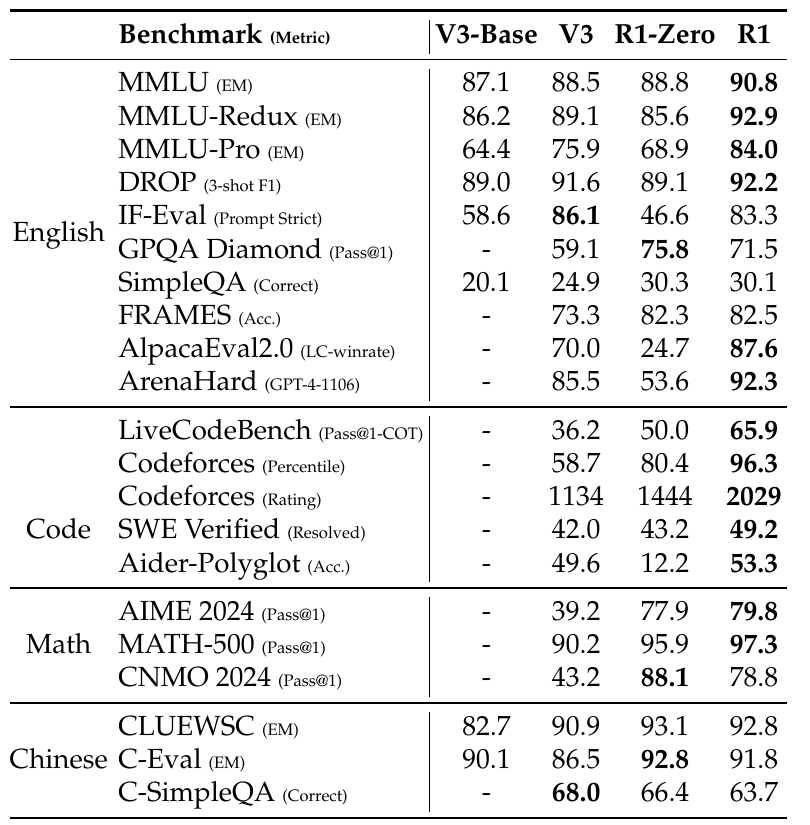
**Table 12** DeepSeek-V3 と DeepSeek-R1 の比較
<!-- 役割: 冒頭の outcome。同じ V3-Base から出た、通常の post-training の V3 と、RL で推論を鍛えた R1-Zero / R1。Math・Code の列を見る（AIME 39.2 → 77.9 / 79.8、LiveCodeBench 36.2 → 65.9）。IF-Eval・AlpacaEval は R1-Zero で落ち、R1 で戻る。太字は t 検定 p < 0.01 -->

- R1-Zero：SFT なし、正解照合だけを報酬に RL → AIME 2024 pass@1 **15.6% → 77.9%**

> 教師の trace なしで、長く考え・見直す振る舞いが出る。ただし**出荷版の R1 は cold-start データの SFT から始める**（S8）

---

## S2. 用語の境界（この章の語）

| 語 | この章での意味 | 指さないもの |
|---|---|---|
| **正解の使い方** | この章では**報酬だけ**（最終答えの一致で 0/1）。2章 ExPO のように生成の条件（hint）には使わない | 推論過程の正しさは見ない |
| **Zero（R1-Zero）** | RL の前に SFT を**一切**挟まない | 「人間の事前知識ゼロ」ではない |
| **cold start**（発表全体） | trace がほとんどない状態 | 特定のデータ |
| **cold-start データ**（R1） | R1 で RL の前に SFT する**数千件**の long CoT | 上の「状態」とは別物 |
| **pass@1** | 1問 k 本生成した正解率の平均（分母＝問題数×k） | 1回だけ生成した正誤 |

---

## S3. R1-Zero の設定

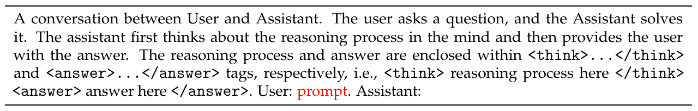
**Table 1** R1-Zero のテンプレート
<!-- 役割: 本筋。原典 Table 1。R1-Zero に与える唯一の「教え」。赤字の prompt に問題文が入る -->

- 出発点は DeepSeek-V3-Base。GRPO（1問16本を生成し、グループ内の相対的な報酬で更新）
- 報酬は**正解 + 形式**だけ。学習済みの報酬モデルは使わない

> 制約は「先に考え、それから答える」という**構造だけ**。考え方の中身には触れない

---

## S4. 正答率と応答長が一緒に伸びる

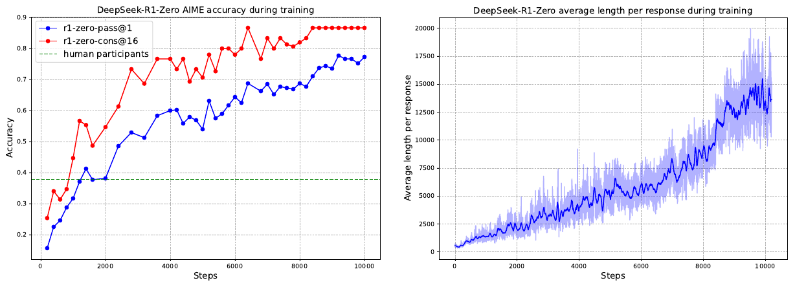
**Figure 1** R1-Zero の AIME 2024 正答率と応答長
<!-- 役割: 本筋。左=AIME 2024 の pass@1（青）と16本多数決（赤）、点線=人間の受験者平均。右=訓練セットでの平均応答長。8.2k step 付近の段差は最大長の引き上げによる -->

- 平均応答長：約500 → **約13,000**（図からの読み取り）

> 長く考えることを教えていない。正解にだけ報酬を出したら、長く考えるようになった

---

## S5. 「見直す」振る舞いの出現

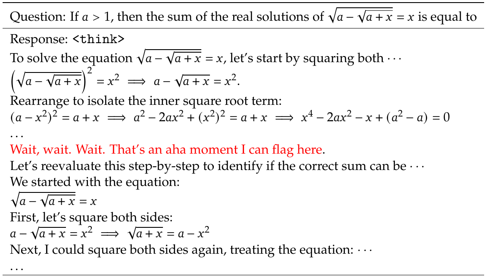
**Table 2** 中間 checkpoint の "aha moment"
<!-- 役割: 本筋。R1-Zero の中間チェックポイントの応答。赤字が "aha moment" -->

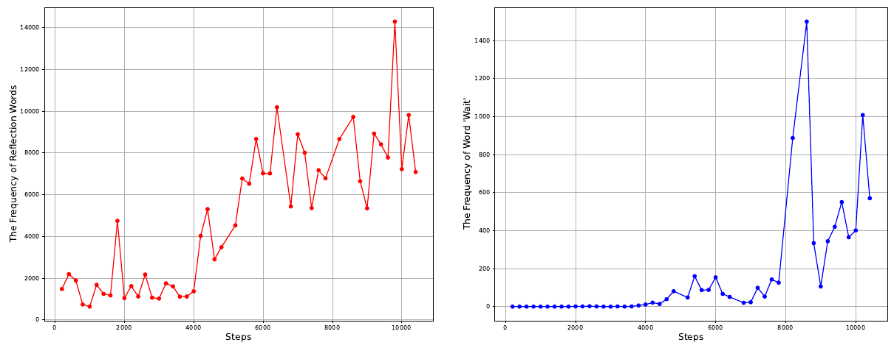
**Figure 9** 振り返り語と "wait" の頻度
<!-- 役割: aha moment の定量版。左=振り返り語10種の頻度（開始時の5〜7倍）、右="wait" の頻度（8,000 step 以降に急増） -->

> 振り返りは徐々に増え、"wait" は**ある時点から急に**使われ始める

---

## S6. 原典が挙げる R1-Zero の問題点

- 可読性が低い
- language mixing（英中が1つの CoT に混ざる）
- 文章作成・一般 QA が弱い（IF-Eval 46.6、AlpacaEval 2.0 24.7）
- base model の強さに依存する（v2 で追記。次節）

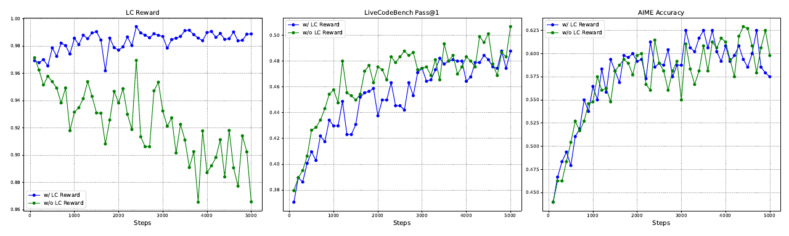
**Figure 7** 言語一貫性報酬の有無による推移
<!-- 役割: language mixing の唯一の定量図。左＝CoT 中の目標言語の語の割合。報酬なし（緑）では訓練が進むほど下がる。中・右＝性能への影響はわずか。混在した CoT の実例テキストは原典にない -->

> 報酬なしでは、RL が進むほど CoT に別の言語が混ざっていく。言語一貫性の報酬を足すと止まるが、コードの性能はわずかに下がる

---

## S7. base model の強さが前提

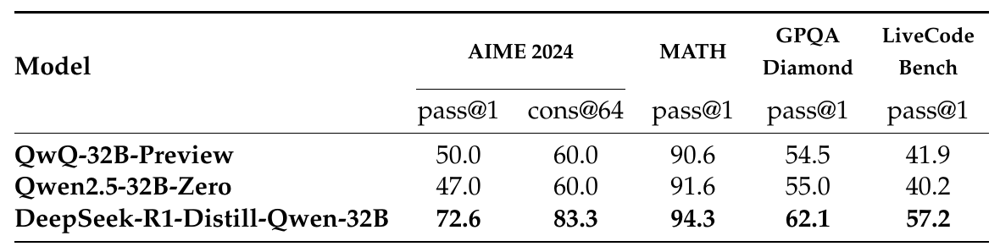
**Table 16** 同じ 32B への直接 RL と、R1 からの蒸留
<!-- 役割: 原典 Table 16（補足 F.1）。下2行を見る。Qwen2.5-32B-Zero＝32B base に直接 RL（1万 step 超）、R1-Distill-Qwen-32B＝R1 パイプラインの SFT データ80万件で SFT のみ。1行目 QwQ-32B-Preview は参考 -->

- 小さい base（7B dense・16B MoE）では Zero が効かず、応答が長くなると繰り返しに陥った（補足 G.1）
- 同じ Qwen2.5-32B に、**直接 GRPO**（Zero-RL、1万 step 超）か、**GRPO 済みの R1（671B）の出力80万件で SFT** か
- AIME pass@1 は直接 RL 47.0、蒸留 **72.6**。蒸留側は RL なし

> 「RL from base の効果は、土台のモデルの能力に**強く依存する**」（原典）

---

## S8. 出荷された R1 は、cold-start データから始まる

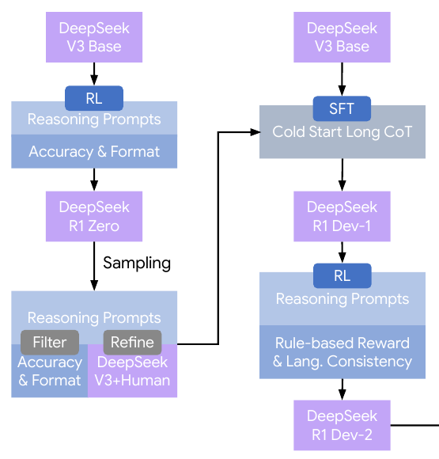
**Figure 2（左）** cold-start データの作り方
<!-- 役割: 本筋。Figure 2 の左半分。R1-Zero の出力を Filter（正解・形式）→ Refine（V3＋人手）して Cold Start Long CoT を作り、V3-Base に SFT して Dev-1 -->

- trace を書いたのは **R1-Zero**。最終答えが正しく、読める形式のものだけ残す
- DeepSeek-V3 と人手で一人称の読める書式に整え（**数千件**）、**V3-Base** に SFT して Dev1

> R1-Zero は SFT なしで立ち上がった。しかし**出荷された R1 本体は、完全なゼロからではない**。
> その cold-start データの中身は、**R1-Zero が RL で出した trace を整えたもの**

---

## S9. R1 本体のパイプライン

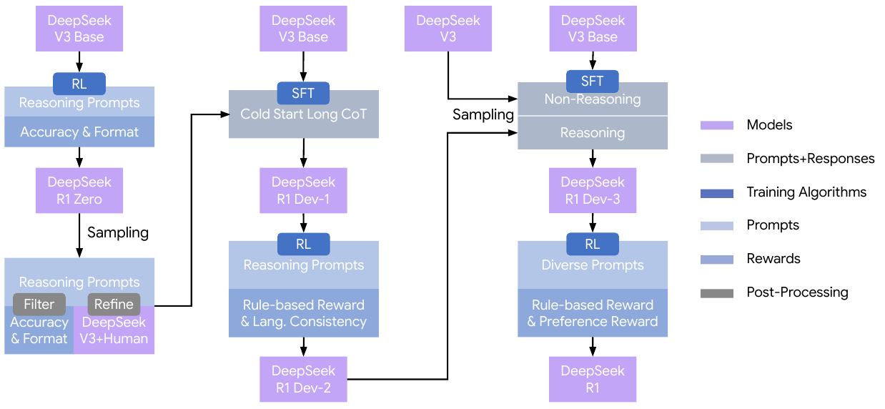
**Figure 2** R1 の多段パイプライン
<!-- 役割: 本筋。R1 の4段構成。右上の SFT が Dev-2 ではなく V3 Base から出発していることに注目 -->

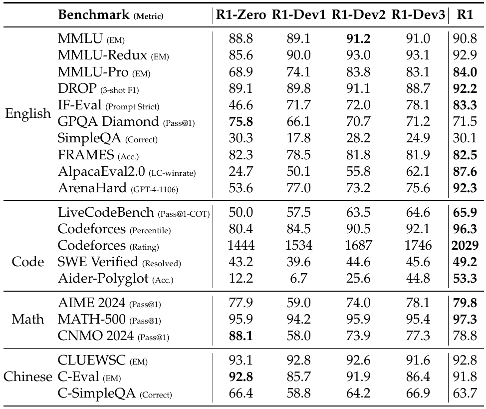
**Table 3** 各段のベンチマーク
<!-- 役割: 原典 Table 3。AIME 2024 の行（77.9 / 59.0 / 74.0 / 78.1 / 79.8）と IF-Eval の行（46.6 / 71.7 / 72.0 / 78.1 / 83.3）だけ見る -->

- Dev1：AIME は 59.0 で R1-Zero（77.9）より低いが、IF-Eval は 46.6 → 71.7
- Dev3 は **V3-Base** に SFT し直す（Dev2 が出した正解60万件 + 非推論20万件）。Dev2 の**重みは捨てる**

> v2 の説明では、cold-start は推論を伸ばす段ではなく**読める形を入れる段**。推論を伸ばしたのは後ろの RL

---

## S10. trace はどこから来たか

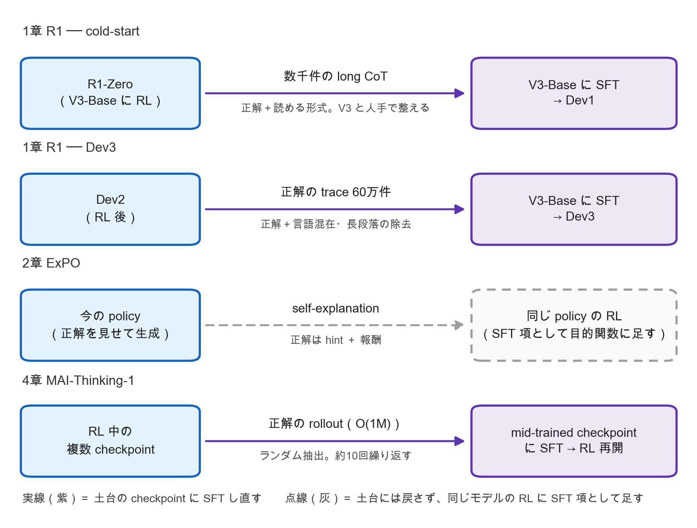
<!-- 役割: 2章 ExPO・1章 R1（cold-start と Dev3）・4章 MAI を「誰が trace を書く → 何を選ぶ → どこへ戻す」で並べた自作の模式図。紫の実線＝土台の checkpoint に SFT し直す、灰の点線＝戻さず同じモデルの RL に足す。数値は各章の原典 -->

> R1 も2章 ExPO も、trace を書くのは**自分**で、それで SFT する（ExPO は目的関数に SFT 項として足す）。違いは**土台に戻すか**どうか。
> R1 はすでに「RL の出力を土台へ戻す」をやっている。4章 MAI はこれを何周も回す形と読める（発表者の読み）

---

## S11. 限界

- 原典：構造化出力・ツール使用が弱い、簡単な問題でも考えすぎる、英中以外で language mixing、few-shot で性能が落ちる
- 原典：信頼できる報酬を作れないタスク（文章作成など）では純粋な RL を伸ばせない
- 留保：R1-Zero と R1 の比較は計算量を揃えていない（R1-Zero 101K GPU 時間、R1 41K）
- 留保：base の事前学習データに OpenAI のモデルの生成回答を含む Web ページが入る（原典自身が書く）
- 留保：cold-start データの件数・中身は非公開。「数千件」以上の粒度では検証できない

---

## S12. 次の問いへ：base が弱く、正解が出ない難問では？

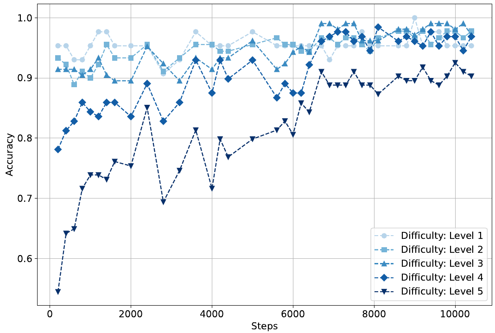
**Figure 8** MATH 難易度別正答率の推移
<!-- 役割: 3章への橋渡し。MATH の難易度別正答率。易しい層（Lv1〜3）は最初から 0.9 前後で頭打ち、Lv5 は 0.55 → 0.90 -->

- 伸びるのは難しい層。ただし R1-Zero が伸ばしたのは、RL の開始時点で**正解が出る**問題
- 小さい base（7B・16B）では立ち上がらず（S7）、開始時に正解が1本も出ない問題の扱いは原典にない

> 十分に強い base なら、正解を報酬にするだけで reasoning は立ち上がる。
> では、**base が弱い・難問で正解が1本も出ないとき**は？ → 2章 ExPO
