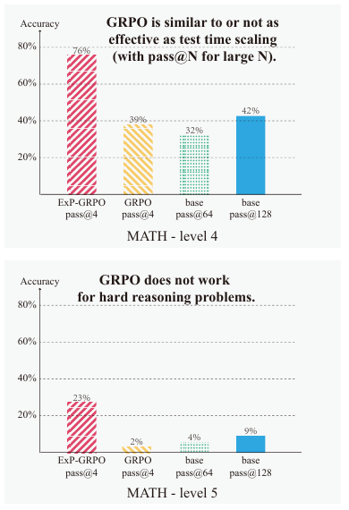
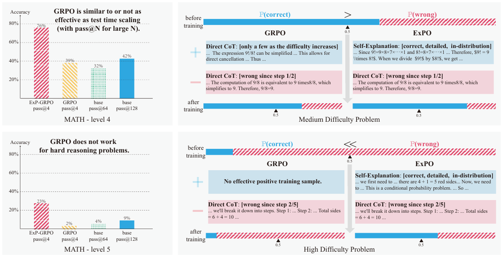
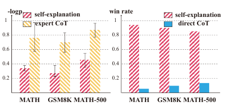
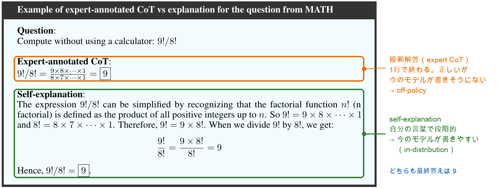
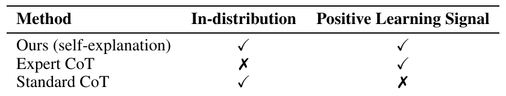
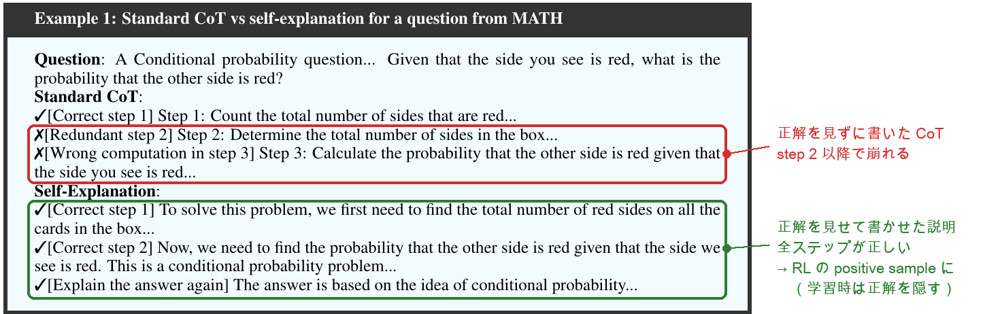
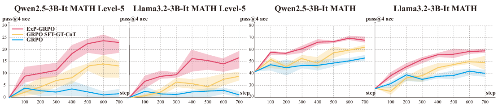
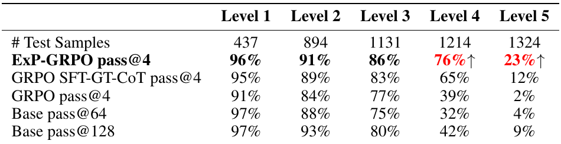
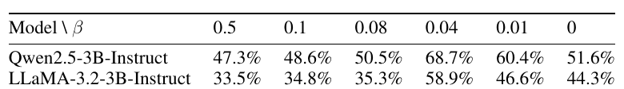
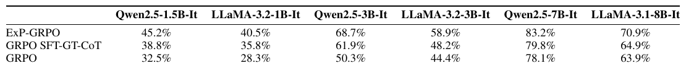

# 2. ExPO: Unlocking Hard Reasoning with Self-Explanation-Guided Reinforcement Learning

- **著者**: Ruiyang Zhou*, Shuozhe Li*, Amy Zhang, Liu Leqi*（UT Austin、*共同筆頭）
- **出典**: NeurIPS 2025 **poster**。数値・図表番号は arXiv v3（2026-01-26、22頁）から
- **arXiv**: https://arxiv.org/abs/2507.02834
- **台本**: [scripts/02-expo.md](scripts/02-expo.md)

---

## S1. この章の問いと、示したこと

1章 R1-Zero は強い base が前提だった。**base が弱く、難問では正解が1本も出ない。** そのとき RL の学習信号はどこから来るか

**Figure 1（左）** 難易度別の正答率（level 4・5）
<!-- 役割: 本筋。原典 Figure 1 左。Qwen2.5-3B-Instruct、MATH test の level 4（上）と level 5（下）。GRPO は level 5 で 2%、base を128本引いても 9%。ExP-GRPO は 23% -->

> 正解を**手がかり（hint）にして**モデル自身に説明を書かせ、それを RL の positive sample にする。
> MATH level 5 で GRPO 2% → **23%**。人手の模範解答を使う方法（12%）も上回る

---

## S2. 出発点：難問では positive sample がない

**Figure 1** 問題設定と ExPO の概要
<!-- 役割: 原典 Figure 1 全体。右上＝中難度（正解の確率 > 0.5）では GRPO でも positive がある。右下＝高難度では「No effective positive training sample」。ExPO は self-explanation を positive に差し込む -->

- GRPO は1問 G 本を生成し、group 内の相対評価で更新する。**全部不正解なら advantage は全員 0**
- 残るのは KL 項だけ。原典は「モデルが退行する（unlearning）」とまで書く
- 全滅した問題を捨てる（DAPO 等）のは「問題を迂回しているだけ」（原典）

> 3章 S7 の「pass rate 0 では勾配が出ない」と同じ事実。この章はそこで**捨てずに信号を作る**

---

## S3. 「教師の模範解答を positive にすればよいのでは？」

**Figure 2** 尤度と正しいステップ数の比較
<!-- 役割: 本筋。原典 Figure 2（Qwen2.5-3B-Instruct、各 test split）。左＝負の対数尤度。expert CoT は self-explanation の約2倍で、今の policy からは出にくい。右＝GPT-4o 判定の勝率（正しいステップ数）。self-explanation が direct CoT に 8〜9割勝つ -->

**付録 C.2 の例** 模範解答と self-explanation
<!-- 役割: 原典 C.2。同じ問題の expert CoT（1行で終わる）と self-explanation（モデル自身の言葉で段階的）。文体の違いを見せる。色の枠と右の注記は発表者の加筆（無加工版は expo-ex2-expert-vs-expl.png） -->

> 模範解答は正しいが、**今のモデルが書きそうにない（off-policy）**。RL の positive sample としては効きにくい

---

## S4. 良い positive sample の2条件

**Table 1** 3種のデータと2条件
<!-- 役割: 本筋。原典 Table 1。self-explanation だけが両方を満たす -->

- **条件1 in-distribution**：今の policy のもとで尤度が高い（期待する相手より高い、という相対比較）
- **条件2 positive learning signal**：その CoT の後で**正解が出る確率**が、比べる相手の CoT より高い
- 模範解答は条件2だけ、通常の CoT は条件1だけ

> self-explanation は「正しさでは模範解答に劣り、尤度では通常の CoT に劣る」が、**両方をほどほどに満たす**

---

## S5. なぜその2条件か（理論の筋）

- **条件1の根拠**：1回の更新で目的（正答率）がどれだけ上がるかを一次近似すると、主要項は**そのサンプルの尤度に比例**する。尤度が低いサンプルからは、どれほど正しくても動きが小さい
- **条件2の根拠**：目的関数は「各 CoT の確率 × その CoT の後で正解が出る確率」の和。正解に繋がりやすい CoT の確率を上げ、繋がりにくい CoT を下げれば目的は必ず上がる
- **Lemma 2**：正解を条件に生成した説明は、**平均として**通常の CoT より正解に繋がりやすい（Jensen の不等式）

> 「正しさ」ではなく「今のモデルが書けて、正解に近づく」ことが positive sample の条件（原典）

---

## S6. ExPO の手順：正解を見せて説明させ、学習時は隠す

**Example 1** 通常の CoT と self-explanation
<!-- 役割: 本筋。原典 Example 1。同じモデルが同じ問題に、正解なしで書いた CoT（上。step 2 以降が誤り）と、正解を見せて書いた self-explanation（下）。色の枠と右の注記は発表者の加筆（無加工版は expo-ex1-self-explanation.png） -->

- **生成**：問題文と正解を prompt に入れ、「この答えに至る説明」を**今の policy** に書かせる
- **学習**：生成した説明を、**正解を隠した**（問題 → 説明 → 正解）の形で positive sample にする
- 原典の説明：答えを知らせると課題が「解く」から「説明する」に変わり、**通常の CoT から少しだけずれた**正しい trace が出る

> 新しい知識を教えるのではなく、**モデルの中にある解き方を正解で引き出し、どこを直せばよいかを示す**（原典「自然な process supervision」）

---

## S7. ExP-GRPO：通常の GRPO に1項だけ足す

**通常の GRPO**：1問 $q$ に $G$ 本の応答 $o_1,\dots,o_G$ を旧 policy $\pi_{\theta_{\text{old}}}$ から生成し、正誤の報酬 $R_i\in\{0,1\}$ を group 内で正規化して advantage にする

$$\hat A_i=\frac{R_i-\mathrm{mean}(R_1,\dots,R_G)}{\mathrm{std}(R_1,\dots,R_G)}$$

→ **全部不正解なら $R_i$ がすべて 0 で $\hat A_i=0$。勾配は出ない**

**ExP-GRPO**：その目的関数に、正解 $a^\star$ を見せて書かせた説明 $\tilde c$ の対数尤度を足す

$$J(\theta)=\mathbb{E}\Big[\underbrace{\tfrac{1}{G}\sum_{i=1}^{G}\tfrac{1}{|o_i|}\sum_{t}\min\!\big(\rho_{i,t}\hat A_{i,t},\ \mathrm{clip}(\rho_{i,t},1-\varepsilon,1+\varepsilon)\hat A_{i,t}\big)}_{\text{通常の GRPO 項（}o_i\sim\pi_{\theta_{\text{old}}}(\cdot\mid q)\text{）}}\;+\;\underbrace{\beta\,\log\pi_\theta(\tilde c,a^\star\mid q)}_{\text{ExP-SFT 項（}\tilde c\sim\pi_\theta(\cdot\mid q,a^\star)\text{）}}\Big]$$

- 左の項：$G$ 本は**正解を見せずに**生成。説明 $\tilde c$ はこの $G$ 本に**入らない**ので advantage は付かない
- 右の項：説明は正解を**見て**生成するが、尤度の条件は $q$ だけ（学習時は正解を隠す）。全滅でもここから勾配が出る
- $a^\star$ は2役。**条件側**は説明を書かせる hint、**出力側**は「説明の後に書く最終答え」（$\log\pi_\theta(\tilde c,a^\star\mid q)=\log\pi_\theta(\tilde c\mid q)+\log\pi_\theta(a^\star\mid q,\tilde c)$）
- $\beta=0.04$ と小さく。$\beta=0.5$ だと素の GRPO より悪い（S11）

> 左の項が自分の誤った CoT を**下げ**、右の項が正解を見て書いた説明を**上げる**。2つの trace は近いので、その**差分**が「どこを直すか」になる（原典：自然な process supervision）

---

## S8. 実験設定

- **モデル**：Qwen2.5-3B-Instruct、LLaMA-3.2-3B-Instruct（**instruct 済み**。付録で 1B〜8B）
- **データ**：MATH（train 7.5K、test 5K、level 1〜5）、GSM8K。ExP-GRPO の訓練は「MATH level 5 のみ」と「MATH 全体」の2通り
- **比較**：GRPO ／ GRPO SFT-GT-CoT（模範解答を SFT に使う）／ base の pass@64・128
- **評価**：pass@4、Math-Verify で照合、温度 0.7

> モデルは最初から CoT を書ける。足りないのは **難問での正しい CoT**。「trace が1本もない」状況ではない

---

## S9. ExP-GRPO：全滅した難問から学習が立ち上がる

**Figure 3** ExP-GRPO の学習曲線
<!-- 役割: 本筋。原典 Figure 3（pass@4、横軸 step、帯は 3 seed の標準偏差）。左2枚＝MATH level 5 だけで訓練し level 5 で評価。右2枚＝MATH 全体で訓練し test 全体で評価。赤 ExP-GRPO、黄 GRPO SFT-GT-CoT、青 GRPO -->

- level 5 だけの訓練：GRPO（青）は 700 step 動かしても **5% 以下**のまま。ExP-GRPO は 100 step で約 8%、600 step で約 24%（Qwen、図から読み取り）
- 模範解答で SFT（黄）も効くが、立ち上がりが遅く天井も低い

> 「学習信号ゼロ」から立ち上がる。しかも**模範解答より速く、高く**

---

## S10. 伸びは難問から来る

**Table 3** MATH の難易度別正答率
<!-- 役割: 本筋。原典 Table 3（Qwen2.5-3B-Instruct、MATH 全体で訓練、test を level 別に）。Level 4・5 の列を見る。Level 1〜3 は手法間でほぼ横並び -->

- Level 5：base pass@128 **9%** → GRPO pass@4 2% → 模範解答 SFT 12% → ExP-GRPO **23%**
- Level 1〜3 では GRPO も base の pass@128 を超えない（distribution sharpening の実測）

> 128本引いても 9% の問題で、4本で 23%。**元々出せなかった正解が出る**ようになった（原典の主張）

---

## S11. β とモデル規模

**Table 5** 係数 β の ablation
<!-- 役割: 原典 Table 5。MATH 全体 1 epoch、ExP-SFT 項の係数 β。β = 0 が素の GRPO。0.04 が最良で、0.5 では GRPO より下がる -->

**Table 6** モデル規模別の正答率
<!-- 役割: 原典 Table 6（MATH test、1 epoch）。7B・8B は LoRA。差は 7B で縮む（Qwen 7B：GRPO 78.1 vs ExP-GRPO 83.2） -->

> 説明を**強く**模倣させると（β = 0.5）素の GRPO より悪い。「説明は探索の錨で、暗記の対象ではない」（原典の読み）

---

## S12. 限界と留保

- 原典：**正解（verifier）が要る**。コード・科学 QA にも広がると書くが、実験は数学だけ
- 原典：最大 8B（7B 以上は LoRA）。7B では GRPO との差が縮む
- 留保：self-explanation の**忠実性**は検証されていない。Example 1 の説明にも、最終答えは正しいが途中に誤った数え方が残る（台本）
- 留保：Lemma 2 は「正解を見せた生成＝自分の CoT 分布の事後分布」と置く。実際の prompt 付き生成とは別の分布
- 留保：原典内の不一致（ExP-GRPO の説明を「最初に1回」生成か毎回か、GRPO の group サイズ未記載）

> 強い主張は「正解を hint にすれば**今のモデルから**正しい trace が引き出せる」まで。**それが無理な問題は RL には難しすぎる**、と原典自身が書く

---

## S13. 次の問いへ：RL に何を解かせるか

- ExPO の前提：**正解を見れば**モデルは正しい説明を書ける。見ても書けない問題は「RL では難しすぎる」（原典 4.1）
- 原典の位置づけ：RL は新しい知識を教えるのが苦手で、**base にある振る舞いを形づくる**もの

> 正解率 0 の問題は、正解を hint にして救えた。
> では、**RL にどんな問題を、どの順番で解かせれば効率よく伸びるのか？** → 3章 Curriculum RL
