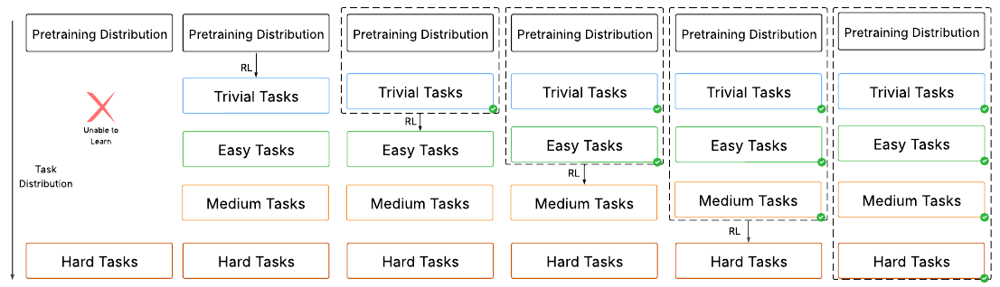
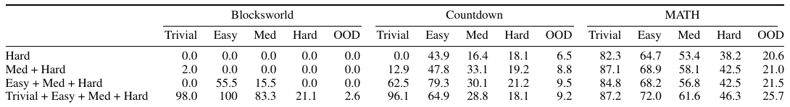
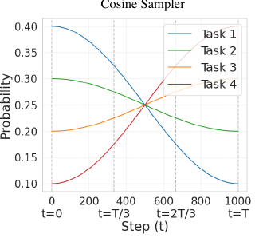
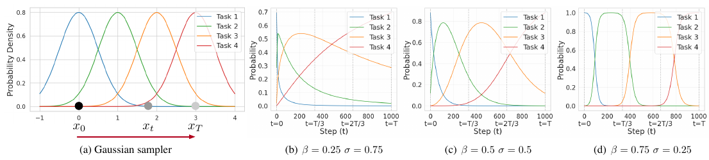
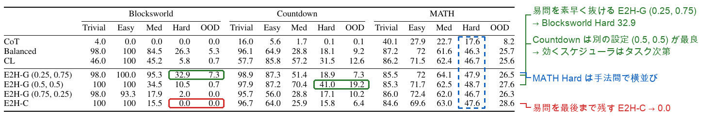
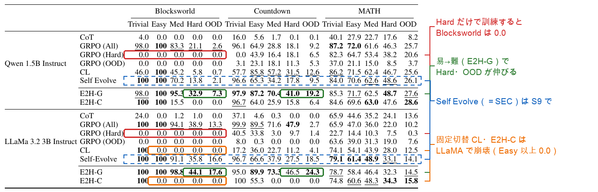
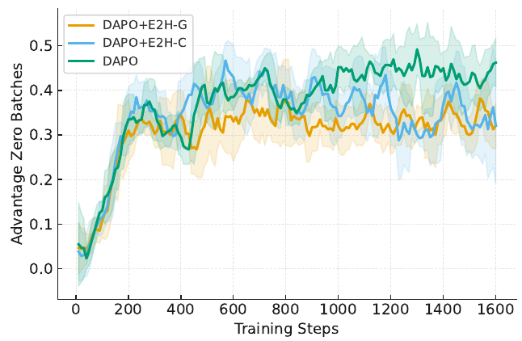
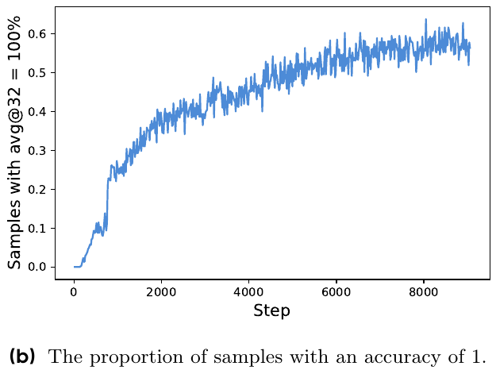
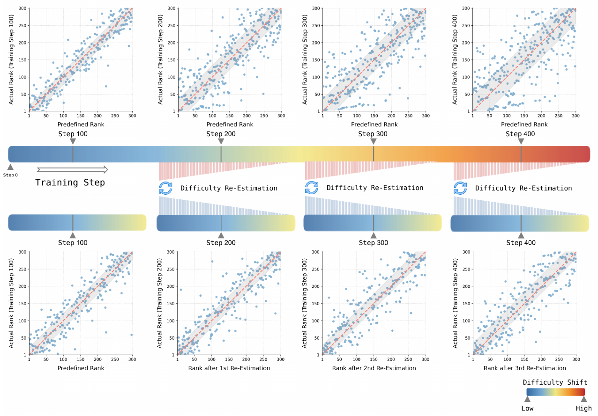

# 3. Curriculum RL — E2H Reasoner と adaptive curriculum

| | 論文 | 著者 | 出典 | リンク |
|---|---|---|---|---|
| **主論文** | Curriculum Reinforcement Learning from Easy to Hard Tasks Improves LLM Reasoning（E2H Reasoner） | Shubham Parashar, Shurui Gui, Xiner Li ほか、Dileep Kalathil, Shuiwang Ji（Texas A&M） | ICLR 2026（v3 を参照） | https://arxiv.org/abs/2506.06632 |
| 補足 | Self-Evolving Curriculum for LLM Reasoning（SEC） | Xiaoyin Chen ほか（Mila / ServiceNow ほか） | arXiv preprint（v4） | https://arxiv.org/abs/2505.14970 |
| 補足 | Learning Like Humans: … Adaptive Difficulty Curriculum Learning …（ADCL） | Enci Zhang ほか（ZTE / 北京大学） | EMNLP 2025 | https://arxiv.org/abs/2505.08364 |
| 補足 | DAPO: An Open-Source LLM RL System at Scale | ByteDance Seed ほか | NeurIPS 2025 | https://arxiv.org/abs/2503.14476 |

- **台本**: [scripts/03-e2h-curriculum-rl.md](scripts/03-e2h-curriculum-rl.md)

---

## S1. 問い：RL に何を、どの順番で解かせるか

- **E2H**（主論文）：訓練前に決めた難易度の上を、時間で易→難へ移す（**open-loop**）
- **SEC・ADCL**（頭出し）：訓練中のモデルを測って出題を変える（**adaptive**）

> 「learning frontier を追う」は E2H の主張ではなく、adaptive 側の発想

---

## S2. 出発点：難問だけでは RL が回らない

**Figure 2** 全体概要
<!-- 役割: E2H の全体概要図。左端＝Hard に直接 RL すると学べない。右へ進むほど易しい段から順に習得し Hard に届く -->

**Table 1** 訓練に入れる難易度を変えた結果
<!-- 役割: 原典 Table 1（Qwen 1.5B、均等に混ぜた GRPO で、訓練に入れる split だけを変える）。Blocksworld の5列を見る。Hard のみ・Med + Hard は Hard 0.0、Trivial を加えた最下行で初めて Hard 21.1 -->

> 正解が1本も出なければ報酬はゼロで、強化するものがない（**reward sparsity**）。最も易しい段が入って初めて Hard に届く

---

## S3. E2H の設計：固定の難易度と4つのスケジューラ

- 難易度は**訓練前に一度だけ**決める：人手（手数・数の個数・MATH Level）か、base model の誤答率の4分位（GSM8K・AQuA）
- スケジューラはどれも「**訓練ステップ t** → 4難易度の出題確率」の関数。モデルの成績は見ない
- Balanced（常に1/4）／ CL（決めたステップで切替）／ E2H-C（cosine で易→難）／ E2H-G（Gaussian、ハイパラ β・σ）

**Figure 3** cosine スケジューラ（E2H-C）
<!-- 役割: E2H-C。最も易しい問題も最後まで10%残る点に注目（S4 の失敗の伏線） -->

**Figure 4** Gaussian スケジューラ（E2H-G）
<!-- 役割: E2H-G。(b) β=0.25 は易問を急速に抜ける。(d) σ=0.25 は固定切替に近い -->

---

## S4. どのスケジューラが効くかはタスク次第

**Table 2** スケジューラ比較（Qwen 1.5B）
<!-- 役割: 原典 Table 2（Qwen 1.5B）。各タスクの Hard / OOD 列を見る。Blocksworld は E2H-G (0.25, 0.75) が最良、Countdown は E2H-G (0.5, 0.5) が最良、MATH は横並び。色の枠と右の注記は発表者の加筆（無加工版は e2h-tab2-schedulers.png） -->

> 原典の説明：易問は学習を**立ち上げる**が、**出しすぎると易問に過学習**する。Blocksworld Hard は易問を素早く抜ける E2H-G が 32.9、易問を最後まで残す E2H-C は 0.0

---

## S5. 主結果

**Table 3** 主要結果（Qwen 1.5B / LLaMA 3B）
<!-- 役割: 原典 Table 3。太字=最良、下線=次点。GRPO (Hard) の行と E2H-G の行を比べる。Self Evolve（＝SEC）の行は S9 で扱う。色の枠と右の注記は発表者の加筆（無加工版は e2h-tab3-main.png） -->

- Hard だけで訓練すると Blocksworld は Qwen・LLaMA とも Hard / OOD 0.0 / 0.0
- 固定切替（CL）と E2H-C は LLaMA の Blocksworld で崩壊（Trivial 100、Easy 以上すべて 0.0）
- MATH で訓練 → AIME24 pass@1 は 3.3 → 6.7（**30問中 1問 → 2問**）

> 難易度ラベルの上を易→難へ移すだけで、Blocksworld・Countdown の Hard と OOD が伸びる

---

## S6. E2H の限界：open-loop

**Figure 7** advantage が 0 のバッチの割合
<!-- 役割: open-loop の帰結。E2H を入れても、advantage が 0 のバッチは 200 ステップで約3割まで増える（DAPO 併用時） -->

> 原典の限界の節：スケジューラは「**訓練中に適応しない**」。advantage に基づくスケジューリングのような**適応的な戦略**でさらに改善しうる

- その代わり、**タスクごとにスケジューラとハイパラを選び直している**（S4）
- 固定ラベルの「Hard」が難しいかはモデル次第：Qwen2.5 **3B** は Hard だけの訓練で Blocksworld Hard **72.4** と最良（付録）

---

## S7. なぜ pass rate の中間に学習信号があるか

- GRPO は1問に複数本生成し、報酬を**グループ内で標準化**して advantage にする
- pass rate p が 0 でも 1 でも advantage は全員 0 で、**勾配が出ない**
- 正誤が混在すると |advantage| の期待値は 2√(p(1−p))、**p = 0.5 で最大**（SEC 付録 A。図はなく式のみ）
- DAPO は p が**ちょうど 0 と 1** の問題を捨てて引き直す（積み上げ ablation で 42 → 50 点）

**DAPO Figure 3b** 全問正解の問題の割合の推移
<!-- 役割: 補足（DAPO）。訓練が進むと「32回中すべて正解」の問題が 0 → 約 0.55〜0.6 に増え、勾配を出さなくなる -->

> 「どの問題に学習信号があるか」は**今のモデルで決まり、訓練とともに動く**。adaptive curriculum の根拠

---

## S8. 訓練中のモデルを測って出題を変える手法もある：SEC・ADCL（頭出し）

**ADCL Figure 1** Difficulty Shift と測り直し
<!-- 役割: 頭出し。上段＝訓練前の難易度順と、訓練が進んだモデルにとっての難易度順が step とともにずれる。下段＝測り直すと揃う。SEC・ADCL の仕組みと結果の詳細は台本へ -->

- **SEC**（Chen ほか, arXiv 2505.14970）：難易度カテゴリを腕とするバンディット。各カテゴリが出した **|advantage| の平均**を報酬に、出題割合を**毎ステップ**更新
- **ADCL**（Zhang ほか, EMNLP 2025）：問題を4つの塊に分け、次の塊の難易度を**今のモデルで測り直して**並べ替える（計3回）
- どちらも**問題は捨てない**。3B では Random や固定順より良いが、7B では差が縮む（SEC）

> 訓練中のモデルで測り直す（adaptive）手法は複数ある。ただし E2H と直接は比べていない（S9）

---

## S9. 正直な留保：どちらが勝つかは原典から言えない

- 3本とも**自分が選んだ比較相手には勝っている**。E2H と SEC を同じ条件で比べたのは E2H の Table 3 だけ
- その Table 3（S5 の青い点線の行）：Countdown Hard は E2H-G **41.0** vs SEC 17.8。LLaMA の MATH Hard は SEC **33.1** vs 32.3
- ただし E2H-G は3設定の最良値、SEC のハイパラは不明、訓練ステップも違う（1,600 vs 120〜240）

> 「open-loop が劣る」とも「adaptive が常に勝つ」とも言えない。勝っているのは、各論文が自分で選んだ相手に対してだけ

---

## S10. 原典の主張と発表者の読み

| | 中身 |
|---|---|
| **E2H の主張** | 易→難へ出題を移し、**易問を適切に減らす**と難問・OOD が伸びる（S2・S4・S5） |
| **SEC・ADCL の主張** | 訓練中のモデルを測って出題を更新すると、固定順やランダムより良い（S8、S9 の留保つき） |
| **発表者の読み** | curriculum とは、**今のモデルの learning frontier を追い続けること**と考えられる（S7 と adaptive 側の結果から） |

- 支えられる：pass rate 0 では学べない、1 では信号が出ない、適切な難しさは訓練とともに動く
- **言い過ぎになる**：frontier ＝ pass rate 50% の一点を狙えばよい（E2H の批判と衝突）
- **未決着**：時間で決める open-loop と、測って決める closed-loop の優劣

---

## S11. 限界と次の章へ

- 3本ともモデルは **1B〜8B**、数学とパズル中心。改善幅は多くが数ポイント（AIME は1問で3.3ポイント）
- どの方式もハイパラを持つ（E2H-G：β, σ ／ SEC：α, τ ／ ADCL：塊の数と測り直しの回数）
- モデルが強くなると固定データの中で「全問正解」が増え、学べる問題は使い切られていく

→ 4章 MAI-Thinking-1：pass rate で問題を選びながら RL を回し、得た能力を次の学習へ持ち越す
