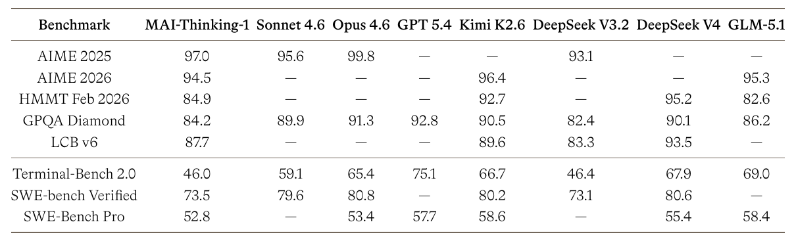
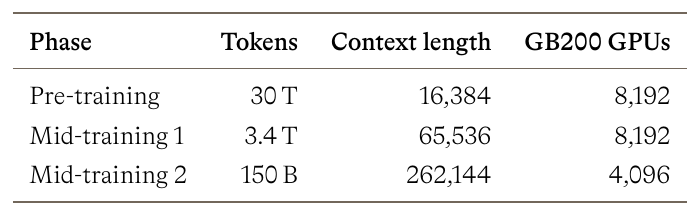
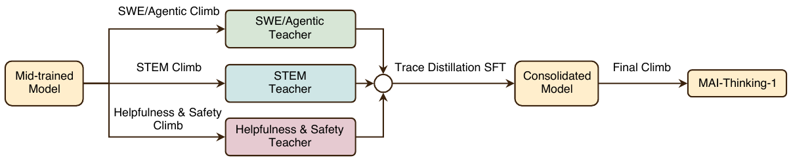
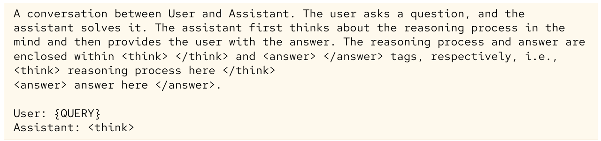
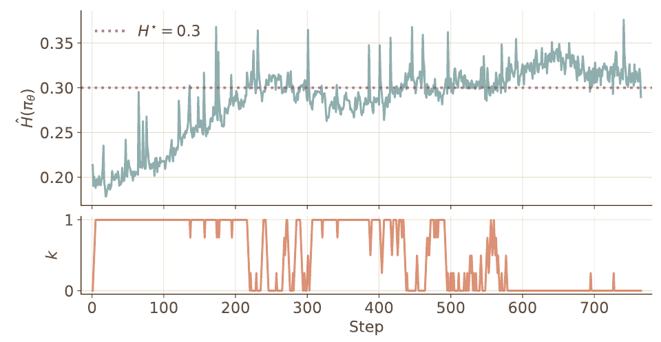
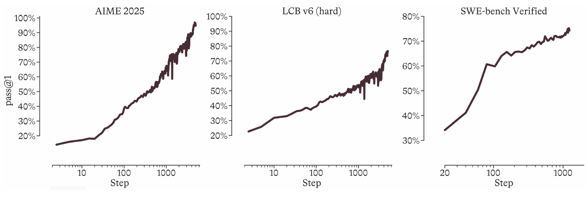
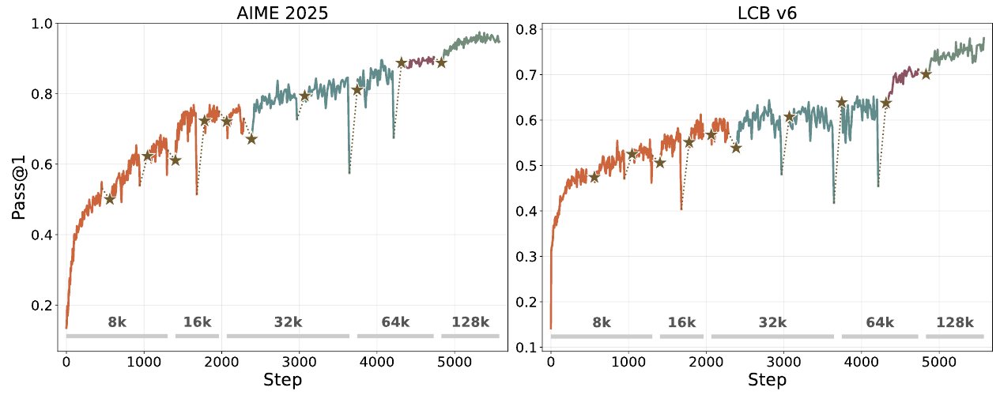
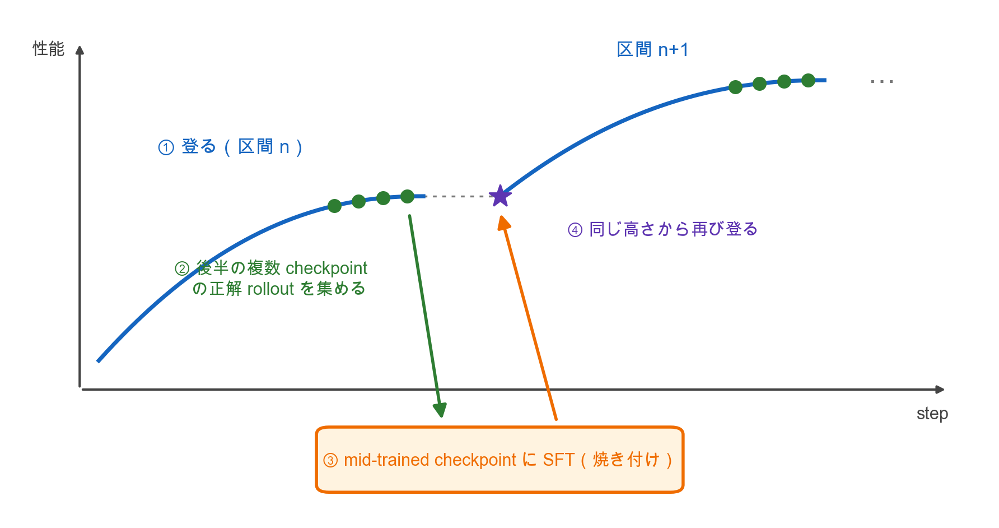

# 4. MAI-Thinking-1: Building a Hill-Climbing Machine

- **著者**: The Microsoft AI Team（Microsoft AI）
- **出典**: 技術レポート（**査読なし**）、2026-06、109頁
- **URL**: https://microsoft.ai/pdf/mai-thinking-1.pdf
- **台本**: [scripts/04-mai-thinking-1.md](scripts/04-mai-thinking-1.md)

---

## S1. このレポートが示したこと

35B active / 1T total の MoE を、**reasoning trace に一度も触れていない checkpoint から RL で** reasoning model に育てた。第三者モデルからの蒸留なし。

**Table 11** STEM と agentic coding のベンチマーク
<!-- 役割: outcome の提示（Table 11）。見るのは左から2列目の MAI-Thinking-1 だけ。数値はすべて自社報告で、他社の値は各社モデルカードからの転記 -->

> AIME 2025 で **97.0**。ただし著者自身「**分野をリードしてはいない**」と総括。この章で見るのは数字より **RL と self-distillation の反復の形**

---

## S2. 土台：reasoning trace を見せずに作った base model

**Table 6** pre-training と mid-training の設定
<!-- 役割: 土台の規模（Table 6）。pre-training 30T、mid-training は2段で計 3.55T、文脈長は 256K まで -->

- pre-training に**言語モデル生成の合成データを使わない**
- mid-training は新しいデータを足さない。同じコーパスを**質で絞り、STEM・数学・コードに比率を寄せ、長い文脈で詰め直す**だけ

> RL の出発点は **「CoT を書く訓練を一度も受けていない」checkpoint**。発表冒頭の「Q-A しかない」状況に最も近い

---

## S3. 全体像：3つの専門 climb → 統合 SFT → 最終 climb

**Figure 12** 全体パイプライン
<!-- 役割: 本筋。章全体の地図。左の3本の矢印それぞれの中で「RL → self-distillation → RL」が繰り返される -->

- **3つの専門 climb**：同じ RL レシピ。違うのは問題の分布と報酬だけ
- **Trace Distillation SFT**：3つの teacher の rollout で1つのモデルに SFT
- **Final Climb**：安全性・過剰拒否・文体を整える軽い RL

---

## S4. 出発点：R1-Zero と同じ template で RL を始める

**Figure 14** 最初の区間で使った R1 の template
<!-- 役割: 1章（DeepSeek-R1）との接点。最初の self-distillation までは R1 の生テキスト template をそのまま使った -->

- STEM climb の最初の区間は **DeepSeek-R1 論文の template** で `<think>` を書かせた
- 最初の self-distillation で自社の chat 形式へ乗り換えた

> 1章の「cold-start データなしで RL から始める」を、frontier 規模で実際にやった事例

---

## S5. RL レシピ：崩れずに長く登るための修正

**Figure 13** entropy の自動制御
<!-- 役割: 修正の代表例（Fig 13）。上が entropy、点線が目標 0.3、下が上側 clip 幅の緩和量 k。entropy が目標を下回ると k を上げる -->

土台は GRPO。修正は**3つの場所**に分かれる

| かかる場所 | 修正 |
|---|---|
| **目的関数**（importance ratio の clip） | entropy の自動制御（上側 clip 幅を entropy で動かす）、外側の ratio clip（全枝に上限） |
| **報酬** | 言語一貫性報酬、pass rate に比例する長さ罰 |
| **学習基盤** | 学習側と推論側の数値ずれ対策（bf16 統一、MoE routing replay、top-p mask replay） |

> 設計の重心は「崩れずに長く登る」こと。後で見る self-distillation もその一部

---

## S6. 何を解かせるか：pass-rate filtering と長さの curriculum

- **pass-rate filtering**：問題を引くたびに今の policy で測り、pass rate **0.1〜0.8** の問題だけ学習に使う
- 全問正解・全問不正解に近い問題は相対比較の学習信号がほぼないので捨てる（3章の adaptive 側）
- **length extension curriculum**：rollout の最大長を **8k → 16k → 32k → 64k → 128k**
- 性能が低いうちは長い推論が要らないので、推論コストを大きく削れる

> 50% を狙うのではなく、**両端を捨てる広い帯**

---

## S7. 何千 step も続く log-linear な climb

**Figure 1** STEM climb と agentic climb の pass@1
<!-- 役割: 本筋。outcome の提示。横軸が log であることに注意。左2枚は STEM climb、右は agentic climb -->

- AIME 2025：**約 15% → 約 95%**（STEM climb、約 5,500 step）
- SWE-bench Verified：**約 34% → 約 75%**（agentic climb、約 1,000 step 強）

> ただしこの1本の線は、**1回の連続した RL ではない**（次の節）

---

## S8. 1本の線の内側：self-distillation で何度も区切られた climb

**Figure 15** STEM climb の学習曲線と self-distillation
<!-- 役割: 本筋の山場。★＝self-distillation（STEM climb 内に約10個、図から目視）、色＝pre/mid-trained 版の違い（4色）、下の灰色帯＝最大出力長 -->

- 用途：① chat 形式への移行 ② **崩壊からの復帰** ③ **新しい base 版への引き継ぎ** ④ reward hacking した rollout の除外
- 崩壊前の checkpoint に戻すだけでは駄目だった。不安定性は崩壊の何 step も前から重みに入っている

> **RL 後の重みはそのまま継がない。** 得た能力は trace として持ち帰り、mid-trained checkpoint で学び直してから、もう一度 RL する

---

## S9. self-distillation の作法（原典の知見、数値は非公開）

<!-- 役割: 自作の模式図。①区間 n を登る → ②後半の複数 checkpoint（緑丸。最終だけではない）の正解 rollout を集める → ③mid-trained checkpoint に SFT（焼き付け） → ④★ から同じ高さで区間 n+1 を登る。原典 Fig 15 の ★ と同じ見方。原典 3.1.4 の知見を図にしたもので、数値の裏付けは原典に出ていない -->

- **後半の複数の checkpoint** から集める。最初期は混ぜない、最終だけでは弱い
- 正解のみ、**ランダム抽出**。最短優先などの選別より良い
- **O(1M) 本で十分**。多すぎると分布が狭まり、再開後の探索が鈍る

> 選びすぎない方が、RL を再開したときに伸びる。持ち越すのは重みではなく rollout

---

## S10. 1章・2章・3章との対応

| | 1章 R1 | 2章 ExPO | MAI-Thinking-1 |
|---|---|---|---|
| trace を自分で出す | ○ | ○ | ○ |
| その trace で SFT | ○ | ○（SFT 項として RL の目的関数に足す） | ○ |
| 土台に戻してから再 RL | ○ | × | ○ |

3章の adaptive curriculum は pass-rate filtering と長さ curriculum として入っている。2章のように**正解を hint に trace を作る**手はなく、正解率が低すぎる問題は**捨てる**（pass rate 0.1 未満を除外）。

> **3本とも、trace は自分で出し、それで SFT する**。違いは、RL を続けた重みをそのまま使う（ExPO）か、**土台に戻してから再び RL する**（R1・MAI）か

---

## S11. 限界

1. **査読のない技術レポート**。ベンチマークは自社評価で、他社の数値とは条件が揃っていない
2. **self-distillation の有無を比べた統制実験はない**。Fig 15 は1本の実運用ランの記録で、各部品の ablation は結論だけ
3. 「from scratch」は**他社モデルの出力・CoT で学習しない**という意味（原典が4か所で明言）。訓練中の整形・採点に使う AI judge のモデルは非公開。評価の judge は GPT-5-mini・GPT-5.4

> outcome としては強い証拠。**どの部品がどれだけ効いたか**は、このレポートからは切り分けられない
