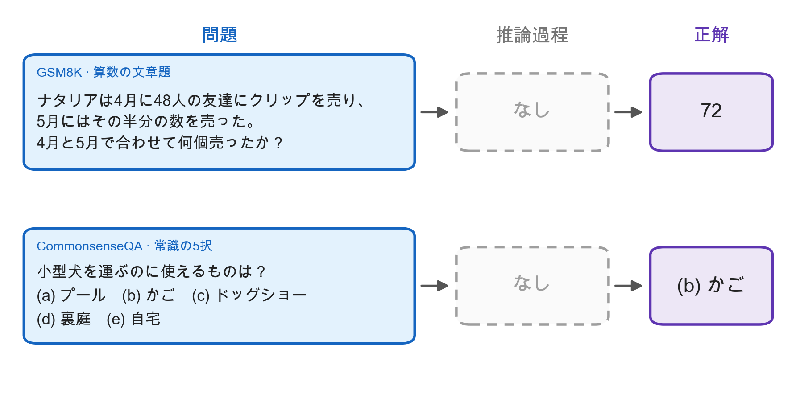
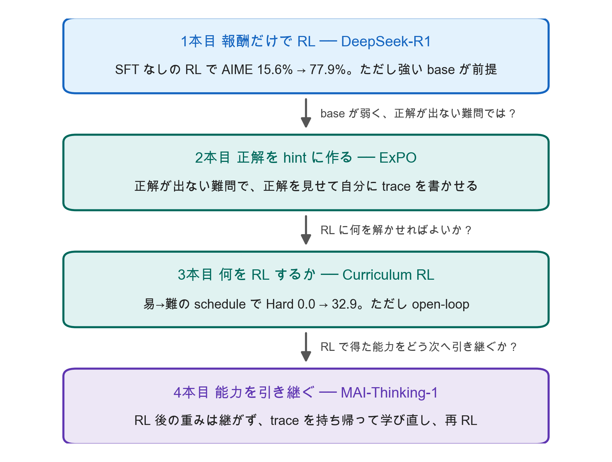

# Bootstrapping Reasoning — Answer-only データから自己進化する reasoning model を作る

> 勉強会発表資料（2026-10-08）。この README が導入スライドを兼ねる ／ 台本: [scripts/00-readme.md](scripts/00-readme.md)

---

## S1. 今日の問い


<!-- 役割: 出発点のデータの形を見せる。問題文は GSM8K と CommonsenseQA の問題の和訳 -->

> 推論過程のない Q-A データから reasoning model を作り、**一度で終わらせず伸ばし続ける**にはどうするか

---

## S2. 4本と3つの問い


<!-- 役割: 4本の並びと、各本が答える問いを1枚で見せる。図は presentations/tools/make_story_arc.py で生成（内容は figures/story-arc.json） -->

| 段 | 問い | 章 |
|---|---|---|
| **作る** | reasoning trace をどこから持ってくるか | [1 DeepSeek-R1](01-deepseek-r1.md)・[2 ExPO](02-expo.md) |
| **選ぶ** | 何を RL するか | [3 Curriculum RL](03-e2h-curriculum-rl.md) |
| **引き継ぐ** | RL で得た能力をどう次の学習へ引き継ぐか | [4 MAI-Thinking-1](04-mai-thinking-1.md) |

> 4本目は査読のない技術レポートで、ベンチマークは自社報告

---

## S3. 今日の主張

> trace を書くのは4本とも**自分のモデル**。正解は **報酬**（1章）にも **hint**（2章）にも **問題を選ぶ基準**（3章）にもなる。
> R1 と MAI は、**RL で更新した重みをそのまま継がず、trace だけを持ち帰って土台から学び直す**

- 「Q-A だけ」で済む方法はない。どれも、ある程度解ける base model が前提
- 正解率 0 の問題から学習信号を作るのが2章、正解率 0 と 1 の問題を外すのが3章・4章

---

## S4. 用語の境界

| 語 | 今日の意味 | 指さないもの |
|---|---|---|
| **hint / 報酬** | 正解との一致を報酬に使う（1章以降）／正解を生成の条件に使う（2章） | 推論過程の正しさの判定 |
| **cold start** | 発表全体では「trace がほとんどない状態」 | R1 の「cold-start データ」（具体的なデータ名） |
| **open-loop / adaptive** | 出題の変え方を訓練前に決める／訓練中のモデルを測って変える | 制御工学の厳密な用語 |
| **pass rate** | **1問**を複数回解かせたときの正解の割合 | データセット全体の正解率 |

---

# 資料について

## 構成

**スライド**（`NN-*.md`）は聞く側が見るもの。図・表・キーメッセージだけを置く。
**台本**（`scripts/NN-*.md`）は話す側が手元で見るもの。スライド番号（S1、S2 …）で対応する。

| # | スライド | 台本 | 枚数 | 段 | 扱い |
|---|---|---|---|---|---|
| 0 | 導入（この README の S1〜S4） | [台本](scripts/00-readme.md) | 4 | | |
| 1 | [DeepSeek-R1 / R1-Zero](01-deepseek-r1.md) | [台本](scripts/01-deepseek-r1.md) | 12 | 作る | 事例 |
| 2 | [ExPO: Unlocking Hard Reasoning with Self-Explanation-Guided RL](02-expo.md) | [台本](scripts/02-expo.md) | 13 | 作る | 詳しく |
| 3 | [Curriculum RL：E2H Reasoner と adaptive curriculum](03-e2h-curriculum-rl.md) | [台本](scripts/03-e2h-curriculum-rl.md) | 11 | 選ぶ | 詳しく |
| 4 | [MAI-Thinking-1: Building a Hill-Climbing Machine](04-mai-thinking-1.md) | [台本](scripts/04-mai-thinking-1.md) | 11 | 引き継ぐ | 事例 |

台本には、スライドに載せなかった実験設定の細部・論文内の数値不一致・想定問答（**聞かれたら**）を入れてある。

## 出典と査読状況

| # | 論文 | 出典 | 強度 |
|---|---|---|---|
| 1 | DeepSeek-R1: Incentivizing Reasoning Capability in LLMs via RL（[arXiv 2501.12948](https://arxiv.org/abs/2501.12948)） | Nature 645, 633–638（2025）。数値は arXiv v2（2026-01、補足込み86頁）から | 査読あり |
| 2 | ExPO: Unlocking Hard Reasoning with Self-Explanation-Guided Reinforcement Learning（[arXiv 2507.02834](https://arxiv.org/abs/2507.02834)） | NeurIPS 2025 poster。arXiv v3（2026-01）を参照 | 査読あり |
| 3 | Curriculum Reinforcement Learning from Easy to Hard Tasks Improves LLM Reasoning（E2H Reasoner、[arXiv 2506.06632](https://arxiv.org/abs/2506.06632)） | ICLR 2026。v3 を参照 | 査読あり |
| 3補 | Self-Evolving Curriculum for LLM Reasoning（SEC、[arXiv 2505.14970](https://arxiv.org/abs/2505.14970)） | arXiv preprint（v4）。Microsoft Research のページは COLM 2026 と記載するが、公式の採択リストで未確認 | 査読未確認 |
| 3補 | Learning Like Humans: ... Adaptive Difficulty Curriculum Learning and Expert-Guided Self-Reformulation（ADCL、[arXiv 2505.08364](https://arxiv.org/abs/2505.08364)） | EMNLP 2025 main | 査読あり |
| 3補 | DAPO: An Open-Source LLM Reinforcement Learning System at Scale（[arXiv 2503.14476](https://arxiv.org/abs/2503.14476)） | NeurIPS 2025 | 査読あり |
| 4 | MAI-Thinking-1: Building a Hill-Climbing Machine（[microsoft.ai/pdf/mai-thinking-1.pdf](https://microsoft.ai/pdf/mai-thinking-1.pdf)） | Microsoft AI 技術レポート、2026-06 | **査読なし**・数値は自社報告・ablation の数値は非公開 |

E2H が比較対象にした「Self-Evolve (Chen et al., 2025)」は SEC と同じ論文。

## テーマ原案から変えたところ

原案（発表者メモ）の主張を原典と照合し、次の点を直した。詳細は各章の台本にある。

| 原案の言い方 | 直した理由 |
|---|---|
| Q-A だけから | R1-Zero も 2章 ExPO も、ある程度解ける base model が前提（R1-Zero は 7B・16B では効かなかった）。出荷版 R1 は cold-start データから始める。「Q-A だけ」で済む方法はないとした |
| answer を verification signal にして trace を作る | 2章 ExPO は正解を条件に self-explanation を生成し、RL の positive sample にする。正解は生成の hint と RL の報酬の両方に使われる、と書き分けた |
| R1-Zero は何もなしで立ち上がる | 出力形式のテンプレートと十分に強い base model が前提（7B・16B では効かなかった）。出荷版の R1 は、R1-Zero の出力を整えた cold-start データの SFT から始める |
| R1-Zero の問題に reward sparsity・難問から始める問題 | R1 原典にない。R1 の主張としては出さず、GRPO の定義から導ける事実として3章で扱った |
| curriculum ＝ learning frontier を追うこと | E2H は訓練前に決めた schedule で動く open-loop で、モデルの成績を見ない。frontier を追う発想は adaptive curriculum（SEC・ADCL）側として分けた |
| reasoning length curriculum | MAI 原典の語は length extension curriculum。rollout の最大長を 8k → 128k と2倍ずつ上げる |

当初の構成にあった「まとめ」の章は外し、導入はこの README に統合した。STaR（NeurIPS 2022）は、同じ発想（正解を hint に自分で trace を書く）を RL と統合した ExPO（NeurIPS 2025）に差し替えた。BFS-Prover-V2（arXiv 2509.06493）は、木探索と定理証明の説明で主題が散るため外した。どちらも導入の台本（S3 の「聞かれたら」）に1項目ずつ残してある。

## 図表ディレクトリ

`figures/` に各論文の原典 PDF から切り出した図表を配置（Python 生成のグラフは作らない方針）。「予備」はスライドに埋め込んでいないが、質疑用に残してある。

```
# 導入
intro-qa-only.png                   問題 → 推論過程（なし）→ 正解。GSM8K と CommonsenseQA の問題の和訳から作図

# 1本目 DeepSeek-R1（arXiv 2501.12948v2）
r1-tab12-v3-vs-r1.png               Tab 12     同じ V3-Base から出た V3 / R1-Zero / R1 のベンチマーク比較
r1-fig1-zero-aime-length.png        Fig 1      R1-Zero の AIME 2024 正答率と平均応答長の推移
r1-tab2-aha-moment.png              Tab 2      中間 checkpoint の "aha moment" 応答例
r1-fig9-reflection-words.png        Fig 9      振り返り語10種と "wait" の頻度の推移
r1-fig7-language-consistency.png    Fig 7      言語一貫性報酬の有無による LC・LCB・AIME の推移（language mixing の定量図）
r1-fig2a-cold-start.png             Fig 2 左   cold-start データの作り方（R1-Zero の出力 → 選別 → V3＋人手で整える → V3-Base に SFT）
r1-fig2-pipeline.png                Fig 2      R1 の多段パイプライン（Dev3 の SFT が V3 Base から出発）
r1-fig8-math-difficulty.png         Fig 8      MATH 難易度別正答率の推移（3章への橋渡し）
r1-trace-flow.png                   自作       trace を書くモデル → 選び方 → 学習先（ExPO / R1 cold-start / R1 Dev3 / MAI）
r1-fig1a-zero-aime.png              Fig 1(a)   予備：上の左パネルのみ
r1-fig1b-zero-length.png            Fig 1(b)   予備：上の右パネルのみ
r1-tab1-zero-template.png           Tab 1      R1-Zero のテンプレート
r1-tab16-distill-vs-zero.png        Tab 16     蒸留と Zero-RL の比較（Qwen2.5-32B-Zero と R1-Distill-Qwen-32B）
r1-tab3-stages.png                  Tab 3      各段（R1-Zero・Dev1〜3・R1）のベンチマーク

# 2本目 ExPO（arXiv 2507.02834v3）
expo-fig1a-bars.png                 Fig 1 左   MATH level 4・5 の正答率（ExP-GRPO / GRPO、base pass@64・128）
expo-fig1-overview.png              Fig 1      問題設定と ExPO の概要（中難度・高難度での positive / negative sample）
expo-fig2-nll-winrate.png           Fig 2      self-explanation と expert CoT の負の対数尤度、direct CoT との勝率
expo-ex2-expert-vs-expl-annot.png   付録 C.2   同じ問題の expert CoT と self-explanation（色の枠と注記を加筆）
expo-ex2-expert-vs-expl.png         付録 C.2   予備：上の無加工版
expo-tab1-properties.png            Tab 1      3種のデータ × 2条件（in-distribution、positive learning signal）
expo-ex1-self-explanation-annot.png Example 1  通常の CoT と self-explanation（色の枠と注記を加筆）
expo-ex1-self-explanation.png       Example 1  予備：上の無加工版
expo-tab2-dpo.png                   Tab 2      予備：ExP-DPO の pass@4（self-explanation vs expert CoT を preferred に）
expo-fig6-deceptive-loss.png        Fig 6      予備：offline DPO の loss と pass@4（expert CoT では loss だけ下がる）
expo-fig3-grpo-curves.png           Fig 3      ExP-GRPO の学習曲線（level 5 のみ訓練／MATH 全体訓練）
expo-tab3-levels.png                Tab 3      MATH test の難易度別正答率
expo-tab5-beta.png                  Tab 5      ExP-SFT 項の係数 β の ablation
expo-tab6-model-sizes.png           Tab 6      モデル規模別（1B〜8B）の MATH 正答率

# 3本目 Curriculum RL：E2H（arXiv 2506.06632v3）、SEC（2505.14970v4）、ADCL（2505.08364）、DAPO（2503.14476）
e2h-fig2-decomposition.png          Fig 2   全体概要。Hard への直接 RL は失敗、段階を踏むと到達
e2h-fig3-cosine.png                 Fig 3   cosine スケジューラ（E2H-C）の出題確率
e2h-fig4-gaussian.png               Fig 4   Gaussian スケジューラ（E2H-G）と3設定の出題確率
e2h-tab1-decomposition.png          Tab 1   訓練に入れる難易度を変えた結果。Hard だけでは 0.0
e2h-tab2-schedulers-annot.png       Tab 2   スケジューラ比較（Qwen 1.5B）。色の枠と注記を加筆
e2h-tab2-schedulers.png             Tab 2   予備：上の無加工版
e2h-tab3-main-annot.png             Tab 3   主要結果表（Qwen 1.5B / LLaMA 3B × 3タスク）。色の枠と注記を加筆
e2h-tab3-main.png                   Tab 3   予備：上の無加工版
e2h-fig7-advzero.png                Fig 7   advantage が0のバッチの割合（open-loop の帰結）
dapo-fig3b-acc1-ratio.png           DAPO Fig 3b  訓練中に「全問正解」の問題の割合が増える
sec-fig2-overview.png               SEC Fig 2    予備：SEC の仕組み（カテゴリの価値で出題 → |advantage| で価値を更新）
sec-fig3-difficulty-trace.png       SEC Fig 3    予備：SEC が引いた問題の平均難易度の推移
sec-tab1-main.png                   SEC Tab 1    予備：Random・Ordered・SEC を Qwen2.5 3B/7B × 4タスクで比較
adcl-fig1-difficulty-shift.png      ADCL Fig 1   Difficulty Shift と、測り直しによる補正
adcl-tab1-main.png                  ADCL Tab 1   予備：Qwen2.5-7B の全手法（PCL と ADCL の2行を見る）
e2h-fig1-passk.png                  Fig 1   予備：pass@k と LLaMA の推論例
e2h-fig5-gsm8k-difficulty.png       Fig 5   予備：GSM8K の誤答率分布と4難易度の切り方
e2h-tab5-dapo.png                   Tab 5   予備：GRPO / DAPO それぞれに E2H を組み合わせた結果
dapo-fig6-dynamic-sampling.png      DAPO Fig 6   予備：dynamic sampling の有無と到達ステップ

# 4本目 MAI-Thinking-1（技術レポート）
mai-fig1-log-linear-climb.png       Fig 1   STEM climb と agentic climb の pass@1。横軸 step は log
mai-tab11-benchmarks.png            Tab 11  STEM と agentic coding のベンチマーク
mai-tab6-training-phases.png        Tab 6   pre-training と2段の mid-training（トークン数・文脈長・GPU 数）
mai-fig12-pipeline.png              Fig 12  全体パイプライン。3つの専門 climb → Trace Distillation SFT → Final Climb
mai-fig13-entropy-control.png       Fig 13  entropy の自動制御（目標 0.3）の推移
mai-fig14-r1-template.png           Fig 14  最初の self-distillation 前に使った DeepSeek-R1 の template
mai-fig15-self-distillation.png     Fig 15  STEM climb の学習曲線。★＝self-distillation、色＝base の版、下帯＝最大出力長
mai-self-distillation-flow.png      自作    self-distillation の作法（どの checkpoint から集め、どう絞り、どこへ SFT して再開するか）
```
