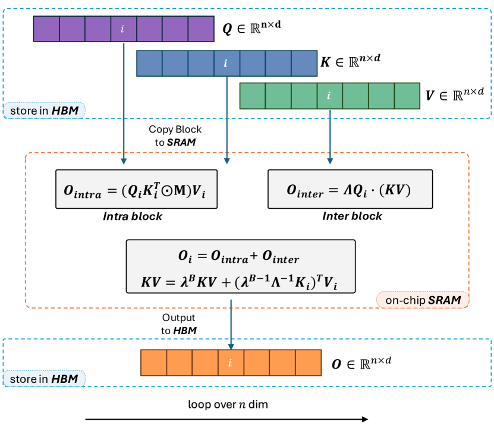
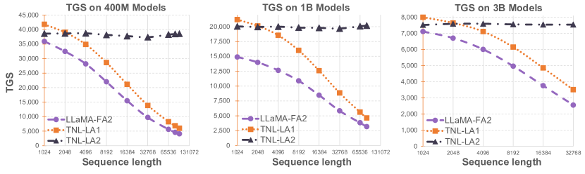
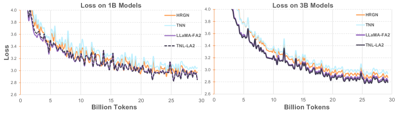

# Lightning Attention-2: A Free Lunch for Handling Unlimited Sequence Lengths in Large Language Models

> **査読**: — n/a（テクニカルレポート、arXiv Comments に "Technical Report" と明記）

Qin, Sun, Li, Shen, Sun, Zhong (2024) — arXiv 2401.04658 / OpenNLPLab × Shanghai AI Lab

## 主要な図表

*出典: 論文 Figure 2。HBM から Q/K/V を SRAM に転送し、**intra-block** は left-product 形式 `O_intra = (Q_b K_bᵀ ⊙ M) V_b`（softmax-like、並列化可能）、**inter-block** は right-product 形式 `O_inter = Q_b·(KV_state)`（linear、KV state を block 間で recurrent 累積）。最後に on-chip で合算 `O = O_intra + O_inter`、HBM に書き戻し。FlashAttention の I/O-aware 設計を linear attention に持ち込んだ。*

*出典: 論文 Figure 1。横軸はシーケンス長（1024 → 131072）、縦軸は TGS。**TNL-LA2 は系列長に対し TGS がほぼ完全に horizontal**（400M で約 38K, 1B で約 20K, 3B で約 7.6K）。LLaMA-FA2 は急減（131K で OOM）、TNL-LA1 も先行モデル（前作）として cumsum ボトルネックで急減。Lightning Attention-2 の最大の実用上の貢献を示す中心図。*

*出典: 論文 Figure 4。30B トークン訓練、HGRN / TNN / LLaMA+FA2 / TNL-LA2 の training loss。**TNL-LA2 は LLaMA+FA2 とほぼ同じ収束カーブ**、「速度を取り戻した代償としての性能劣化はない」という主張の実証。*

## ソースからの事実
- causal linear attention の理論 O(N) は cumsum が逐次計算となるため GPU 上で並列化できず、実測で FlashAttention に勝てなかった問題を解決 [source: §1](../../../sources/Architecture/lightning-attention-2.md)
- attention を block 単位に **tiling** し、intra-block は左積（softmax-like）、inter-block は右積（KV state）で分離計算 [source: §3](../../../sources/Architecture/lightning-attention-2.md)
- Triton による I/O-aware 実装で SRAM 内に計算駐留、HBM 通信最小化 [source: §4](../../../sources/Architecture/lightning-attention-2.md)
- TransNormerLLM 1B/3B、30B トークン訓練で **シーケンス長 1K→128K で TGS が flat**、LLaMA+FA2 は急減 [source: §5](../../../sources/Architecture/lightning-attention-2.md)
- training loss は LLaMA+FA2 / HGRN / TNN と同水準で性能劣化なし [source: §5.2](../../../sources/Architecture/lightning-attention-2.md)

→ 詳細: [evidence](../../../evidence/Architecture/lightning-attention-2.md)

## 現時点の解釈
**「linear attention は理論的にO(N)だが実装では遅い」というジレンマを破った最初の本格的 GPU-aware 実装**。本論文の貢献は理論ではなく、エンジニアリング側にある:

1. **Tiling による cumsum 並列化**：linear attention の causal 形式を、softmax attention と同じ block-parallel な構造に翻訳した。これが本質的な工夫
2. **left-product / right-product の使い分け**：block 内は softmax 形式（精度・並列性）、block 間は linear 形式（O(N) スケーリング）。両者の "いいとこ取り" を block size という単一ハイパラで調整
3. **FlashAttention の概念を linear に拡張**：I/O-aware カーネル設計が softmax 専用ではないことを示した

実用面の影響は大きい：
- **MiniMax-M1** (2025) — 456B MoE で 1M context をオープンウェイト公開、本論文の lightning attention をスケール
- **Kimi Linear** — hybrid local softmax + linear、本論文の構造を継承
- **Qwen3.5-Omni** — Hybrid Attention MoE、本系統の延長

理論面では[Linear Transformers (Katharopoulos et al., 2020)](linear-transformers.md) の `Attn = φ(Q)·(φ(K)ᵀV)` 形式を直接継承しているが、本論文の主張は「kernel 設計」ではなく「block-aware 並列化」にある。kernel 選択（elu+1, FAVOR+, selective SSM）の比較は本論文の射程外で、後の研究（[Attention to Mamba Distillation](attention-to-mamba-distillation.md), Mamba-2 等）に託された。

「linear attention の **実用化** が始まった論文」として、Linear Transformers (2020) → Lightning Attention-2 (2024) → MiniMax-M1 (2025) の系譜の中央に置かれる。

## 関連ページ
- [Linear Transformers: Transformers are RNNs](linear-transformers.md) — 数学的祖、本論文が GPU 実装に落とし込んだ理論
- [MiniMax-M1](../Technical_Report/minimax-m1.md) — 本論文の lightning attention を 456B MoE / 1M context にスケール、$534,700 でフル RL
- [Attention Residuals](attention-residuals.md) — Kimi Linear の hybrid attention、構造を継承
- [Attention to Mamba: Cross-Architecture Distillation](attention-to-mamba-distillation.md) — kernel trick 経由の Transformer→Mamba 蒸留、kernel 設計面の発展
- [Memory Sparse Attention](memory-sparse-attention.md) — 100M token 規模、長系列 attention の延長

## 未解決の問い
- block size の auto-tuning：seq length / hidden dim / GPU world size に対する最適 block size の解析的決定
- 本論文の tiling 構造に **より強い kernel feature map**（FAVOR+, selective SSM, RWKV time-decay）を組み込んだときの性能・速度トレードオフ
- **decoding 時の KV state d×d** の容量限界：実効 retrieval 容量は何トークン分か？hybrid attention で local softmax 何 % あれば長距離 retrieval を救えるか
- bidirectional / cross-attention 設定への一般化（本論文は causal autoregressive 専用）
- ICML 2024 等の主要会議で査読を経たか、現時点では確認できておらず保守的に `n/a` 扱い
