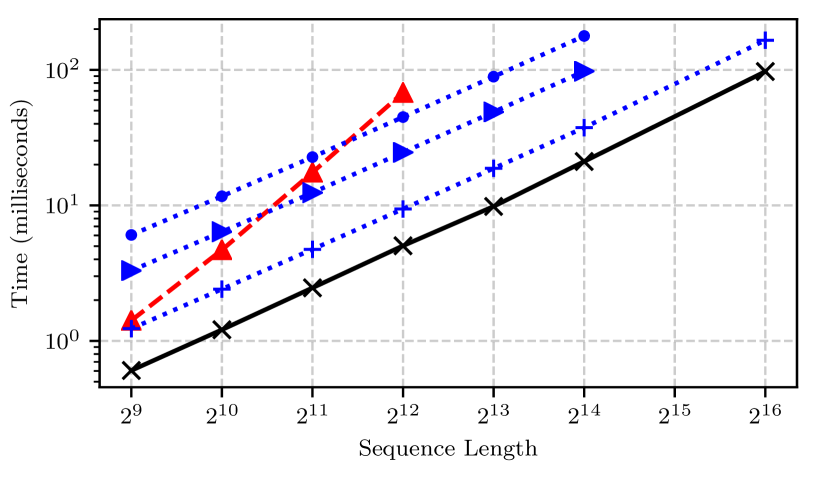
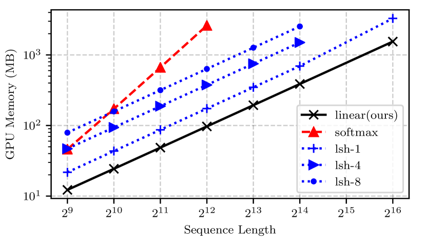
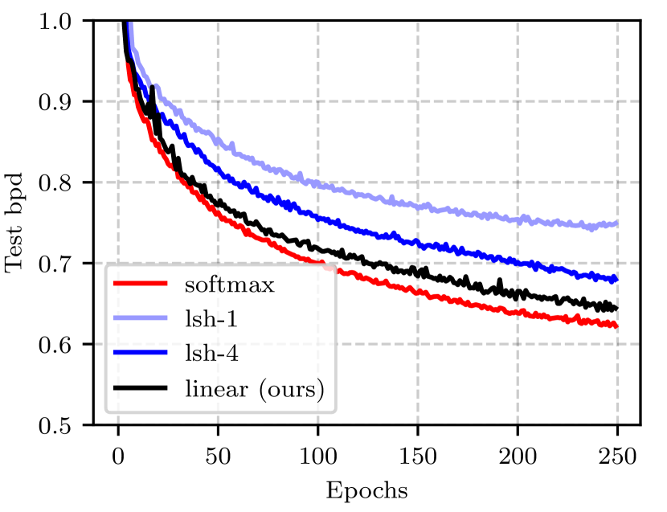

# Linear Transformers: Transformers are RNNs

> **査読**: ✅ accepted — ICML 2020 (PMLR v119, pp.5156-5165)

Katharopoulos, Vyas, Pappas, Fleuret (2020) — arXiv 2006.16236 / Idiap Research Institute × EPFL × University of Washington

## 主要な図表

*出典: 論文 Figure 1。横軸はシーケンス長（2⁹〜2¹⁶）、縦軸は1ステップあたり時間 (ms)。**linear (本論文, 黒×) が一貫して最速で、O(N) スケーリング**。softmax (赤△) は O(N²) で 2¹² 以上は OOM。reformer (LSH-1, LSH-4, 青) は O(N log N) で linear より遅い。*

*出典: 論文 Figure 2。**linear はメモリも O(N) で全attentionの中で最小**。softmax は早期にOOM、LSH 系は中間。長系列処理での実用上の決定的な差。*

*出典: 論文 Figure 4（画像生成タスク）。**linear (黒) は softmax (赤) と同等の test bpd へ収束**、LSH-1/LSH-4 (青系) より明確に良い。「速度・メモリ削減と引き換えに精度を大きく落とさない」という主張の実証。*

## ソースからの事実
- 一般化された self-attention で `sim(Q,K)` が positive かつ kernel feature map で表せれば、`Attn = φ(Q)·(φ(K)ᵀV) / (φ(Q)·Σφ(K))` と再順序化でき計算量が **O(N²d) → O(Nd²)** に [source: §3](../../../sources/Architecture/linear-transformers.md)
- 特性関数 `φ(x) = elu(x) + 1` で正値性・微分可能性・追加学習なしを達成 [source: §3.4](../../../sources/Architecture/linear-transformers.md)
- causal mask 付き自己回帰生成は **隠れ状態 S_i = Σ_{j≤i} φ(K_j)V_jᵀ ∈ R^{d×d} を持つ RNN** として等価表現でき、各推論ステップが O(d²) で済む [source: §3.3](../../../sources/Architecture/linear-transformers.md)
- 自己回帰推論で長系列に対し **softmax 比 ~4000× 高速** [source: §4.3](../../../sources/Architecture/linear-transformers.md)
- copy / image generation (MNIST, CIFAR-10) / speech recognition (WSJ) の3領域で softmax と同等性能、訓練速度・メモリで優位 [source: §4](../../../sources/Architecture/linear-transformers.md)

→ 詳細: [evidence](../../../evidence/Architecture/linear-transformers.md)

## 現時点の解釈
**Linear attention 系全般の数学的祖**。本論文の貢献は2つに分けて評価される：

1. **再順序化トリック (φ(Q)·(φ(K)ᵀV))**：softmax 近似のための kernel 表現を仮定すれば自然に出てくる代数的書き換え。Performer / Linformer / RetNet など多くの後続派生の出発点
2. **causal linear attention = RNN という等価性**：これが本当に独自の洞察。「Transformer は softmax がなければ RNN である」という見方が、**RWKV / Mamba / RetNet / Lightning Attention** など現代 efficient attention 系の理論的基盤を提供

ただし、2026年現在の視点では **本論文の `φ(x) = elu(x) + 1` 自体は性能上の最適選択ではない**。後続の改良:
- **Performer** — FAVOR+ random feature で softmax を厳密近似
- **RWKV / RetNet** — time-decay / retention で長距離依存を補強
- **Mamba** — input-dependent (selective) SSM で記憶選択性を獲得
- **Lightning Attention** — LLM 規模で実用化、MiniMax-M1 / Kimi Linear 等の基盤

「kernel-based linear attention は softmax より厳密には弱い」という事実は本論文以降の派生でも本質的には変わらず、現代の主流は **hybrid attention**（local softmax + global linear）に落ち着きつつある（[Attention Residuals](attention-residuals.md), [MiniMax-M1](../Technical_Report/minimax-m1.md), [Qwen3.5-Omni](../Technical_Report/qwen35-omni.md)）。

教科書的な「Transformer 効率化の起点」として、後続研究を読むときの **言語と数学的枠組みを提供する論文**。

## 関連ページ
- [Attention to Mamba: Cross-Architecture Distillation](attention-to-mamba-distillation.md) — kernel trick 適用 linearized Attention を経由する Transformer→Mamba 蒸留、本論文の数学的枠組みの直接的応用
- [Attention Residuals](attention-residuals.md) — Kimi Linear（hybrid attention）に統合される selective residual aggregation
- [MiniMax-M1](../Technical_Report/minimax-m1.md) — lightning attention（linear attention の LLM 規模実装）+ hybrid MoE
- [Qwen3.5-Omni](../Technical_Report/qwen35-omni.md) — Hybrid Attention MoE（linear + softmax の混成）
- [Memory Sparse Attention](memory-sparse-attention.md) — 100M トークン規模、メモリ効率系 attention の延長線

## 未解決の問い
- kernel feature map の選択（elu+1 / random feature / learnable / softmax-equivalent）における **本質的な情報理論的限界** はどこにあるか？
- causal linear attention の RNN 等価性は **encoder-only / bidirectional / cross-attention** にどう一般化できるか？（2020年論文では未解決）
- 「固定サイズ memory state S_i ∈ R^{d×d}」の容量は実際何トークン分の情報を保持できるか？精密 retrieval タスクでの実効容量の測定
- hybrid attention（local softmax + global linear）の最適混合比は問題依存か、汎用設計が可能か？
