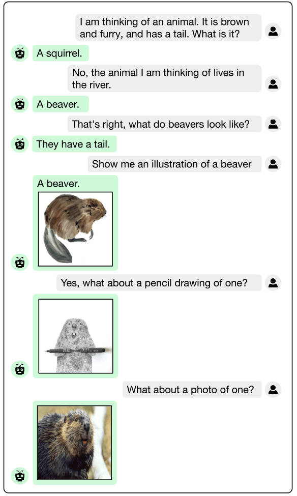
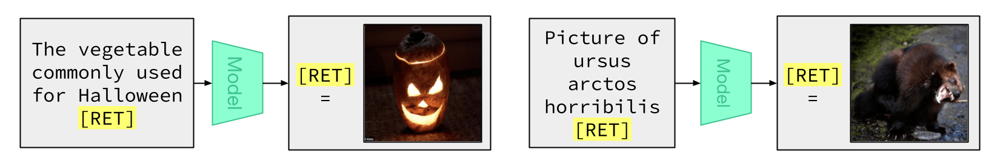

# FROMAGe: Grounding Language Models to Images for Multimodal Inputs and Outputs

> **査読**: ✅ accepted — ICML 2023 (PMLR v202)

Koh, Salakhutdinov, Fried (2023) — arXiv 2301.13823 / Carnegie Mellon University

## 主要な図表

![Figure 1: FROMAGeのアーキテクチャ — 凍結CLIP image encoder + 線形射影 + 凍結OPT LLM + [RET] token + 線形射影 + 画像検索](../../../figures/Multimodal/fromage/architecture.png)
*出典: FROMAGe project page / 論文 Figure 1。**両端の Linear 層のみ学習** し、CLIP image encoder と OPT LLM はすべて凍結。入力側で画像→テキスト埋め込みへ写像、出力側で `[RET]` token 直前の hidden state を画像検索 query へ写像。*

*出典: FROMAGe project page。多ターン対話の文脈を保ったまま、ユーザーの追加質問に応じた画像を検索して返す動作例。LLM の dialogue 能力をそのまま継承していることを示す。*

*出典: FROMAGe project page。"the most popular sport in {country}" のような **抽象的・知識依存的** なクエリに対しても、LLM の world knowledge を介して適切な画像を検索 — CLIP 単独では困難な compositional reasoning タスクの例。*

## ソースからの事実
- 凍結 OPT-6.7B + 凍結 CLIP ViT-L/14 を **線形マッピング層のみ**（trainable は全体の0.1%未満）で結合し、interleaved image-text 入出力を可能にした [source: §3](../../../sources/Multimodal/fromage.md)
- 出力側に **`[RET]` token** を追加し、その隠れ状態を画像検索 query として使うことで「LLM が画像を取り出す」インターフェースを構築 [source: §3.2](../../../sources/Multimodal/fromage.md)
- 学習データは **Conceptual Captions (CC3M) のみ**、追加の multimodal instruction tuning なし [source: §3.3](../../../sources/Multimodal/fromage.md)
- VIST (Visual Storytelling) で 5-caption 文脈付き retrieval R@1 = **20.8** vs CLIP ViT-L/14 ゼロショット **5.9** — 文脈長を増やすほど CLIP との差が拡大 [source: §4.2](../../../sources/Multimodal/fromage.md)
- VisDial 10ターン対話 zero-shot retrieval でも文脈なし CLIP より大幅向上、対話履歴の解釈能力が retrieval に効く [source: §4.3](../../../sources/Multimodal/fromage.md)
- LLM の世界知識・compositionality がそのまま使える：抽象クエリ・属性合成・想像物に対し CLIP 単独より優位 [source: §4.4](../../../sources/Multimodal/fromage.md)

→ 詳細: [evidence](../../../evidence/Multimodal/fromage.md)

## 現時点の解釈
**「凍結事前学習モデル × 軽量結合層」レシピの代表例**。同時期に発表された Flamingo / BLIP-2 が cross-attention や Q-Former という比較的重い結合機構を使ったのに対し、FROMAGe は **線形射影と単一 special token** という極限まで軽い結合で同等の interleaved 入出力を実現したのが特徴。これにより以下が示された：

1. **LLM の継承が広範**：凍結のままで dialogue / few-shot / world knowledge / compositionality がそのまま multimodal タスクに転用可能
2. **「生成的 retrieval」という設計選択**：画像を新規生成しなくても、`[RET]` token + 検索で multimodal output が成立する。後の Emu / GILL / Anole（生成方向）と対をなす設計
3. **パラメータ効率の極北**：trainable params 数百万、CC3M のみで OPT-6.7B + CLIP-L の能力を viable に統合

実用面では、**FROMAGe 直系の retrieval-only 路線は GILL / Emu / Anole（生成あり）に置き換えられた** のが現状。ただし「凍結バックボーン + 軽量 projection」という設計原理は **LLaVA の MLP projector / BLIP-2 の Q-Former / Idefics3 の perceiver resampler** など現代 MLLM の標準アーキテクチャ群の祖型として残る。Vision-language pretraining から MLLM への移行期の **architecture minimalism** の到達点として参照される論文。

[CLIP](clip.md) を入力側 visual grounding の祖、FROMAGe を出力側 multimodal generation（retrieval版）の祖と位置付けると、両論文は現代の MLLM への二つの入り口を示している。

## 関連ページ
- [CLIP](clip.md) — FROMAGe が visual encoder として凍結利用するモデル、入力側 grounding の源流
- [Video models are zero-shot learners and reasoners](video-models-zero-shot-learners.md) — 大規模生成モデルのゼロショット汎化を視覚領域に拡張、FROMAGe の延長線上
- [Qwen3.5-Omni](../Technical_Report/qwen35-omni.md) — text + vision + audio + video の統合 omni-modal、FROMAGe 直系の凍結＋軽量結合は卒業しつつある現代の到達点

## 未解決の問い
- 凍結 LLM のスケーリング上限はどこか？OPT-13B → 70B → 405B レベルで線形 projection だけでどこまで multimodal 能力が伸びるか
- retrieval 路線（FROMAGe 系）と生成路線（Emu / GILL / Anole）は本質的にトレードオフか、それとも統合可能か（hybrid: 既知概念は retrieval、新規シーンは生成）
- 「凍結 LLM の継承」は instruction tuning された LLM（Llama-Instruct、Qwen-Instruct 等）でも同じく成立するか、それとも事前学習素体の方が転移しやすいか
- `[RET]` token のような single token grounding は現代の multimodal generation（diffusion conditioning, autoregressive image tokens）にどう一般化されるか
