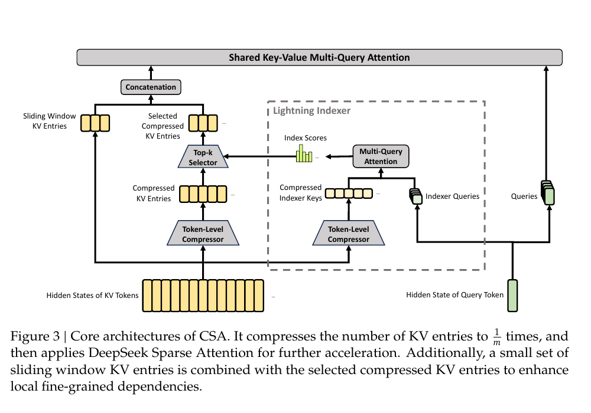
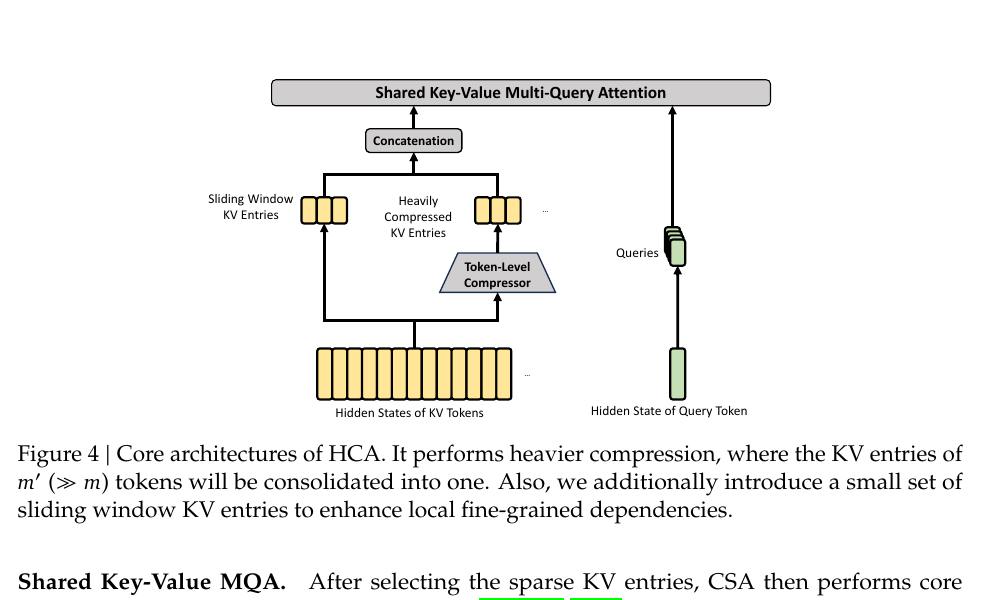
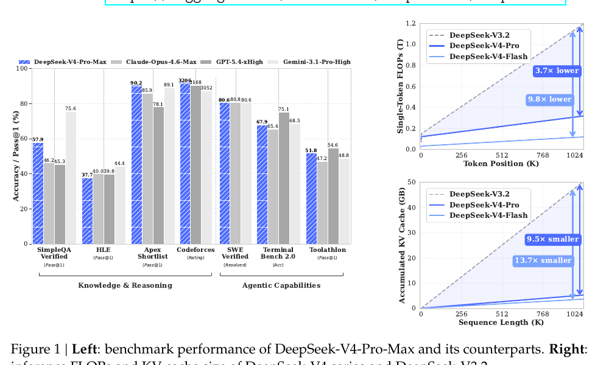

# DeepSeek-V4: Towards Highly Efficient Million-Token Context Intelligence

> **査読**: — n/a（テクニカルレポート / HuggingFace 公開 preview 版）

DeepSeek-AI (2026) — HuggingFace: deepseek-ai/DeepSeek-V4-Pro

## ソースからの事実

### モデル構成
- **DeepSeek-V4-Pro: 1.6T total / 49B active**（61 layers, hidden 7168, 1 shared + 384 routed experts, 6 active）[source: §4.2.1](../../../sources/Technical_Report/deepseek-v4.md)
- **DeepSeek-V4-Flash: 284B total / 13B active**（43 layers, hidden 4096, 1 shared + 256 routed experts, 6 active）[source: §4.2.1](../../../sources/Technical_Report/deepseek-v4.md)
- **ネイティブ 1M トークン context**、両モデル共通 [source: Abstract](../../../sources/Technical_Report/deepseek-v4.md)
- Pre-training: Flash **32T tokens** / Pro **33T tokens**、4K→16K→64K→1M に段階的拡張 [source: §4.2.2](../../../sources/Technical_Report/deepseek-v4.md)

### 主要アーキテクチャ革新（3点）
- **(1) Hybrid Attention**: 最初の2層は sliding window のみ、残りは **CSA と HCA を interleave** [source: §4.2.1](../../../sources/Technical_Report/deepseek-v4.md)
- **(2) mHC** (Manifold-Constrained Hyper-Connections): HC の residual mapping を **doubly stochastic matrices manifold** に Sinkhorn-Knopp 反復で射影し signal propagation を安定化 [source: §2.2](../../../sources/Technical_Report/deepseek-v4.md)
- **(3) Muon Optimizer**: Newton-Schulz orthogonalization、AdamW は embedding/output head/RMSNorm/mHC/static biases のみ [source: §2.4](../../../sources/Technical_Report/deepseek-v4.md)

### CSA (Compressed Sparse Attention) — §2.3.1
- KV cache を **m=4 トークンずつ1エントリに圧縮** → DSA top-k で **sparse selection** → core MQA の2段戦略 [source: §2.3.1](../../../sources/Technical_Report/deepseek-v4.md)
- DeepSeek-V3.2 の DSA を**内包**しつつ、上流に compression を追加した後継 [source: §2.3.1](../../../sources/Technical_Report/deepseek-v4.md)
- Lightning Indexer で低 rank query/compressed indexer keys から index score を算出し top-k 選択 [source: §2.3.1, eq. 13-17](../../../sources/Technical_Report/deepseek-v4.md)
- Sliding window KV entries（n_win=128）を併用 [source: §2.3.3](../../../sources/Technical_Report/deepseek-v4.md)

### HCA (Heavily Compressed Attention) — §2.3.2
- KV cache を **m'=128 トークンずつ1エントリに圧縮**（CSA より 32× 強い圧縮率）[source: §2.3.2 / §4.2.1](../../../sources/Technical_Report/deepseek-v4.md)
- **Sparse selection は行わず dense attention を維持** [source: §2.3.2](../../../sources/Technical_Report/deepseek-v4.md)
- CSA と同じ Shared KV MQA + grouped output projection を使用 [source: §2.3.2](../../../sources/Technical_Report/deepseek-v4.md)

### mHC — §2.2
- Residual mapping B_l を **Birkhoff polytope（doubly stochastic 行列）** に制約：‖B_l‖₂ ≤ 1 → non-expansive、層間の数値安定 [source: §2.2 eq. 2](../../../sources/Technical_Report/deepseek-v4.md)
- 入出力射影 A_l, C_l は Sigmoid で非負・有界に制約 → signal cancellation 防止 [source: §2.2 eq. 6-7](../../../sources/Technical_Report/deepseek-v4.md)
- Sinkhorn-Knopp 反復（t_max=20）で射影、拡張係数 **n_hc=4** [source: §2.2 eq. 8](../../../sources/Technical_Report/deepseek-v4.md)
- Dynamic parameterization: input-dependent + static bias の和、learnable gating factors [source: §2.2 eq. 3-5](../../../sources/Technical_Report/deepseek-v4.md)

### 効率（vs DeepSeek-V3.2、1M context）
- Single-token inference FLOPs: V4-Pro **27%** / V4-Flash **10%** [source: Intro](../../../sources/Technical_Report/deepseek-v4.md)
- KV cache size: V4-Pro **10%** / V4-Flash **7%** [source: Intro](../../../sources/Technical_Report/deepseek-v4.md)
- BF16 GQA8 baseline 比、1M context で KV cache **約 2%** に圧縮 [source: §2.3.4](../../../sources/Technical_Report/deepseek-v4.md)

### Post-training
- **2段構成**: Specialist Training (SFT + GRPO) → **On-Policy Distillation (OPD)** で unified model に統合（V3.2 の mixed RL を OPD で完全置換）[source: §5.1](../../../sources/Technical_Report/deepseek-v4.md)
- **3 reasoning effort modes**: Non-think / Think High / Think Max（最後は system prompt 注入で「shortcuts なし」「全 edge case 検証」を強制）[source: §5.1.1 Table 2-3](../../../sources/Technical_Report/deepseek-v4.md)
- **Generative Reward Model (GRM)**: actor network 自体を GRM として共同最適化、ルーブリック誘導 RL [source: §5.1.1](../../../sources/Technical_Report/deepseek-v4.md)
- **FP4 quantization-aware training** for MoE experts + indexer QK path [source: §5.2.1](../../../sources/Technical_Report/deepseek-v4.md)

### 安定化・Infrastructure 工夫
- **Anticipatory Routing**: routing indices を θ_{t-Δt}（履歴）で計算、loss spike 抑制、~20% wall-clock overhead [source: §4.2.3](../../../sources/Technical_Report/deepseek-v4.md)
- **SwiGLU clamping** [-10, 10] で outlier 除去 [source: §4.2.3](../../../sources/Technical_Report/deepseek-v4.md)
- Fine-grained EP wave scheduling で **1.92× 理論 speedup** vs naive、Comet 比 1.42× [source: §3.1](../../../sources/Technical_Report/deepseek-v4.md)
- **TileLang DSL**、batch-invariant deterministic kernels（訓練・推論 bitwise reproducibility）、on-disk KV cache storage [source: §3.2-3.5](../../../sources/Technical_Report/deepseek-v4.md)

### ベンチマーク（抜粋）
- **DeepSeek-V4-Pro-Base**: MMLU-Pro **73.5**（V3.2 65.5 / V4-Flash 68.3）、FACTS Parametric **62.6**（V3.2 27.1）、LongBench-V2 **51.5**（V3.2 40.2）、HumanEval **76.8**（V3.2 62.8）[source: §4.3.2 Table 1](../../../sources/Technical_Report/deepseek-v4.md)
- **V4-Flash-Base が V3.2-Base を大半で上回る**（13B active vs 37B active のパラメータ効率劇的改善）[source: §4.3.2](../../../sources/Technical_Report/deepseek-v4.md)
- **DeepSeek-V4-Pro-Max**: Codeforces **3206**（Claude Opus 4.6: 3168）、Apex Shortlist **90.2%**（Claude: 85.9）、SWE Verified **80.6%**（Claude: 80.8）、Terminal Bench 2.0 **67.9%**（Claude: 65.4）、SimpleQA Verified 57.9%（Gemini-3.1-Pro: 75.6 で劣後）[source: Figure 1](../../../sources/Technical_Report/deepseek-v4.md)

→ 詳細: [evidence](../../../evidence/Technical_Report/deepseek-v4.md)

## 主要な図表

*出典: 論文 Figure 3 — CSA の compression + sparse selection 2段戦略を示す。KV cache を 1/m 倍に圧縮した後に DeepSeek Sparse Attention (DSA) を適用する点が DeepSeek-V3.2 からの発展。*

*出典: 論文 Figure 4 — HCA は CSA と相補的に、より強い圧縮率（V4 では m'=128）で dense attention を続ける路線。両者を interleave 配置することで sparse と dense の特性を両取りする。*

*出典: 論文 Figure 1（右側のみ） — 1M context での効率改善。Hybrid CSA+HCA と FP4/FP8/BF16 混合 storage の合算効果。*

## 現時点の解釈

### Hybrid Attention の位置付け：sparse と dense の両軸を独立に強化
DeepSeek-V4 の hybrid attention は、**「KV cache 圧縮率」と「attention の sparse/dense 性」を独立した2軸に分離** した上で、両軸を別々のレイヤーに割り当てる設計と読める。

- **CSA**（compression rate m=4、後段で DSA top-k） — 圧縮は穏やかにとどめ、attention 側で sparsity による情報削減を担う。**DeepSeek-V3.2 の DSA を上流の compression で増強した後継版**。
- **HCA**（compression rate m'=128、dense） — 圧縮を極端まで押し進めるが、attention は dense を維持して圧縮後の情報を全 head で使い切る。

これは [MiniMax-M1](./minimax-m1.md) の lightning attention や [Attention to Mamba 蒸留](../Architecture/attention-to-mamba-distillation.md) の "linear attention で全層を置き換える" 路線とは異なる選択肢で、「**標準 softmax attention の枠組みを保ちながら KV cache 軸で2倍ストックを取る**」アプローチに該当する。[Linear Transformers](../Architecture/linear-transformers.md) → [Lightning Attention-2](../Architecture/lightning-attention-2.md) の系譜が **計算量** 軸で O(N²)→O(N) を目指したのに対し、CSA+HCA は **KV cache** 軸で同等以上の削減（1M-context で BF16 GQA8 比 ~2%）を達成しつつ softmax attention の品質を維持する戦略と整理できる。

CSA は [Memory Sparse Attention](../Architecture/memory-sparse-attention.md) や [Mixture-of-Depths Attention](../Architecture/mixture-of-depths-attention.md) と並ぶ "sparse attention 系譜" の最新点に位置するが、**compression を sparsity の前段に配置することで sparsity のための index 計算自体を圧縮済み空間で行う**（Lightning Indexer は compressed indexer keys を使う）点が独自で、長 context での top-k 計算 FLOPs を二重に削っている。

### mHC の大規模実証：理論論文から Production への移行
本リポジトリ既存の [mHC: Manifold-Constrained Hyper-Connections (Xie et al., 2025)](../Architecture/manifold-constrained-hyper-connections.md) は **HC の identity-mapping 特性の崩壊** を Birkhoff polytope への射影で復元する理論論文として位置付けられていた。DeepSeek-V4 はこれを **1.6T-scale MoE で初めて Production scale 実装** した事例であり、Xie et al. 2025 の理論的予測（「大規模学習での有効性とスケーラビリティ」）の実証となる。

n_hc=4 / Sinkhorn-Knopp t_max=20 という具体的ハイパラ、AdamW を mHC modules に使用する（Muon ではない）という分業設計、recomputation + fused kernels によるコスト緩和ノウハウは、後続研究が mHC を取り込む際の参照点になる。**「mHC + Muon が同時導入で安定」** という観察は、HC 系の数値不安定問題に対する解の一つとして界隈に提示された。

### Post-training の方法論的シフト：mixed RL → OPD
DeepSeek-V4 の post-training は **specialist 群を On-Policy Distillation (OPD) で統合** という構造で、V3.2 の mixed RL stage を OPD で完全置換した点が方法論的に重要。これは [willccbb & Claude Opus 4.7 の SFT/RL/OPD メタ分析](../RL/willccbb-sft-rl-opd.md) で提示された **3ダイアル整理（α: on-policy 度、λ: teacher KL vs reward 比、π_T: teacher 政策）** の Pareto curve 上で、明示的に「teacher = 各 specialist、reverse KL = OPD」の点に DeepSeek が舵を切ったことを意味する。

このメタ分析が予告していた **"DeepSeek V4 系 Expert RL + OPD"** という future work がほぼそのままレシピ化されており、本リポジトリの RL クラスタ全体（[Dr. GRPO](../RL/dr-grpo.md) の応答長バイアス、[Flash-RL/TIS](../RL/flash-rl-tis.md) の暗黙 off-policy、[ScaleRL](../RL/scale-rl.md) の asymptote vs efficiency、[RL Scaling Laws Qwen2.5](../RL/rl-scaling-math-qwen25.md)）の議論の **実プロダクション帰結** がここに観測される。

Think Max mode の system prompt 注入による reasoning effort 制御は、[Reasoning with Sampling](../Inference_Decoding/reasoning-with-sampling.md) の inference-time scaling 系譜とも連関する。**GRM（actor を reward model に共同最適化）** は generative reward model の量産化方針として、scalar reward model 依存からの脱却を志向する界隈動向（OpenAI o1, Anthropic constitution）と整合的。

### 効率改善の内訳の解釈
1M context で V3.2 比 single-token FLOPs 10-27% / KV cache 7-10% という数字は、(a) **CSA+HCA の KV 圧縮**、(b) **FP4 expert weights + FP4 indexer QK + FP8 attention KV + BF16 RoPE のhybrid precision**、(c) **MoE active params の絞り込み**（V3 37B → V4-Flash 13B）、の3要因の積で達成されている。**(a) のアーキテクチャ寄与と (b) の量子化寄与を切り分ける ablation は本論文では明示的に提示されていない** — 後続独立評価の宿題点。

特に **HCA の m'=128 という強圧縮率の精度劣化が dense attention で本当に補償されているか** は、LongBench-V2 +11.3pt（V3.2 → V4-Pro）以外の評価が論文内に限られ、independent な long-range dependency 評価（needle-in-haystack, RULER 等）を待つ必要がある。

### Open ecosystem への帰結
1.6T パラメータ規模で **MIT License で重みを公開**（DeepSeek-V4-Pro）したことは、open weight ecosystem の上限を更新する。[MiniMax-M1](./minimax-m1.md) の 456B / [Qwen3.5-Omni](./qwen35-omni.md) の数百億規模に対して **1桁大きい開示**。reasoning では GPT-5.4/Gemini-3.1-Pro に "approximately 3-6 months" 遅れと自認しているが、**1M context の実用化コスト**（FLOPs/KV cache）で proprietary models を引き離した可能性があり、long-horizon agentic 用途の open-source 基盤として位置付けが強い。

## 関連ページ

- [mHC: Manifold-Constrained Hyper-Connections](../Architecture/manifold-constrained-hyper-connections.md) — mHC の元理論論文、DeepSeek-V4 はこれの大規模実装事例
- [MiniMax-M1](./minimax-m1.md) — 同時期のオープンウェイト hybrid attention 推論モデル、lightning attention 路線
- [Qwen3.5-Omni](./qwen35-omni.md) — 同時期の hybrid attention MoE、omni-modal 拡張版
- [Kimi K2.5](./kimi-k25.md) — 同枠のオープンウェイトテクニカルレポート
- [Lightning Attention-2](../Architecture/lightning-attention-2.md) — linear attention 系の対照、O(N) 路線
- [Linear Transformers](../Architecture/linear-transformers.md) — efficient attention の祖、CSA+HCA とは別軸
- [Attention to Mamba Distillation](../Architecture/attention-to-mamba-distillation.md) — クロスアーキテクチャ蒸留路線
- [Memory Sparse Attention](../Architecture/memory-sparse-attention.md) — sparse attention 系譜
- [Attention Residuals](../Architecture/attention-residuals.md) — residual 系の関連
- [On SFT, RL, on-policy distillation (Brown & Claude Opus 4.7)](../RL/willccbb-sft-rl-opd.md) — OPD メタ分析、DeepSeek-V4 の post-training シフトを予告したエッセイ
- [Dr. GRPO](../RL/dr-grpo.md) — GRPO 改良、specialist training 内部の RL ステージで類似議論が関係
- [ScaleRL](../RL/scale-rl.md) — RL scaling 法則、V4 の specialist GRPO の効率を再評価する道具
- [DeepSeek-R1](../RL/deepseek-r1.md) — DeepSeek 系列前作、pure RL 推論モデル
- [TurboQuant](../Efficiency_Optimization/turboquant.md) — KV cache 量子化路線、CSA+HCA と相補
- [Memory-Efficient Community Detection via Weighted Sketches](../Graph_Network/memory-efficient-cd-sketches.md) — メモリ削減の独立軸（OPD 訓練の KV cache 戦略との比較用）

## 未解決の問い

- **CSA と HCA を interleave する比率（何層ごとにどちらを置くか）** は性能・効率にどう効くか？本論文では Pro/Flash 共通の比率が明示されていない
- m=4（CSA） vs m'=128（HCA） の **2段階圧縮率の選択根拠**：m' を更に大きくすると dense でも維持できるか？逆に CSA 側で m を大きくして DSA top-k を削減することは可能か？
- HCA の **dense + heavy compression** が long-range dependency でどこまで実効性能を保つかは LongBench-V2 のみでは不十分。RULER / needle-in-haystack / multi-document QA での独立評価が必要
- mHC + Muon の組み合わせは **mHC modules に AdamW を使う** 設計が固有制約か。他の Muon 系プロジェクトで mHC 採用時の汎用レシピは？
- **OPD への移行** が specialist 群の質に強く依存する場合、specialist training の SFT/GRPO ハイパラを共有しない他組織で再現できるか
- **Think Max mode** の system prompt 注入が reasoning 性能を引き上げる規模は本論文では数値で切り分けられていない、Think High との Pareto を見たい
- FP4 expert weights の **将来 HW での 1/3 効率改善** は理論値、実 HW（B200 等）での実測待ち
- DeepSeek-V4-Pro-Max の **SimpleQA Verified 57.9% vs Gemini-3.1-Pro 75.6%** の差は何が起因か（事前学習データの質？知識蒸留の差？）
- 1.6T MoE の MIT License open weight 公開が、Anthropic/Google/OpenAI の proprietary frontier に対する商業的・社会的影響は？
